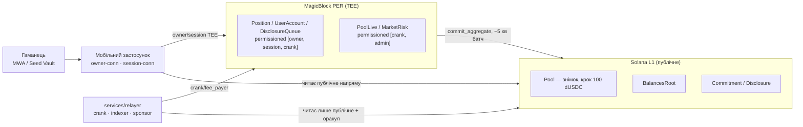

# Dexxer

Приватний perpetual DEX для Solana Seeker, побудований на MagicBlock Private
Ephemeral Rollups (PER, TEE). Позиція видима лише власнику — трекери,
копі-боти й самі ми бачимо тільки те, що вихідно публічне: огрублений
знімок пулу, `BalancesRoot`-квитанцію і 13F-розкриття без адреси.

## Що це

Dexxer — власне перп-ядро (не омнібус над Jupiter, не форк існуючого
протоколу) на шаблоні MagicBlock: позиція — делегований PDA всередині TEE
(Intel TDX) з permission-списком `[owner, session, crank]`. Жоден акаунт із
полями позиції не комітиться на L1 до закриття — на базовому шарі видно
лише акаунт під Delegation Program з байтами онбордингу, без жодного поля
трейду. Приватність тут — це **фільтр читання в TEE**, а не шифрування: на
L1 такого фільтра немає, тому сирий приватний акаунт ніколи не потрапляє
туди як є; усе, що має вийти назовні, виходить лише через окремий
публічний похідний акаунт (`Pool`-знімок, `BalancesRoot`, `Commitment`/
`Disclosure`). Формулювання приватності — від трекерів, копі-ботів і від
нас; **не** від Intel і не від оператора MagicBlock.



## Що зроблено (MVP, тижні 0–4)

- **Тиждень 0** — 10/11 spike-перевірок PASS (приватність у TEE, eSPL,
  scheduler, MWA з ER-blockhash, `verifyTeeRpcIntegrity` на Hermes).
- **Тиждень 1** — перп-ядро без приватності: маржа, ліквідація, crank,
  інваріант пулу; тулчейн-пастки задокументовано (nightly для LiteSVM).
- **Тиждень 2** — приватність (`[owner, session, crank]`), devnet-tee
  деплой `dexxer_core`, `withdraw`, планувальник + `commit_aggregate` через
  делегований `FeeEscrow`, мобільний скелет (TEE-conn, session-стор,
  Trade/Position).
- **Тиждень 3** — 13F-розкриття (commit-then-reveal через `commit_aggregate`),
  `BalancesRoot` (zero-copy, keccak256), `undelegate_user`/trustless-exit,
  History/Receipt екрани, перший CI.
- **Тиждень 4** — `PoolLive` приватний агрегат + `Pool` як публічний
  огрублений знімок (ризик #24 закрито), `services/relayer` на Railway
  (crank + публічний індексер + `/sponsor`), онбординг у ≤2 підписи зі
  спонсорованим rent, планувальник `i64::MAX` на живому розкладі
  (mark-backstop), дизайн-токени + 5-табовий UI за макетами Claude Design.
- **Тиждень 5** — надійність без relayer-а: per-position `liquidation_check`
  (планувальник у TEE реально ліквідує, не лише рухає mark — ризик #18
  закрито повністю), close звільняє позицію одразу й кладе запис у
  `DisclosureQueue` (`mark_committed` видалено), reveal за один цикл при
  нульовій затримці, вихід із боргом розкриття (частковий
  `undelegate_user` + `close_orphan_queue`/`close_exited_user`), **0-SOL
  онбординг** (`DelegateUser.payer`, нові `/sponsor`-shapes — виміряно 0
  лампортів на owner, включно з ER-леґом), identity-aware MWA auth-token,
  два devnet-апгрейди програми, relayer з карантином отруєних черг.

Деталі й виміряні цифри — `docs/superpowers/plans/week{1,2,3,4,5}-results.md`.

## Швидкий старт

### Передумови

- Anchor `1.0.2`, Solana CLI `3.1.9`, Rust `1.89` (закріплено в
  `rust-toolchain.toml`)
- Додатково `rustup toolchain install nightly-2026-09-18` — потрібен лише
  для LiteSVM-тестів (транзитивний `solana-syscalls`, див. `CLAUDE.md`)
- Node `24` (через `nvm`; `export PATH="$HOME/.nvm/versions/node/v24.18.0/bin:$PATH"`
  у прикладах нижче — підставте свою версію)

### Програма й тести

```sh
anchor build

cargo test -p dexxer_core                                 # unit — 61/61
cargo +nightly-2026-09-18 test -p dexxer_litesvm            # LiteSVM — 87/87
```

### ER/devnet-скрипти (`tests/er/`)

```sh
cd tests/er
npm ci
npm run q1              # локальний mb-stack: депозит
npm run q2               # локальний mb-stack: permissions
DEXXER_NET=devnet npm run devnet:onboard    # приклад devnet-скрипту; повний список — tests/er/README.md
```

### Relayer (`services/relayer`)

```sh
cd services/relayer
npm ci
npm test                 # 100/100 — candles, feed golden vectors, health, shutdown, keys,
                          # sponsor whitelist/rate-limit, orphan janitor, disclosure quarantine/rotation
npm run dev               # локальний запуск (DEXXER_NET=devnet, потребує CRANK_KEY_B58/FEE_PAYER_KEY_B58 env)
```

Живі env тижня 5 (значення на Railway, деталі — `docs/deployments.md`):
`COMMIT_INTERVAL_TICKS=60` (замінює зашитий `DISCLOSURE_EVERY_TICKS`, дефолт 300),
`COMMIT_MAX_ACTIONS=4` (дефолт; реальний бридж MagicBlock відхиляє 8 реальних дій за раз —
виміряно), `QUARANTINE_CYCLES` (дефолт 10, ізолює чергу, що падає 2 рази поспіль).

### Мобільний застосунок (`app/`)

MWA не працює в Expo Go — потрібен dev build:

```sh
cd app
npm ci
npx expo run:android      # dev build; або npm run android
npx tsc --noEmit
npm run lint:check         # expo lint
```

Для перевірки на емуляторі без реального гаманця — fakewallet:

```sh
npx solana-mobile@latest device install fakewallet
```

Скріпти crank-fallback і week-1 CLI демо — у `scripts/` (`npm run crank`,
`npm run week1`).

### Devnet-адреси й live-сервіси

Повний і актуальний список — `docs/deployments.md`. Коротко:

| | |
|---|---|
| `dexxer_core` program id | `Fyg2yJBoN97ScWxT37xBp2zaaiNncNqnGJ7PAbtnUfCY` (позиції-слоти, план 4; стара — `G2ok…`, див. `docs/deployments.md`) |
| Base RPC | `https://rpc.magicblock.app/devnet` |
| ER/TEE | `https://devnet-tee.magicblock.app` |
| Relayer/індексер | `https://relayer-production-1ae7.up.railway.app` |

Ендпоінти relayer/індексера:

| Ендпоінт | Що повертає |
|---|---|
| `GET /healthz` | стан crank/fee-payer балансів, тік/коміт, статус індексера, `schedulerActive` |
| `GET /mark` | останній mark-прайс (з `stale`-прапорцем) |
| `GET /prices?tf=1m\|5m\|15m&limit=N` | OHLC-свічки |
| `GET /pool/latest` | останній `Pool`-знімок (capital/locked/fees/…) |
| `GET /disclosures?limit=N` | стрічка 13F-розкриттів без адрес |
| `GET /root/latest` | останній `BalancesRoot` (root_slot, листки) |
| `wss://…/ws` | live `mark`/`pool`/`disclosure`-фрейми |

`dUSDC`-мінт — власний faucet-мінт, генерується bootstrap-скриптом
(`Config.dusdc_mint`, не фіксована адреса в цьому README — пул фондує
протокол на кожному чистому devnet-розгортанні).

## Як це працює (коротко)

- **Приватність = фільтр читання в TEE/QFS, не шифрування.** Permissioned
  акаунт (`Position`/`UserAccount`/`DisclosureQueue`) блокує читання для
  всіх, крім `[owner, session, crank]`; байти ніколи не шифруються — на L1
  такий фільтр не діє, тому сирий приватний акаунт туди не комітиться.
- **`PoolLive` vs `Pool`.** Кожна дія (open/close/deposit/withdraw/
  ліквідація) пише лише приватний робочий агрегат `PoolLive` (`[crank,
  admin]`, ніколи не комітиться). Раз на ~5 хв `commit_aggregate` публікує
  в `Pool` округлений знімок (крок `SNAPSHOT_STEP = 100 dUSDC`: активи —
  вниз, зобов'язання — вгору) — це єдине, що бачить світ на L1.
- **Commit-then-reveal, queue-first (week 5).** Закрита позиція одразу
  штовхає запис у приватну `DisclosureQueue` і звільняє `Position` —
  `commitment` (keccak256-хеш деталей угоди) і саме розкриття (`Disclosure`,
  без адреси власника) виходять із черги в одному `commit_aggregate`-батчі
  (`write_commitment`/`write_disclosure`). Програмна стеля
  `MAX_ACTIONS_PER_COMMIT = 8`; живий relayer-дефолт `COMMIT_MAX_ACTIONS = 4`
  — реальний бридж MagicBlock відхиляє 8 реальних дій за раз (виміряно).
- **Онбординг в один клік, 0 SOL (week 5).** Застосунок збирає весь
  онбординг у пачку (`signTransactions`); rent усіх трьох PDA й
  делегування тепер спонсорується через `POST /sponsor` relayer'а
  (`DelegateUser.payer` окремо від `owner`, нові ATA/delegate-shapes) —
  виміряно **0 лампортів на owner** протягом усього циклу, включно з
  ER-леґом (permissions+session), на живих 0-SOL гаманцях (M-I,
  `week5-results.md`).
- **Relayer — єдиний привілейований сервіс.** `services/relayer` тримає
  лише `crank`/`fee_payer`-ключі, ніколи owner/session-токени; читає лише
  публічні акаунти й оракул. Клієнт читає приватний стан напряму через
  owner-TEE-з'єднання (`accountSubscribe`), не через relayer.

## Чесні обмеження

- **Anonymity set мала** — тестери одиниці; `Pool`-знімок округлений до
  100 dUSDC, але при малій кількості одночасних трейдерів differencing між
  знімками все одно може виказати активність (ризик #24, знято архітектурно
  цього тижня, differencing лишається). Повне рішення — ZK-доказ
  забезпеченості над приватним root-ом (§2.4.5 спеки), пост-MVP.
- **Довіра до TEE (Intel/оператор MagicBlock).** Апаратна гарантія, не
  криптографічна; `verifyTeeRpcIntegrity` перевіряє справжність TDX-квоти,
  але не звіряє MRTD/RTMR з allowlist коду (v1).
- **Ліквідації тепер planувальник-driven, `services/relayer` — fallback,
  не єдина точка відмови (тиждень 5).** `liquidation_check` — окрема
  scheduler-задача на кожну позицію, зареєстрована самою програмою; на
  devnet виміряно PASS — ліквідація без жодного relayer-виклику за 6.97 с
  (ризик #18 закрито повністю, не лише mark-backstop тижня 4).
  `services/relayer`/`crank-fallback` лишається потрібним як другий
  незалежний шлях і для всього іншого (коміти, індексація, sponsor).
- **Reveal за один цикл, з відомим дефектом бриджу.** При нульовій
  затримці розкриття комміт+reveal виходять на L1 одним циклом
  `commit_aggregate` (виміряно). Одна конкретна черга на devnet
  відхиляється бриджем MagicBlock на кожному протестованому бюджеті дій
  (не рятується тюнінгом) — цей трейдер лишається заблокованим на
  `QueueFull`, доки не буде програмного фіксу (тиждень 6); relayer ізолює
  проблему карантином, щоб вона не блокувала розкриття інших трейдерів.
- **Exit із боргом розкриття.** Вихід не чекає на reveal — частковий
  `undelegate_user` лишає чергу делегованою crank-у, який її дренує й
  закриває постфактум (`close_orphan_queue`/`close_exited_user`), rent
  повертається власнику. Виміряно end-to-end на 0-SOL гаманцях (M-I).
- **Онбординг — 0 SOL, виміряно, не лише спонсоровано частково (тиждень
  5).** `DelegateUser.payer` + нові `/sponsor`-shapes закрили останній
  owner-funded залишок (≈0.004 SOL тижня 4) — на живих 0-SOL гаманцях весь
  цикл, включно з ER-леґом, пройшов за 0 лампортів (ризик #22 закрито
  повністю).
- **Одна позиція на ринок**, devnet-only, тестовий `dUSDC`-мінт, власний
  тестовий пул як контрагент PnL — не реальна ліквідність. 4 legacy-позиції
  тижнів 1–2 назавжди застрягли на старому лейауті акаунта (постійне
  зміщення OI на ринку).
- Повний список ризиків (#1–#36, з мітигаціями й статусом) —
  `docs/superpowers/specs/2026-09-18-dexxer-mvp-design.md` §7.1.

## Roadmap

Пост-MVP апгрейди (спека §2.4.5):

- Merkle-root замість плаского списку `BalancesRoot` при N > 64.
- Root рахує сама програма інкрементально (без crank-асерту).
- Власний L1-vault замість eSPL → суверенний exit.
- ZK-доказ забезпеченості (Groth16/BN254) над приватним root-ом — публічний
  знімок несе лише `root + proof + огрублений ratio`, без сирих агрегатів.
- Disclosure/root-цикли всередині MagicBlock scheduler-а (потребує реєстру
  кандидатів у програмі).
- Funding rate, TP/SL, мульти-маркет, TEE-атестація в застосунку, iOS.

## Документи

- `docs/superpowers/specs/2026-09-18-dexxer-mvp-design.md` — джерело
  правди для MVP (скоуп, акаунти, математика, програма, клієнт, тести,
  ризики, календар).
- `docs/dexxer-architecture.md` — обґрунтування, витік-модель, конкурентна
  рамка (§2.1 застарів там, де розходиться зі спекою).
- `docs/dexxer-plan.md`, `docs/dexxer-mobile-stack.md` — план і мобільний
  стек (частково застарілі, замінені спекою).
- `docs/superpowers/plans/week{1,2,3,4,5}-results.md` — виміряні результати
  кожного тижня.
- `docs/deployments.md` — живі devnet-адреси, PDA, relayer/Railway,
  scheduler `task_id` (без секретів).
- `services/relayer/README.md` — crank/індексер/`/sponsor` зсередини.
- `CLAUDE.md` — архітектурні рішення й робочі правила репозиторію.
