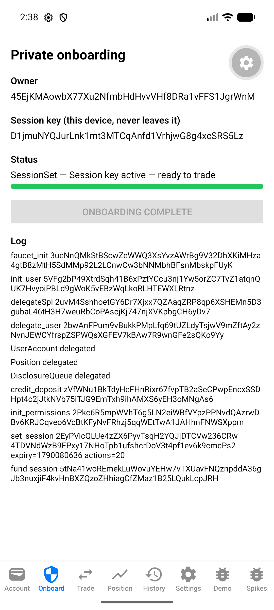
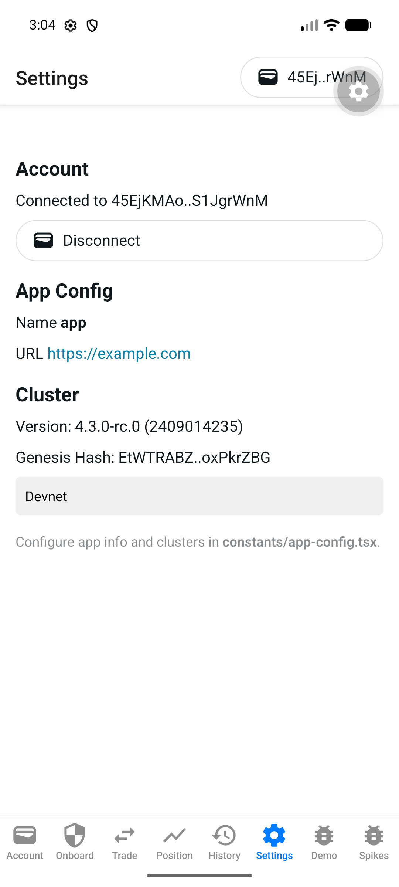
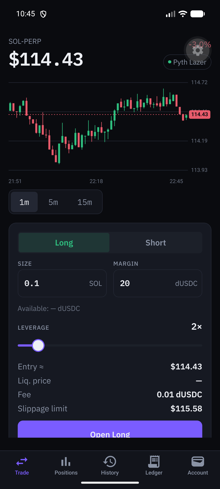
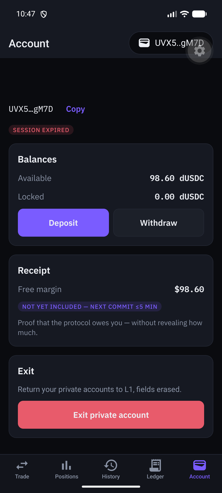
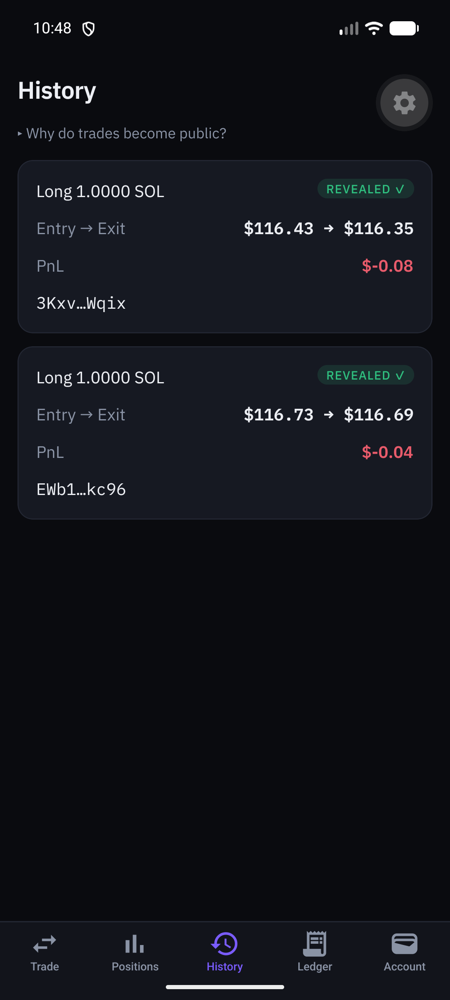
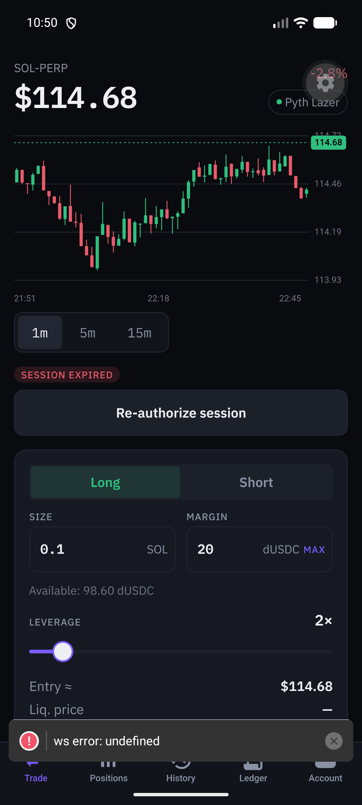
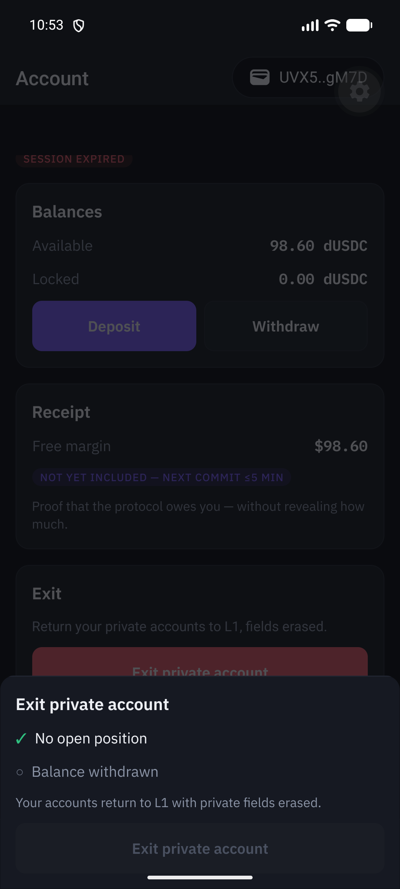
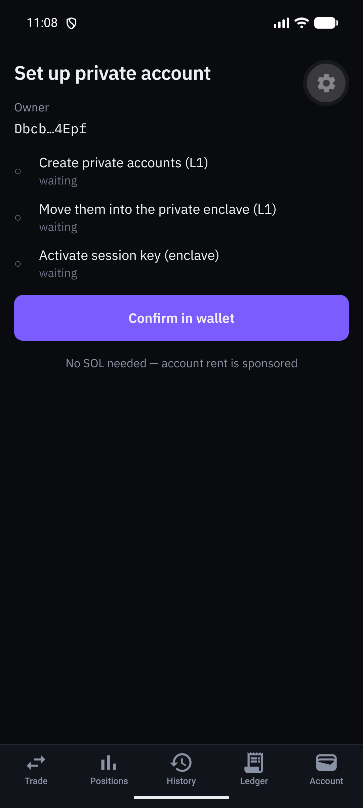
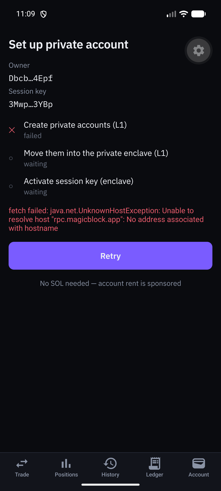

# Dexxer — тижні 0–5: стисла історія планів і результатів

Один документ замість тринадцяти потижневих файлів планів і результатів (тижні 0–5, 19–25.09.2026). Плани зведено до мети й переліку задач; виміри, вердикти, рулінги, знахідки, адреси й сигнатури з результатів збережено. Покрокові інструкції, лістинги коду й чек-листи планів прибрано.

Повні оригінали — в історії git, останній коміт із ними — `7243d39` (наприклад, `git show 7243d39:docs/superpowers/plans/week2-results.md`). Назви старих файлів у тексті нижче («Джерела: …») — посилання саме на ці оригінали. Мітки (`Task N`, `M-x`, `рулінг N`, `ризик #N`, `fix round N`) збережено дослівно, бо на них посилаються коментарі в коді й інші документи.

Це історія: значна частина описаного (розкриття `Commitment`/`Disclosure`/`DisclosureQueue`, `Position` на ринок, `MAX_ACTIONS`) скасована тижнем 6 — чинні правила в `CLAUDE.md` і spec §2.9. Тиждень 6 — окремі файли в цій теці.

| Тиждень | Тема | Замінює файли |
|---|---|---|
| [0](#week-0) | Спайки на devnet-tee, гейт хакатону | `2026-09-19-week0-spikes.md`, `week0-gate.md`, `week0-results.md` |
| [1](#week-1) | Ядро без приватності | `2026-09-19-week1-core.md`, `week1-results.md` |
| [2](#week-2) | Приватність, devnet-tee, мобільний скелет | `2026-09-20-week2-privacy-devnet.md`, `week2-results.md` |
| [3](#week-3) | 13F-розкриття, `BalancesRoot`, вихід | `2026-09-22-week3-disclosure-root-exit.md`, `week3-results.md` |
| [4](#week-4) | `PoolLive`, relayer, онбординг в один клік, UI | `2026-09-22-week4-mvp-polish.md`, `week4-results.md` |
| [5](#week-5) | Надійність без relayer-а, живі гаманці | `2026-09-23-week5-reliability.md`, `week5-results.md` |

---

## Тиждень 0 — спайки: 11 перевірок на devnet-tee і гейт правил хакатону

Джерела: план `2026-09-19-week0-spikes.md` («Dexxer Week 0 — Spikes Implementation Plan»), `week0-gate.md` (перевірено 19.09.2026, доповнено 21.09.2026), `week0-results.md` (заповнено 19.09.2026).

### Мета

Закрити 11 перевірок тижня 0 зі spec §7.2 запускними спайк-скриптами на `devnet-tee`, щоб кожне архітектурне припущення спеки було або доведене, або замінене fallback-ом до старту продуктового коду 28.09. Продуктовий код цього тижня не пишеться; єдині не-спайкові результати — пін тулчейну, Expo-скелет, правки документів і червоні тести математики.

Рамка плану:

- Кожен спайк — одноразова тека `spikes/NN-<name>/`: клонований приклад `magicblock-engine-examples` + `check.ts` (exit code = сигнал PASS) + `RESULT.md` (статус, докази, рішення — який ризик/fallback спеки спрацьовує). Код зі `spikes/` не копіюється в `programs/`/`app/` без свіжого ревʼю.
- Стек плану: Solana 3.1.9, Rust 1.89.0, Anchor 1.0.2, `ephemeral-rollups-sdk` 0.16.2 (`anchor`, `access-control`), `@magicblock-labs/ephemeral-rollups-sdk@0.17.0`, `@coral-xyz/anchor@0.32.1`, `@solana/web3.js@^1.98` (**ніколи** `@solana/kit`), `@magicblock-labs/gum-sdk`, `pyth-solana-receiver-sdk` 2.0.0, Node `24.10.x`, Expo + `@wallet-ui/react-native-web3js`.
- Ендпоінти: base `https://rpc.magicblock.app/devnet`; router `https://devnet-router.magicblock.app/`; TEE `https://devnet-tee.magicblock.app` (WS `wss://devnet-tee.magicblock.app`); ідентичність TEE-валідатора `MTEWGuqxUpYZGFJQcp8tLN7x5v9BSeoFHYWQQ3n3xzo` (перевіряється `getIdentity`, `spikes/00-identity.ts`).
- Blockhash — завжди з того зʼєднання, куди шлеться tx; `skipPreflight: true` — лише при задокументованій несумісності симуляції ER, і тоді дивитись логи виконання.
- **Gate:** Task 1 (правила Colosseum) вирішує, чи можна комітити до 28.09 «Tasks 13–14 (red math tests, Expo skeleton)» — так у плані дослівно, хоча Expo-скелет у ньому — Task 11 (його крок коміту теж «respecting Task 1 gate»), а Task 14 — правки документів. Спайки — дослідження, не продуктовий код, ідуть незалежно.

### План (стисло)

Відповідність «перевірка spec §7.2 → задача → тека спайку» (з Self-review плану й «Folder mapping» результатів): 1→T3, 2→T5, 3→T6, 4→T7, 5→T8, 6→T4, 7→T9, 8→T12, 9→T10, 10→T12, 11→T12.

| Task | Назва | Перевірка | Тека | Результат |
|---|---|---|---|---|
| Task 1 | Colosseum rules gate | — | `docs/superpowers/plans/week0-gate.md` | Рішення: продуктовий код МОЖНА комітити до 28.09 (з двома умовами, нижче) |
| Task 2 | Toolchain pin and spikes workspace (`rust-toolchain.toml`, `.nvmrc`, `spikes/lib/env.ts`, ключі `payer`/`user`/`stranger`/`session`, `spikes/00-identity.ts`) | — | `spikes/` | Окремого вердикту в джерелах нема; за A8 спайки йшли на solana-cli 3.1.10 / Node 24.18.0, `.nvmrc` → `24.18.0` (план писав `24.10.0`) |
| Task 3 | Check 1 — private-counter on devnet-tee, non-member read denied | 1 | `spikes/01-private-counter-tee` | PASS |
| Task 4 | Check 6 — non-member transaction visibility on TEE RPC | 6 | `spikes/01-private-counter-tee` (секція «Check 6» у `RESULT.md`) | **FAIL** — ризик #4 активовано |
| Task 5 | Check 2 — Ephemeral SPL Token inside the TEE | 2 | `spikes/02-espl-tee` | PASS |
| Task 6 | Check 3 — ER reads a non-delegated L1 account (`Config` PDA, `increment_by_config`) | 3 | `spikes/03-l1-readonly-clone` | PASS (fresh clone) |
| Task 7 | Check 4 — Pricing Oracle SOL/USD readable and fresh inside devnet-tee | 4 | `spikes/04-oracle-tee` | PASS |
| Task 8 | Check 5 — scheduler (crank) ticks inside devnet-tee | 5 | `spikes/05-crank-tee` | PASS |
| Task 9 | Check 7 — Magic Action writes an L1 account after commit; direct call rejected | 7 | `spikes/06-magic-action` | PASS |
| Task 10 | Check 9 — session key as ER fee payer after one-time top-up | 9 | `spikes/07-session-payer` | PASS |
| Task 11 | Expo skeleton with MWA connect on the emulator (передумова для 8, 10, 11; `create-solana-dapp`, AVD Pixel 7 arm64 API 34, fakewallet) | — | `app/` | Окремого вердикту в джерелах нема; перевірки 8/10/11 на ньому пройшли з fakewallet |
| Task 12 | Checks 8, 10, 11 — MWA signs ER-blockhash tx; WS with token in RN; TDX attestation in Hermes | 8, 10, 11 | `spikes/08-mobile-checks` (код — `app/src/spikes/`) | PASS ×3 |
| Task 13 | Red math tests — інтерфейс `math.rs` зафіксований падаючими тестами (заплановано на 25–26.09): `notional`, `upnl`, `fee` (вгору), `required_margin` (вгору), `equity`, `liq_price`, `is_liquidatable`, `vwap_entry`; `MathError { Overflow, DivisionByZero }`; ціни 1e6, розміри 1e9, USD 1e6, ставки bps; proptest | — | `programs/dexxer_core/` | У джерелах тижня 0 результат не записано |
| Task 14 | Docs corrections and week-0 wrap-up (позначка «Застаріло» в `docs/dexxer-plan.md`, виправлення фактів у `docs/dexxer-architecture.md` і `docs/solana-perp-privacy-landscape.md`, таблиця результатів) | — | `docs/` | `week0-results.md` заповнено 19.09.2026; про решту правок запису в джерелах нема |

Поза планом за задумом (Self-review): Publisher Policy checklist, `dexxer.xyz` + assetlinks, деки, пост №1 — некодові пункти, власник робить їх прямо зі spec §7.3.

### Що зроблено

- Усі 11 перевірок закриті: **10 PASS, 1 FAIL задокументовано** (перевірка 6). Висновок результатів: «Week 1 plan may start: **yes**»; A3 і A5 внести до першого рядка `oracle.rs` / guards.
- Гейт Colosseum (Task 1) пройдено з рішенням «можна», з обовʼязковим розкриттям.
- Сформовано дев'ять обовʼязкових правок спеки A1–A9 (нижче).
- Перевірки 8/10/11 виконано на Hermes (рушій за замовчуванням, без перемикання на JSC) з fakewallet.

### Виміри

| # | Перевірка | Статус | Докази (`spikes/…/RESULT.md`) | Застосоване рішення |
|---|---|---|---|---|
| 1 | private-counter TEE, non-member denied | PASS | Програма `2DvXCXzp56aFw8JsHrMuiRwZWizZjxwaqzYo2ADKH2W7`, counter PDA `GUrqtjuVRoRYxfeDWpwTNn5xb9vSSBWTZ7KpMfMUdzuJ`, delegate sig `43EgR5v185rby9hR8m28Pcjahig25G2fZbRkemSydUePtvsdgRHNd5SNjfiazBiaRKZCpcweKPyhhauLtMTQMsb4`; власник читає 48 байтів, stranger — `null`, без токена — `null` (HTTP 200, `result.value: null`, без обʼєкта помилки) | Модель permission §2.1 підтверджено. Клієнт мусить трактувати `null` як неоднозначний: «не член» чи «не існує» |
| 2 | eSPL in TEE | PASS | Мінт `44FTm7zsYePyuBzLmQDjxk53eioxqzkdEW28FEPnSNBk` (6 dec); ER `transferSpl` sig `2CZHv9YUCN9Gmo3QQcdHj6md1L1oSLnSaTSaraS4jxENMXpWa36SEkjPUUjvRVNdLLA2Qnpz8nGAvgX7z5sQLtHS`; баланси user 500,000,000 → 400,000,000, pool 0 → 100,000,000; stranger `getAccount(userAta)` → `TokenAccountNotFoundError` / сире `value: null` | Ризик #1 не спрацював, Plan B (власний escrow vault) не потрібен. §2.1 правило 2 лишено як є, з приміткою, що owner-scoping eSPL — бонус, на який не покладаємось (A7) |
| 3 | L1 read-only clone | PASS (fresh clone) | Програма `Gn3UvsXPdWrBJGmz3sxYSgFjF9pJy8b92cpSanMKYCCJ`, config PDA `4cdN75h3sZ4me9pZT4g4ZXAuGHaxc3J1LsazkxS3niWr`; counter 0 → 5 → 12: перший `increment_by_config` прочитав `config.step = 5` з неделегованого L1-акаунта, після L1 `set_step(7)` (sig `2TutEEq1fFKMZoCoNUKPMUtFbYRpqQNM4KHE8zeTzG5HwijCZexNbTeChsxyVkG9rJ3h2cVEZfSYQeYTrP6kb8qK`) наступна ER-tx уже бачила `7` — свіжий клон, не застарілий; підтверджено незалежним другим прогоном | Ризик #2 понижено: неделегований read-only L1-акаунт безпечно читати з ER-інструкцій, тригер ре-делегування не потрібен |
| 4 | Oracle fresh in TEE | PASS | Фід `ENYwebBThHzmzwPLAQvCucUTsjyfBSZdD9ViXksS4jPu` = PDA `["price_feed","pyth-lazer","6"]` під `PriCems5tHihc6UDXDjzjeawomAwBduWMGAi8ZUjppd`. TEE read #1: `price=11282999668, expo=8, conf=0, publishTime=1789795444, postedSlot=317241243, age=0s`, акаунт 134 байти, `writeAuthority=11111111111111111111111111111111`. Base read: `price=0, postedSlot=0` (мертвий) | Дизайн ліквідації не заблоковано. Правила оракула загартовано в §3.3 / §4.4: ідентичність за PDA-деривацією, `price / 10^exponent`, `conf == 0` → відхиляти відкриття, стейлнес за ER `Clock`/`publish_time` (A5) |
| 5 | Scheduler ticks | PASS | Програма `Ctj6Hz5RG8cPDgmrDPKGjqKVNdHi7x7hmhKshy5wsNyA`, schedule sig `27yoVEtAeVBJ6QAVRQ8zvXi3dgjQTRFAaLZzAVg9HV3i3wKvWgcX7M5fJeKYf1jQKwdT7e8VbfhDYbvZDnwpiTJr`; **27 тіків за 20 с** при запитаному `execution_interval_millis = 1000` (≈740 мс середній крок); лічильник зупинився рівно на запитаних 30 ітераціях (поріг плану був ≥12 тіків/20 с) | Ризик #3 не спрацював. Запитаний інтервал — підлога, не період → гістерезис рахувати в тіках; продакшн `crank_tick` мусить валідувати crank signer PDA й мати шлях скасування (A6) |
| 6 | Tx visibility | **FAIL** | Секція Check 6. `getTransaction("3AGUL9ajNUUcLDKrtXmj9wLCusJzs16SWTVmsE3SvhyaSCMVA6ukkL4ctvnAirjD2EMq5BNrxQPsmqTFpkDK9xYa")` повертає non-null і stranger-у, **і** викликачу без токена: `slot 317219812`, `blockTime 1789794373`, `meta.err null`, `fee 0`, `computeUnitsConsumed 0`; `accountKeys`/`instructions`/`logMessages`/баланси — усі `[]`. `getSignaturesForAddress(PROGRAM_ID)` віддає stranger-у повний список сигнатур програми. `getSignaturesForAddress(PDA)` = `[]` — і для власника теж (ER не індексує за PDA) | **Ризик #4 активовано.** Модель витоків §2.3 переписано тим, що реально видно; мітигація = однакова форма tx + crank chaff + чесний README; спільний payer явно не допомагає (A1, A2) |
| 7 | Magic Action + escrow check | PASS | Програма `6Tm2qGHSsmYhaCtLmWf7TQ2VBi84s2bzuzrHKGFePoxR`; ER commit+action sig `2mfdiacoXjiFEaZrLxwy2xio3f1EfS8wAmGLMDANTG16UAyJDk2496NfF3jgrBEYHV5jGX3KKoqAL9bqZHS78kT6`, base commit sig `3vwcYnLKSDtnCd36xVWdTHDd1qdb9zn5jEsjLU4hceW69DhGNDWVV7dzP8cvZJoTfpu6oACXvQ2cJ6JN7iTPAM9b`; leaderboard `highScore` 0 → 3, ER-tx → ефект на L1 4.702 с; прямий виклик відхилено (`Missing signature for public key [7tSuwoRxtbwiccZo93NnDnMKqxSUhSBjtMp2DrKuL5wh]`) | Шлях 13F розблоковано. Жорстке правило `source_program` (A4) |
| 8 | MWA signs ER blockhash | PASS | Гаманець `DR16D5BEAn49deCA6RXYjbqpJZAX2rxtfxEcksnVXA1A` (fakewallet), counter `6S5yRVbL8gPRDNQR6QE3KZwbV5vcNuAd1ommoKwQJJ4R`; onboarding ER tx `2HCu8KYy…KSuRX` (blockhash→signed 4629 мс), `increment` ER tx `s7UfiXSC…3fev2q` (1598 мс, разом 3112 мс) | Ризик #7 закрито: MWA встигає підписати tx з ER-blockhash у межах його життя; `set_session` через MWA життєздатний, угоди лишаються на session key |
| 9 | Session key payer | PASS | Session `8Fn3roFL9f9i4h3rCQa1yMohT4NiAN8pdu9oxjk4wQhQ`, поповнено 5,000,000 лампортів через `createSessionV2`; ER `increment` sig `4qja4Y9miUxehE72up7Ak9rUtipEVwa59xQfzcBpcSdkMXg23a9Z744A3zy9FEGDszdj3oLbewQhKu8PNmiB74XV`, session = єдиний підписант + fee payer, `meta.fee 0`, `meta.err null`; counter 4 → 5, прочитано токеном члена; **власний** токен session прочитати counter не зміг (`null`) | Session key як ER-payer підтверджено; головна знахідка — A3 |
| 10 | WS token in RN | PASS | `onAccountChange` через `wss://devnet-tee.magicblock.app?token=…` спрацював (48 байтів) одразу після підтвердження increment-а з Check 8 | §5.5: WS — основний; 1-с полінг лише як fallback на реконект |
| 11 | TDX attestation in Hermes | PASS | `verifyTeeRpcIntegrity(TEE_RPC)` завершився за 3246 мс на Hermes (рушій за замовчуванням, без перемикача JSC) | Ризик #6 закрито: WASM-shim не потрібен; allowlist MRTD/RTMR лишається на v1 |

Folder mapping (з результатів): 1 і 6 → `spikes/01-private-counter-tee`, 2 → `spikes/02-espl-tee`, 3 → `spikes/03-l1-readonly-clone`, 4 → `spikes/04-oracle-tee`, 5 → `spikes/05-crank-tee`, 7 → `spikes/06-magic-action`, 9 → `spikes/07-session-payer`, 8/10/11 → `spikes/08-mobile-checks`.

### Рулінги й знахідки

**Гейт Colosseum (Task 1, `week0-gate.md`, перевірено 2026-09-19).**

- Джерело: `https://colosseum.com/hackathon` (`colosseum.org` 301-редиректить туди), FAQ «Are Colosseum hackathons only for new products, and who is eligible to win?». Сторінка — JS-SPA: `curl`/WebFetch віддають порожню оболонку, цитату звірено через `document.body.innerText` відрендереної сторінки.
- Дослівно: «Teams may begin development before the hackathon, but products are judged only on the work completed between the competition's start and end dates.» / «Builders may use pre-existing code, but teams must disclose all relevant past development work in the submission form.» / «If a team misrepresents its product's development history or fails to disclose relevant information, Colosseum retains the sole right to: Disqualify the team from the competition / Ban individual builders from participating in future Colosseum hackathons / Revoke prizes if applicable» / «'Pre-existing code' does not refer to open-source code developed by others. We encourage founders to compose with existing crypto protocols.»
- **Рішення:** `[x]` Product code (`programs/`, `app/`) MAY be committed before 28.09. Варіант «MUST NOT → локальна гілка `pre-hackathon`, що не пушиться» — не обрано.
- Дві умови: (1) **розкриття обовʼязкове** — увесь продуктовий код до 28.09 декларується в submission-формі як prior development (інакше дискваліфікація, бан, відкликання призів); (2) **судять лише роботу у вікні конкурсу** — коміти до 28.09 тримати в історії так, щоб diff «до» / «під час» був чесний; не видавати роботу спайк-тижня за роботу хакатонного тижня.
- Застереження (не причина змінювати рішення): сторінка показує живим **«Crypto World's Fair»** (14.09 – 12.10.2026, мульти-чейн, є Solana-трек), а не хакатон з 28.09. Прочитано повністю rules PDF «Crypto World's Fair» (`https://colosseum.com/legal/Crypto%20World's%20Fair%20Hackathon%20Rules.pdf`) і «Solana Frontier Hackathon» (`https://colosseum.com/legal/Solana%20Frontier%20Hackathon%20Rules.pdf` — виявився **весняним**, 6.04 – 11.05.2026): клаузи про pre-existing code в жодному нема, вона лише у FAQ. Блог «Colosseum Codex: 2026 Hackathons» (`https://blog.colosseum.com/2026-hackathons-updraft-course-offline-signer-cli/`) і X-пост Venture Launch називають друге Solana-вікно 2026 — **28.09 – 2.11.2026**; окремої rules-сторінки/PDF для нього не знайдено, і неясно, чи «Crypto World's Fair» замінив цей слот.
- Solana Mobile CLOCK IN («third Solana Mobile hackathon», `https://solanamobile.radiant.nexus/`, панель «EVENT INFO → KEY DATES»): подачі відкриті 8.09.2026; дедлайн 9.10.2026, 09:59 GMT+3; суддівство 10.10 – 9.11.2026; переможці ≈10–11.11.2026 (KEY DATES каже 11.11, текст RESULTS — «Results announced November 10th»; розбіжність на день). Власне правило CLOCK IN: «Pre-existing projects are allowed if they show significant new mobile development during the hackathon. A pre-existing project with no new work is not eligible.»

**Обовʼязкові правки спеки (A1–A9, з `week0-results.md`).**

- **A1** — §2.3 модель витоків: рядок «ER RPC не-member» замінено тим, що виміряла перевірка 6 (видно список сигнатур за program id і метадані `getTransaction`; ключі акаунтів, інструкції, логи, баланси приховані), плюс примітка, що `getSignaturesForAddress(PDA)` порожній навіть для власника.
- **A2** — §7.1 ризик #4: позначено **АКТИВОВАНО (check 6)**; мітигація = однакова форма tx + cover traffic тіками кранка + чесне розкриття; сам спільний payer явно не допомагає.
- **A3** — §5.4 + §4.4 + вступ §4.2: `EphemeralPermission` гейтить лише читання; `getAuthToken` — лише підпис; відправка й виконання tx не гейтяться; кожна ER-інструкція сама забезпечує свою авторизацію (check 9).
- **A4** — §4.2 (`write_commitment`, `reveal`/`write_disclosure`) + §4.4: контексти `#[action]` мусять оголошувати `source_program` (`address = crate::ID`) у порядку `[...data, source_program, escrow_auth, escrow]` (check 7, SDK 0.16.2). Першопричина попереднього `Unauthorized`: on-chain CPI передавав 5 акаунтів, структура оголошувала 4.
- **A5** — §3.3 + §4.4 `oracle.rs`: ідентичність фіда за PDA-деривацією, `exponent = +8` → `price / 10^exponent`, `conf == 0` → жорстка відмова для відкриттів, `posted_slot` — слот ER, акаунт 134 байти (check 4).
- **A6** — §3.5 + таблиця §3.3: запитаний інтервал кранка — підлога (27 тіків / 20 с при 1000 мс); гістерезис у тіках, не секундах; продакшн `crank_tick` валідує crank signer PDA й потребує шляху скасування (check 5).
- **A7** — §2.1, примітка під правилом 2: check 2 показав, що ER-баланси eSPL owner-scoped на рівні RPC; правило «маржа — облік, не токени» не змінюється.
- **A8** — §6.1: пін Solana лишається 3.1.9, Node → 24.18.x; спайки йшли на solana-cli 3.1.10 / Node 24.18.0 (сумісно); `.nvmrc` → `24.18.0`.
- **A9** — §8: відкриті питання 1 (звʼязок deposit → `credit_deposit`), 2 (permission на 3 PDA в одній Delegation Actions tx), 3 (рента для `Position` + `DisclosureQueue`) тижнем 0 **не** закриті → тиждень 1, дні 1–2.

**Рантайм-знахідки MWA (check 8).** `address` з хука — base58-рядок; MWA `signMessages` повертає message‖signature; L1-леги мусять іти через `signAndSendTransaction`.

**Пастки, передбачені планом** (у результатах не зафіксовано, що спрацювали): `EphemeralAtaValidatorMismatch` (`0x7`) — ATA раніше делегований іншому валідатору, створити свіжі keypair-и (Task 5); у Task 10 `increment` приклада не валідує session token — спайк перевіряє **лише механіку payer-а**, не валідацію сесії.

### Що згодом скасовано або замінено

- План: Node `24.10.x` / `.nvmrc` `24.10.0` → за результатами `.nvmrc` `24.18.0`, Node 24.18.x (A8).
- План Task 14 позначає застарілими §2 (скоуп) і §3 (календар) `docs/dexxer-plan.md` (замінені spec §1 і §7.3; «Опція 1 (омнібус над Jupiter) не є MVP»; §5–§7 лишаються довідковими) і виправляє факти про кандидатів на форк: `solana-labs/perpetuals` — Anchor 0.28.0, solana-program 1.16.9, pyth-sdk-solana 0.8.0; Drift `protocol-v2` archived 03.09.2026 → `velocity-exchange/protocol-v2` (Anchor 0.29); програма Flash закрита (репо `flash-perpetuals` публічно не існує); `AdrenaFoundation/perpetuals` — archived 2024 копія solana-labs; Brute — LICENSE відсутній, код не брати; Surfpool не потрібен (LiteSVM/proptest → `mb-stack` → devnet + `devnet-tee-as`, spec §6.3).
- Fallback-и плану, що не знадобились: Plan B власний escrow vault (ризик #1), делегування всіх ER-читаних акаунтів (ризик #2), `scripts/crank-fallback` як основний з тижня 2 (ризик #3), sponsor PDA як payer (§5.4), 1-с полінг замість WS (§5.5), JSC/WASM-shim (ризик #6).

### Відкрите на кінець тижня

- **Ризик #4 активний** (перевірка 6 FAIL): список сигнатур програми й метадані tx видимі не-членам — закривається лише мітигаціями A1/A2.
- **A9:** питання §8 Q1–Q3 (1 — deposit → `credit_deposit`; 2 — permission на 3 PDA в одній Delegation Actions tx; 3 — рента `Position` + `DisclosureQueue`) → тиждень 1, дні 1–2.
- A3 і A5 внести до першого рядка `oracle.rs` / guards на старті тижня 1.
- **Нагадування гейту (week 2, 21.09.2026): перечитати правила 26–27.09.** Тижні 0–2 (весь код `programs/`, `app/`, `tests/`, `scripts/`) написані **до** 28.09; жодна задача тижнів 0–2 не закрила остаточно, яка саме подія («Crypto World's Fair» 14.09–12.10 чи окремий Solana-слот 28.09–02.11) і чи є для неї окремий rules PDF. Дія не пізніше 26–27.09: повторно відкрити `colosseum.com/hackathon` і підтвердити (a) назву події, вікно, rules PDF; (b) що клауза pre-existing code у FAQ не змінилась; (c) механізм розкриття в submission-формі (поле, формат). Якщо подія інша — оновити рішення, не подавати мовчки. Процедурний крок, не блокер розробки.
- Результат Task 13 (червоні тести `math.rs`) і правок документів Task 14 у джерелах тижня 0 не зафіксовано.

---

## Тиждень 1 — ядро без приватності (19–20.09.2026)

Джерела: план `2026-09-19-week1-core.md` («Dexxer — тиждень 1: ядро без приватності. План імплементації») і `week1-results.md` («Тиждень 1 — результати»). Гілка `week1-core` від `main`, інтеграція — PR.

### Мета

Робоче перп-ядро `dexxer_core` (стани, математика, ризик, оракул, `open/close/add_margin/increase/decrease`, `crank_tick` з ліквідацією), зелене на LiteSVM, з делегацією й eSPL-депозитом, доведеними на `mb-stack`; закриті відкриті питання spec §8 Q1–Q3.

Архітектура тижня: один Anchor-крейт `dexxer_core` (`#[ephemeral]`), чиста математика в `math.rs`, політика в `risk.rs`, парсер оракула в `oracle.rs`; кожна ER-інструкція сама перевіряє підписанта (spec A3). Маржа — облік у PDA; токени рухаються лише на депозиті (`credit_deposit`) і на сідуванні пулу (`seed_pool`). Тест-оракул `mock_oracle` — окрема програма (лише localnet/LiteSVM), пише байти в layout `PriceUpdateV2`; на devnet `Config.oracle_program` = `PriCems…`.

Стек: Anchor 1.0.2 (`anchor-lang`, `anchor-spl` `=1.0.2`), `ephemeral-rollups-sdk =0.16.2` (`anchor`, `access-control`), `magicblock-magic-program-api` (для `CRANK_SIGNER`), Rust 1.89.0, Solana CLI 3.1.x, `litesvm =0.16.0`; TS: Node 24.18.0, `@coral-xyz/anchor 0.32.1`, `@magicblock-labs/ephemeral-rollups-sdk 0.17.0`, `@solana/web3.js` v1, `@solana/spl-token ^0.4.14`, `tsx`; локальний стек `npx --yes --package=@magicblock-labs/ephemeral-validator@0.13.7 mb-stack`.

### План (стисло)

**Global Constraints** плану: коментарі в коді англійською; кожен арифметичний крок `checked_*`; округлення на користь пулу, `u128` проміжні, ставки `u32` bps; оракул — feed key == `Market.feed`, owner == `Config.oracle_program`, `posted_slot > 0`, staleness за `Clock.unix_timestamp − publish_time`, `conf == 0` → відмова на open/increase, deviation `|index − mark|`, stale → скіп ліквідацій; `exponent` зберігається як `+8` (ціна = `price / 10^exponent`), акаунт 134 байти, читати за офсетами, довжину не валідувати; `init_if_needed` не використовувати (і в `mock_oracle`); гістерезис у **тіках**, не секундах (check 5); `program_autofixer` на кожну зміну програми; тестові ключі `spikes/keys/*.json` не комітити, ключі mb-stack — у `tests/er/.keys/` (gitignored).

**Рішення тижня 1, що уточнюють spec** (план, фіксуються в Task 15 маркером `(week 1, дата)`):

1. **Q1 (депозит → облік).** Клієнт робить `delegateSpl(owner, dUSDC, amount)` на L1; в ER юзер підписує `credit_deposit(amount)`: CPI SPL-transfer ATA(owner) → ATA(pool PDA), `free_margin += amount`, `pool.capital_total += amount`. Ідемпотентність конструктивна; crank і `l1_signature` не потрібні; помилка `DuplicateDeposit` не потрібна. Те саме для `seed_pool` (admin → `protocol_liquidity`).
2. **Q2 (permission на 3 PDA в одній tx).** Не через `DelegateConfig` (у SDK 0.16.2 там лише `commit_frequency_ms`, `validator`), а ER-інструкцією `init_permissions`: три `CreateEphemeralPermissionCpi`, payer — сам PDA, профондований на L1 в `init_user` на `ephemeral_accounts::rent(EphemeralPermission::size_of(3))`. Тиждень 1 — `is_private: false, members: []` (privacy — тиждень 2).
3. **Q3 (розмір/рента).** Обчислюється тестом у Task 2.
4. `Pool.protocol_liquidity` — власний капітал пулу, контрагент PnL. **Інваріант тижня 1:** `protocol_liquidity + Σ free_margin + Σ position.margin + fees_accrued + insurance == capital_total == баланс pool ATA`; bad debt — статистика `bad_debt_total`, токени не рухає.
5. `MarketRisk.buckets` прибрано (§8 Q4: лінійно, кандидати з `remaining_accounts`).
6. `Market.max_stale_ticks: u16`, `Position.liq_ticks: u8`.
7. `init_pool`/`delegate_pool`, `init_market`/`delegate_market`, `init_user`/`delegate_user` — L1-ініціалізація окремо від делегації, щоб LiteSVM покривав ініціалізацію без Delegation Program.

**Задачі.** «Очікування плану» — числа з плану; фактичний підсумок у результатах є лише там, де вказано.

| Task | Назва | Результат |
|---|---|---|
| Task 0 | Гілка, тулчейн-гейт, LiteSVM-крейт, інвентар mb-stack | Виконано; дві знахідки тулчейну (keypair/`declare_id!`, nightly для litesvm), smoke `1 passed`, mb-stack 0.13.7 піднявся з першої спроби — див. «Що зроблено» |
| Task 1 | `math.rs` — зелений | План: 22 червоні тести → `22 passed`. У результатах: «усі 22 тести `math` лишились незмінними й зеленими» (Task 2) |
| Task 2 | Стани, помилки, розміри (Q3) | Виконано; числа Q3 — «Виміри» |
| Task 3 | `oracle.rs` — парсер і валідація | Очікування плану: `6 passed` (7 після Task 12, тест `mock_layout_matches_parser`) |
| Task 4 | `risk.rs` — політика поверх математики | Очікування плану: `11 passed` |
| Task 5 | Адмін-інструкції + LiteSVM: `init_config`/`init_market`/`init_pool`/`set_params`/`pause`/`seed_pool` | Очікування плану: `admin` `3 passed` |
| Task 6 | Користувацькі L1/ER-інструкції: `faucet_mint`, `init_user`, `set_session`, `credit_deposit` | Очікування плану: `user` `4 passed`; faucet розбито на `faucet_init` (`init`) і `faucet_mint` (`mut`), бо без `init_if_needed` |
| Task 7 | Трейд-інструкції: `open_position`, `add_margin`, `close_position` | Очікування плану: `trade` `6 passed` |
| Task 8 | `crank_tick` — mark-EMA, deviation guard, ліквідація з гістерезисом | Очікування плану: `crank` `7 passed` |
| Task 9 | `increase_position` / `decrease_position` | Очікування плану: `resize` `5 passed` |
| Task 10 | Інваріанти на випадкових послідовностях (LiteSVM) | Рандомізований тест знайшов баг подвійного округлення VWAP-entry → додано `Position.oi_notional` (див. «Рулінги й знахідки») |
| Task 11 | Делегація й permission: `delegate_market`, `delegate_pool`, `delegate_user`, `init_permissions` (Q2) | На LiteSVM не тестується (немає Delegation Program); чотири баги спливли лише в Task 13 |
| Task 12 | `mock_oracle` — тестова програма-фід для localnet | Задеплоєно на mb-stack: `68xBWNR1uKorC7keLWvsT1pCmKC4RnwvRF4LoV3CCprh` |
| Task 13 | mb-stack: Q1 (депозит → облік) і Q2 (три permission в одній tx) | **Q1 PASS**, **Q2 PASS** (включно з ідемпотентністю); LiteSVM 30/30 після фіксів |
| Task 14 | Crank-fallback і CLI п'ятниці: депозит → open → crank ліквідує → close | **WEEK1 CLI PASS**; два баги mb-stack виправлено |
| Task 15 | Документи: spec-правки тижня 1, §8 Q1–Q3 закриті, CLAUDE.md, PR | Правка чисел Q3 (20.09.2026); формальне закриття Q1–Q3 — spec §8 |

**Дизайн-факти, зафіксовані планом.**

- Сіди: `CONFIG_SEED=b"config"`, `MARKET_SEED=b"market"`, `RISK_SEED=b"risk"`, `POOL_SEED=b"pool"`, `USER_SEED=b"user"`, `POSITION_SEED=b"position"`, `DQ_SEED=b"dq"`, `FAUCET_SEED=b"faucet"`, `MINT_AUTH_SEED=b"mint_auth"`; `SOL_SYMBOL: [u8;8] = *b"SOL\0\0\0\0\0"`; `PERMISSION_MEMBERS = 3` (owner, session, crank); `MAX_CANDIDATES = 16`; `DQ_CAPACITY = 8`. PDA: market `[MARKET_SEED, SOL_SYMBOL]`, risk `[RISK_SEED, market]`, pool `[POOL_SEED, mint]`, user `[USER_SEED, owner]`, position `[POSITION_SEED, owner, market]`, dq `[DQ_SEED, owner]`, feed `[b"price_feed", b"pyth-lazer", lazer_feed_id]` під `oracle_program` (у тестах id `"6"`).
- Акаунти: `Config { version, admin, crank, paused, oracle_program, tee_validator, dusdc_mint, disclosure_delay_slots, bump }`; `Market { version, symbol, feed, max_lev_bps, imr_bps, mmr_bps, open_fee_bps, close_fee_bps, liq_fee_bps, oi_cap, max_position, min_size, max_staleness_secs, max_conf_bps, max_deviation_bps, mark, mark_slot, ema_alpha_bps, liq_hysteresis_ticks, max_stale_ticks, paused_open, stale_ticks, bump }`; `MarketRisk { version, market, oi_long, oi_short, open_positions, bump }`; `Pool { version, mint, vault_ata, capital_total, protocol_liquidity, locked_total, fees_accrued, insurance, bad_debt_total, last_commit_slot, bump }`; `UserAccount { version, owner, session_key, session_expiry, actions_left, free_margin, locked_margin, nonce, bump }`; `Position { version, owner, market, state (Empty/Open/Closed), side, size, entry, margin, liq_price, opened_slot, liq_ticks, closed: Option<ClosedRecord>, bump }` (+ `oi_notional: u64`, додано пізніше в тижні); `ClosedRecord { market, side, size, entry, exit, pnl, fees, reason (User/Liquidated), opened_slot, closed_slot, salt, nonce, reveal_after_slot, commitment_written }`; `DisclosureQueue { version, owner, head, len, records: [ClosedRecord; 8], bump }`, `DisclosureCommitment { hash, batch_slot }`, `Disclosure {…}` — лише структури, логіка — тиждень 3; `Faucet { version, owner, day_start, minted_today, bump }`, `FAUCET_DAILY_LIMIT = 10_000_000_000` (10 000 dUSDC/добу).
- `MarketParams::sol_perp_defaults()`: `max_lev_bps 100_000`, `imr_bps 1000`, `mmr_bps 500`, `open_fee_bps 6`, `close_fee_bps 6`, `liq_fee_bps 100`, `oi_cap 0` (= 30 % `Pool.capital_total`, рахується в `risk.rs`; явне значення — абсолютний ліміт), `max_position 100_000_000_000`, `min_size 10_000_000`, `max_staleness_secs 2`, `max_conf_bps 50`, `max_deviation_bps 200`, `ema_alpha_bps 3000`, `liq_hysteresis_ticks 2`, `max_stale_ticks 30`. `validate()`: `imr > mmr > 0`, `max_lev_bps ≥ 10_000`, `ema_alpha_bps ≤ 10_000`, `liq_hysteresis_ticks ≥ 1`.
- Математика (`math.rs`): `notional` — вгору (`div_ceil` на `SIZE_SCALE`); `upnl` — до нуля для прибутку, від нуля для збитку; `fee`, `required_margin` — вгору; `liq_price` — long `ceil`, short `floor`, `Err(InvalidInput)` якщо `margin > notional`; `vwap_entry` — `ceil`; `ema(prev, sample, alpha_bps)` = `(prev·(BPS−a) + sample·a) / BPS`; `is_liquidatable` — `equity < fee(notional, mmr_bps)`.
- Ризик (`risk.rs`): `check_open` (min_size, `max_position`, IMR, `notional·1e4 ≤ margin·max_lev_bps`, OI cap, open fee, liq price); `settle(margin, pnl, fee) → {to_user, fee_taken, bad_debt}`; `settle_into_pool` — звільняє `locked_total`, PnL контрагентом — `protocol_liquidity`, fee → `insurance` (ліквідація) або `fees_accrued`, `PoolInsolvent` якщо не вистачає.
- Оракул (`oracle.rs`): layout `8 disc | 32 write_authority | 1 tag (+1 якщо Partial) | 32 feed_id | i64 price | u64 conf | i32 expo | i64 publish | i64 prev | i64 ema | u64 ema_conf | u64 posted`; `price_1e6` — вниз, `conf_bps` — `ceil`; `check_open_quality`: `max_conf_bps == 0` ⇒ conf не перевіряється (devnet-фід давав `conf == 0` на кожному читанні, check 4), інакше `conf_bps > 0 && ≤ max_conf_bps`.
- `Trade`-контекст (порядок): `signer, config, market, market_risk, pool, user_account, position, feed`. `assert_trader`: owner — без обмежень; сесійний ключ — `SessionExpired` / `NoActionsLeft`, `actions_left -= 1`. `open_position` сідує `mark = index`, якщо `mark == 0`. `finalize_close` спільний для close, повного decrease і ліквідації; `salt = keccak(owner, nonce, slot)` («week 3 may replace with VRF/TEE randomness»).
- `crank_tick`: підписант `Config.crank` або `CRANK_SIGNER`; stale → `stale_ticks += 1`, при `≥ max_stale_ticks` — `paused_open`, без оновлення mark і ліквідацій; інакше EMA, `paused_open = dev_bps > max_deviation_bps`; кандидати — пари `[Position, UserAccount]`, ≤16, хибна пара → `InvalidCandidate`; `liq_ticks` росте, скидається при відновленні, при `≥ liq_hysteresis_ticks` — `finalize_close` з `liq_fee_bps`. План: якщо 16 кандидатів > 1.4M CU — знизити `MAX_CANDIDATES` до 8 (результати про це не згадують).
- `decrease_position`: частковий — pro-rata маржа (floor), залишок ≥ `min_size`, IMR залишку за entry; повний = `finalize_close`. `increase_position`: VWAP-entry, комісія з дельти, OI-перевірка лише на дельту.
- `DexxerError`: три наявні (`MathOverflow, DivisionByZero, InvalidInput`), далі повний §4.3 мінус `DuplicateDeposit`, плюс `PoolInsolvent`, `InvalidCandidate`, `InvalidOracleAccount`, `AmountZero` (і `InvalidParams`, `FaucetLimit` за планом); порядок зафіксовано, коди `6000..` стабільні.

### Що зроблено

- **Task 0.** `anchor-cli 1.0.2`, `solana-cli 3.1.9` (jsonrpc), бінарник `solana 3.1.10`, `cargo 1.89.0`. LiteSVM-крейт `tests/litesvm` (`Harness`, `token_ix`, smoke), TS-пакет `tests/er` (`npm install` на Node 24.18.0), інвентар mb-stack, `magicblock-test-storage/` додано в `.gitignore`.
- **Program id.** `anchor keys sync`: `declare_id!` і `[programs.localnet] dexxer_core` переписані на pubkey наявного `target/deploy/dexxer_core-keypair.json` — **`G2okX5Bae4CxfK8vzso1Ecc96QUv7E3P4YvxaZnaYXoV`** (замінив первісний `Htuaqktaa4MkdBS3nbFcoRZuVdLHowZknpW35EokXXxT`, для якого keypair ніколи не існував; program id не деплоївся — тиждень 0 деплоїв лише spike-програми). Keypair гітігнорений (`target/`) — «треба зберегти саме на цій машині» до week 2. `mock_oracle = 68xBWNR1uKorC7keLWvsT1pCmKC4RnwvRF4LoV3CCprh`.
- **Task 2.** Усі акаунти в `programs/dexxer_core/src/state/{config,market,market_risk,pool,user,position,disclosure}.rs` з `#[derive(InitSpace)]`; `math::Side` перенесено в `state/position.rs` і ре-експортовано (`pub use crate::state::Side;`); `anchor-spl = { version = "=1.0.2", features = ["token", "associated_token"] }` (обидві фічі підтверджено в маніфесті), `idl-build = ["anchor-lang/idl-build", "anchor-spl/idl-build"]`.
- **Task 13.** Перший наскрізний прогін реальної програми на локальному mb-stack; обидві програми — `anchor deploy --provider.cluster http://127.0.0.1:8899` (апгрейд адреси `G2ok…`). Нові файли: `tests/er/lib/env.ts`, `lib/program.ts`, `lib/admin.ts`, `q1-deposit.ts`, `q2-permissions.ts`, `README.md`, `.env`. Змінені: `instructions/admin.rs`, `instructions/user.rs`.
- **Task 14 («П'ятниця: CLI на mb-stack»).** `deposit → open → crank ліквідує → close` на чистому леджері (`rm -rf test-ledger magicblock-test-storage`, передеплой, `tests/er/.keys/` очищено): два трейдери, фолбек-crank `scripts/crank-fallback/index.ts` (підпис `Config.crank`), одного ліквідує рух ціни, другий закривається вручну. Нові: `scripts/package.json`, `scripts/tsconfig.json`, `scripts/crank-fallback/index.ts`, `scripts/demo/week1-cli.ts`, `tests/er/lib/trader.ts`; змінені: `tests/er/lib/env.ts` (`sleep`, `confirmSignature`, `sendAndConfirmIx`), `lib/program.ts` (`POSITION_DISC`), `tests/er/package.json` (`bs58`), `.gitignore`. Лог: `.superpowers/sdd/2026-09-19-week1-core/week1-cli-run4.log`.

### Виміри

**Піни `tests/litesvm`** (nightly-2026-09-18, `rustc 1.100.0-nightly 330d31712 2026-09-17`). `Cargo.toml`: `litesvm = "=0.16.0"`, `anchor-lang = "=1.0.2"`, `solana-pubkey = "4"`, `solana-keypair = "3"`, `solana-signer = "3"`, `solana-instruction = "3"`, `solana-message = "4"`, `solana-transaction = "4"`, `solana-account = "4"`, `solana-clock = "3"`, `solana-system-interface = "3"`. Резолвлено: `anchor-lang v1.0.2`, `litesvm v0.16.0`, `solana-account v4.3.2`, `solana-clock v3.1.1`, `solana-instruction v3.4.1`, `solana-keypair v3.1.2`, `solana-message v4.4.1`, `solana-pubkey v4.2.1`, `solana-signer v3.0.1`, `solana-system-interface v3.2.0`, `solana-transaction v4.1.6`. У графі одночасно `solana-pubkey 2.4.0`/`3.0.0` (через `anchor-lang 1.0.2` → `solana-program 3.0`) і `4.2.1` — три різні типи `Pubkey`; конвертація байтами через `pk`/`apk` підтверджена smoke-тестом (`program_loads_and_token_helpers_work`, `1 passed`, 0.04s).

**mb-stack 0.13.7: інвентар.** Порти: base L1 rpc `http://127.0.0.1:8899` / ws `8900`; ephemeral-validator rpc `7799` / ws `7800`; query-filtering-service rpc `6699` / ws `6700`. Identity ER-валідатора (`getIdentity`) — **`mAGicPQYBMvcYveUZA5F5UNNwyHvfYh5xkLS2Fr1mev`** (потрібна як `validator` для делегації); identity базового L1 — `BhwJhiar5U4h7iFvWjQzJmZALvYcACNgKipUzbQckKDW` (лог mb-stack identity не друкує — лише JSON-RPC).

| Програма | ID | L1 (8899) | ER (7799) |
|---|---|---|---|
| Delegation Program | `DELeGGvXpWV2fqJUhqcF5ZSYMS4JTLjteaAMARRSaeSh` | так (upgradeable-loader pointer, 36 байт) | так (`LoaderV4`, 459 464 байти) |
| Magic Program | `Magic11111111111111111111111111111111111111` | ні (нативна для ER) | так (`NativeLoader`, вбудована) |
| Permission / ACL Program | `ACLseoPoyC3cBqoUtkbjZ4aDrkurZW86v19pXz2XQnp1` | так (36 байт) | так (`LoaderV4`, 215 976 байт) |
| eSPL Token Program | `SPLxh1LVZzEkX99H6rqYizhytLWPZVV296zyYDPagv2` | так (36 байт) | так (`LoaderV4`, 924 888 байт) |

Усі чотири — з коробки, без `--bpf-program` і дампів із devnet; fallback на `@0.14.10` і на `devnet-tee-as.magicblock.app` не знадобився.

**Q3: розміри й L1-рента** (тест `state::size_tests::print_sizes_for_spec_q3`; формула `(space + 128) × 6960`, `Rent::default()`: 3480 лампорт/байт-рік × 2 роки).

| Акаунт | Розмір, B (перший вимір) | L1-рента, lamports | SOL | Після правки Task 15 (20.09.2026) |
|---|---|---|---|---|
| `UserAccount` | 110 | 1 656 480 | 0.00165648 | 110 B, без змін |
| `Position` | 257 | 2 679 600 | 0.0026796 | **265 B** (+8 B `oi_notional`) |
| `DisclosureQueue` | 1156 | 8 936 640 | 0.00893664 | 1156 B, без змін |
| **Разом** | | **13 272 720** | **0.01327272** | **13 328 400 лампортів (≈0.01333 SOL)** |

- `Market` — 128 B (ліміти брифу: `Position` < 400, `DisclosureQueue` < 1300, `Market` < 300 — вкладаються).
- ER-рента (`ephemeral_accounts::rent`): 32 лампорт/байт; `Position` в ER — `(257 + 60) × 32 = 10 144` лампорт проти 2 679 600 на L1.
- Префандинг permission (`EphemeralPermission::size_of(3)`): **7264 lamports** × 3 = **21 792 lamports** (0.000021792 SOL) на юзера.
- **Висновок для Q3:** онбординг одного користувача ≈0.0133 SOL ренти + мізерний ER-префандинг — «на порядки менше за очікування з відкритого питання спеки»; правка Task 15 міняє лише точні цифри.

**Q1: депозит → облік** (`tests/er/q1-deposit.ts`, `npm run q1`). Баланси (читання через ER `http://127.0.0.1:7799`):

| Що | До | Після `credit_deposit(1000e6)` |
|---|---|---|
| `poolAta` (ER) | 10 000 000 000 | 11 000 000 000 |
| `Pool.capital_total` / `protocol_liquidity` | 10 000 000 000 / 10 000 000 000 | 11 000 000 000 / — |
| `UserAccount.free_margin` | 0 | 1 000 000 000 |
| `userAta` (ER) | 1 000 000 000 | 0 |

`credit_deposit` CU: **18 090**. Негативний тест: другий `credit_deposit(1)` відхилено (SPL `insufficient funds`) — «ідемпотентність за конструкцією». **Q1 PASS.**

| Крок Q1 | Підпис |
|---|---|
| `init_config` | `2LBkj6WBNqM8Tq2vfNnu8PTD8yfQMos1SMkN8LcoDrHdaKZ6sZYGXF2vmJKrJiU4tQYSi9VCZYMvFi28FLRrXHa` |
| `init_market` | `2A86FKo73gx7God8AXA3pRnvdVwm2cjs1M76D8inXtGLKjarS7ygqfDJ5kXSpGydJ3LHmfmDdirZnNN3QqKPz4aQ` |
| `init_pool` | `3gaH62huCB7QT6WJ6Zazq3tdmMpmVunwWiUaytXaCpb7VTAFmq2Ee4Ajc4mN45cQZy5fv1XrJaoV1uUfVErcudWu` |
| `init_feed` | `vndRLrQh3roY2XstEEyLXPo5qHtiqZNB8yGj5qY4kbmhcz6uPi5R368wmXL42R2XCjGooyjHtwUVHzqyEf3E8ki` |
| `set_price` | `2r8uCAwZf9a13EAeTg6kaPnx3XcKDGPS9eiMaGYtp7kt8ykLCsLwX2J3bduDJPU2BhULHs1ymqvtUhwYq6LPtUST` |
| `delegate_feed` | `5hRQySFwR2NTHvncuHKMitbHhQ7KLVFXqF4CPEzuVoVJhEYw5JpFDKJRixgYBn6rKW6JjH6DSrtqvDxJzUD8RCGZ` |
| `delegate_market` | `4P8Y1wYCYQBz9uGimwVoQJzVm11MVW63HZZcPAwUeocsjN1ybWGTHQLzEDnBvMDvkRvAryn1Xgq3pPpBhCn26ZbX` |
| `faucet_init` (admin) | `3iCixPVviRsUfJMzH3XbkKwsCg1QuWAR9z6mmmC6TJkmw2pTom8dzhimq5xRP2C1RiCWZ1Cx4LsFomfguVVraXvF` |
| `seed_pool` (L1) | `u2k8dDHmk68SvXYLbtb4FHwbnsKUf5mQ5vCsbEw8Y6J89GnEPdMm1KTXnH3UG18ckEYyMCqirakbciBg9yk7Vku` |
| `delegateSpl(admin, 0)` (creates vault) | `2UVQdtQEP14HkfDYogJpxrNSC7SHAPNapRJY4YRAKAUPs6GUEyVgT5ptAF3HwVcaHoy1uF99X1fNetJgurCNz9ev` |
| `delegate_pool` | `3rMmrb21fspMjuLaFsVTKNQ3xTZTX6DbgthGwbxcKwb71r9ARS63R7UoEGDqkvrjmzW2aiNJXPLgqKH6jErUKUJ3` |
| `faucet_init` (user) | `4AAkGFetvhMegEKxvZWYKk8yaFMCpcJxZME96Lqk1gfZYWsYW5GtGdFSQQ1M4SYptDzsLswHKMiCDaF4vaKz9fkV` |
| `init_user` | `65Pp7uqPBpGmePpioiFXQ1jC7PkhKXH68DM5edrZoVFrUdjy1Yut9JKChtbh5Hna5hd3H2jKPsEzKCcvTqpRvc9h` |
| `delegateSpl(user, 1000e6)` | `4Fud5ptsthfCvzJsXfr7MCTLbGJr9B8Jr9moqgUgVi6yXu4vD4ADB8hr45X17ePPNT1Ms2Ujqyprvv7tAToG8F2A` |
| `delegate_user` | `2xnLv3BEP9KpiMkgcRnjQRGgRzheExAhfQKq458d4AJL7FLXQj8zCX3AYjg8vXnckQfzoihzk21DVxQmwGpat56u` |
| **`credit_deposit`** (ER, підписано юзером) | **`2jYKVvZSnoqv36TEMrYaTCFqaApHY2eUdQvxaigwGdF69kdTmjhFJzb4ycmqWaJYy9AMDwMQm8ssDjmSngKqUA17`** |

**Q2: три permission в одній ER-транзакції** (`tests/er/q2-permissions.ts`): одна інструкція `init_permissions`, три CPI в Permission Program (через Magic Program) для `UserAccount`, `Position`, `DisclosureQueue`.

| Виклик | Підпис | CU |
|---|---|---|
| 1-й (створює 3 permission) | `5yBwMWMbyvgV89uPKVqTSSYjq48fwKEyHy44qHs1YC8977FvDEGYT97pcbJo55DEVBffrXoPCR9xtBvrr1yYq7nL` | 57 615 |
| 2-й (idempotent, без CPI) | `zUYTjb6Qycurx1rdosHxtvA1QR4GvEVHy654LPXt9sSiniGXewLV8Zk7mxaoVv8GPH1rBxUkinw8VrYAd2MkYGq` | — |

| PDA | Лампорти до | Після 1-го | Після 2-го |
|---|---|---|---|
| `UserAccount` | 1 663 744 | 1 659 648 (−4096) | без змін |
| `Position` | 2 742 544 | 2 738 448 (−4096) | без змін |
| `DisclosureQueue` | 8 943 904 | 8 939 808 (−4096) | без змін |

Кожен PDA сплатив рівно **4096 лампортів** за публічний `EphemeralPermission` з 0 членів; усі три належать `PERMISSION_PROGRAM_ID`. Це менше за прогноз Task 2 (7264, під майбутню приватну версію з трьома членами); префандинг 7264 × 3 = 21 792 покриває фактичні 4096 × 3 = 12 288 із запасом. **Q2 PASS**, включно з ідемпотентністю другого виклику.

**WEEK1 CLI (Task 14).**

| Крок | Сигнатура |
|---|---|
| `open_position` A (long 10 SOL, margin $150, limit $151) | `4SzqQS84kdNjjPDRVVoD1hxWXsvaziSPnrFyxqkavdrD2K61tyetgJYnFCSUsw6tx3VqHFKZJpXSYX1fF38mXMuY` |
| `open_position` B (short 5 SOL, margin $100, limit $149) | `ZntDpfxcF9Wfm73QEMJ4vpRmvX4YcUCtV7RFhn5sihqkxYmeu9uQ69PJTjyCiTqL7EB3BtMfwJvBqCa1NwGTrmh` |
| `set_price(141e8)` | `3c7sDnVuKNdxSgZmPXkSFdukw1hxLCdqeSz9w61Eh7CFvPivZ54STfSi18j8JXy3SsMzE948huwE4Tc4KaKvmuTb` |
| `close_position` B (User, pnl +$45) | `2Tg75yEweG86D9cYekv7YmTRB2iE3SFaiFWod72WG6AoFi5bMHUBAgmSbGAh5fkWFdAUCfS6MftbXK1fhq6HURZG` |

| n | mark | candidates | cu | tick_ms | liquidated |
|---|---|---|---|---|---|
| 1 | 150.00 | 2 | 34 983 | 30 | — |
| 2 | 150.00 | 2 | 34 983 | 7 | — |
| 3 | 150.00 | 2 | 16 237 | 7 | — |
| 4 (перший після `set_price(141)`) | 141.00 | 2 | 34 988 | 7 | — (`liq_ticks` A → 1) |
| 5 (другий після `set_price(141)`) | 141.00 | 2 | 36 755 | 7 | A закрита (`Liquidated`) |

- **Ticks to liquidation = 2** (гістерезис `liq_hysteresis_ticks: 2`). `crank_tick` CU при 2 кандидатах: 34 983–36 755; про 16 237 на тіку 3 джерело пише: «без кандидатів — 16 237, tick 3 — mark уже збігся, жодної ліквідації не перевіряти не було чого». Час тіка (сигнал → підтверджено): 7 мс, перший — 30 мс (холодний старт).
- A: `exit=141.00`, `pnl=-$90` (10 SOL × (141−150)), `fees=$14.10` (1 % від нешенела $1410) → `Pool.insurance`, не `fees_accrued`. B: `reason=User`, `pnl=+$45` (5 SOL × (150−141)).
- **Фінальний інваріант (зі стану ER):** `protocol_liquidity (10 045 000 000) + fees_accrued (1 773 000) + insurance (14 100 000) + free_A (895 000 000) + free_B (1 044 127 000) = 12 000 000 000 = Pool.capital_total = ER-баланс pool eATA`; `bad_debt_total = 0`. Формула та сама, що `tests/litesvm/src/lib.rs::assert_invariant`.

**Тести.** LiteSVM після чотирьох фіксів Task 13 — 30/30 (`cargo +nightly-2026-09-18 test -p dexxer_litesvm`); `math` — 22; `program_autofixer` на чотирьох фіксах — `issues: [], require_another_tool_call_after_fixing: false`.

### Рулінги й знахідки

**Тулчейн (Task 0).**

- **Keypair / `declare_id!`** — у `target/deploy/` не було keypair для первісного `Htuaq…`; виправлено `anchor keys sync` (новий id `G2ok…`), звичайний `anchor build` без `--ignore-keys` працює.
- **Nightly для litesvm** — `litesvm =0.16.0` не компілюється на stable `1.89.0`: транзитивний `solana-syscalls 4.2.2` (через `solana-builtins`/`solana-bpf-loader-program`, обов'язкова фіча `agave-unstable-api`) використовує unstable `MaybeUninit::write_copy_of_slice` (`#![feature(maybe_uninit_write_slice)]`) без власного гейту — апстрім-баг у крейті від 28.08.2026, полагоджений у `solana-syscalls 4.3.0` (18.09.2026). Жодна версія `litesvm` (`0.16.0`, `0.15.2`, `0.14.0`) не підняла пін — усі резолвляться в `4.2.2`; `0.13.1` і старіші конфліктують з `ephemeral-rollups-sdk =0.16.2` через `solana-instruction`. `RUSTC_BOOTSTRAP=1` не допомагає. `cargo update -p solana-syscalls --precise 4.3.0` **не резолвиться**: `litesvm 0.16.0` пінить `solana-hash = "~4.5.0"`, а `solana-syscalls 4.3.0` вимагає `solana-hash ^4.6.0`. **Робоче рішення:** `rustup toolchain install nightly-2026-09-18`, кореневий `rust-toolchain.toml` лишається `1.89.0`; LiteSVM — `cargo +nightly-2026-09-18 test -p dexxer_litesvm` (не голий `cargo test`).
- mb-stack пише локальний стан (включно з `validator-keypair.json`) у `magicblock-test-storage/` в корені репо — додано в `.gitignore` окремим комітом.

**Три реальні баги, знайдені лише на живому eSPL/Permission** (Task 13; заголовок джерела каже «три», перелік містить чотири, далі текст — «усі чотири виправлення»):

1. **`delegate_pool` → `InitializeEphemeralAta`**: ручна CPI-обгортка позначала `payer` як `is_signer: false` — eSPL падала на CPI в System Program з `PrivilegeEscalation` (`Cross-program invocation with unauthorized signer or writable account`). Виправлено на `true` (звірено з TS SDK `initEphemeralAtaIx`).
2. **`delegate_pool` → `DepositSplTokens`**: жорсткий `amount: 0`. mb-stack приймає tx, але ER-видимий баланс `pool_ata` тоді 0: `seed_pool` перед делегуванням не «переноситься» в ER автоматично — видимий в ER баланс визначається сумою, задепонованою в момент делегування. Виправлено: депонується актуальний `pool_ata.amount`.
3. **`InitUser` → поле `market`**: `Account<'info, Market>` після `delegate_market` падає з `AccountOwnedByWrongProgram`, а онбординг мусить працювати й після делегування маркету. Виправлено на `UncheckedAccount` із seeds на `SOL_SYMBOL` (як у `DelegateUser`).
4. **`init_permissions`, idempotency-перевірка**: `perm.lamports() > 0` ніколи не спрацьовує — `EphemeralPermission` створюється з **0 лампортів** (рента йде в спільний `ephemeral_vault`; `getAccountInfo`: `lamports: 0`, `owner: ACLseo…`, `space: 68`); другий виклик падав з `invalid account data for instruction`. Виправлено на `perm.owner == PERMISSION_PROGRAM_ID`.

**Клієнтська знахідка:** `@coral-xyz/anchor@0.32.1` `AnchorProvider.sendAndConfirm` конструює `web3.SendTransactionError` за старою позиційною сигнатурою `(message, logs)`, а `@solana/web3.js@^1.98` перевизначив конструктор на об'єкт — tx, що впала при виконанні, дає лише `SendTransactionError: Unknown action 'undefined'`. Обхід: `connection.getSignaturesForAddress(signer)` + `getTransaction(sig).meta.logMessages`. Записано в `tests/er/README.md`.

**Стан mb-stack персистентний:** `test-ledger`/`magicblock-test-storage` переживають рестарт процесу — чистий стан дає лише видалення директорій; `config`/`market`/`pool` — синглтони (seeds без admin-ключа), тож фікси перевірялись лише після чистого рестарту.

**Сценарій Q1 (факт):** `seed_pool(10 000 dUSDC)` — **на L1, до делегування пулу** (звичайний SPL-transfer, адмінська eATA в ER не потрібна) → `delegateSpl(admin, mint, 0, {validator, initVaultIfMissing: true})` (створює global vault) → `delegate_pool`; mock-оракул `set_price(150.00, conf 5e6)`; `credit_deposit` підписує юзер, ER-blockhash.

**Вибір параметрів ліквідації: варіант (a)** (Task 14): перед відкриттям — `set_params` з `ema_alpha_bps: 10_000, max_deviation_bps: 10_000` (як у `tests/litesvm/tests/crank.rs` `liquidation_after_two_ticks_below_mmr`). Зі спековими дефолтами (`ema_alpha_bps: 3000`) падіння на 6 % (150 → 141) перевищує `max_deviation_bps: 200`, ставить `paused_open` і робить збіжність mark недетермінованою — варіант (a) єдиний гарантує рівно 2 тіки.

**Два реальні баги mb-stack** (Task 14; LiteSVM не має живого ER/RPC):

1. **Дублікат-транзакція в `crank_tick`.** Інструкція без аргументів: два тіки з незмінними кандидатами дають побайтово однакове повідомлення, якщо `getLatestBlockhash()` двічі повертає той самий blockhash (відтворено навіть за `CRANK_INTERVAL_MS=1000`) → `"This transaction has already been processed"`. Фікс — `freshBlockhash()` у `crank-fallback/index.ts`: опитує `getLatestBlockhash("processed")`, доки не відрізняється від попереднього (слоти ER ~50 мс, 1–2 очікування по 200 мс).
2. **`Connection.confirmTransaction` зависає на цьому валідаторі.** Обидві форми чекають push `signatureSubscribe` (таймаут 30 с для `confirmed`), який на локальному ER надійно не приходить (порт 7800 з'єднання приймає); відтворено на `close_position` — 27 зайвих тіків. Фікс — `sendAndConfirmIx()` у `tests/er/lib/env.ts`: `.instruction()` → підпис → `sendRawTransaction` → поллінг `getSignatureStatuses` (`confirmSignature()`). Для всіх ER-надсилань у `trader.ts` і `set_params` у `week1-cli.ts`; L1 (`baseConn`) лишився на `.rpc()`.

**`oi_notional` (task-10, зафіксовано правкою Task 15):** до `Position` додано `oi_notional: u64` (+8 B) — точний внесок позиції в `MarketRisk.oi_long`/`oi_short`; причина — баг подвійного округлення VWAP-entry, знайдений рандомізованим тестом.

**Примітки фінального фікс-раунду (week 1, 20.09.2026):**

- `Position` у тижні 1 ніколи не повертається в `Empty` після `Closed` — `mark_committed` заплановано на тиждень 3 (§8 Q1 спеки). У межах одного прогону в трейдера рівно одна позиція на ринок; для наступного відкриття потрібен новий `owner`. Так само в `tests/litesvm/tests/invariants.rs`: закритий трейдер замінюється новим.
- При будь-якому підйомі `ephemeral-rollups-sdk` — передіффити `mod espl` (`programs/dexxer_core/src/instructions/admin.rs`) проти `ephemeral-rollups-sdk/src/spl/cpi/*.rs`: модуль копіює PDA-деривацію та CPI-обгортки локально, розходження компілятор не підхопить.

### Що згодом скасовано або замінено

Лише те, що самі джерела позначають як замінене в межах тижня:

- Program id `Htuaqktaa4MkdBS3nbFcoRZuVdLHowZknpW35EokXXxT` → `G2okX5Bae4CxfK8vzso1Ecc96QUv7E3P4YvxaZnaYXoV`.
- Числа Q3 з Task 2 (`Position` 257 B, 13 272 720 лам.) — «застаріли» правкою Task 15: 265 B, 13 328 400 лам.
- Очікування плану «лампорти PDA зменшились на `rent(size_of(3))`» → факт 4096 лам. на PDA (публічний permission без членів).
- Планові `DepositSplTokens { amount: 0 }`, `perm.lamports() > 0`, `InitUser.market: Account<Market>`, `bootstrap()` з `delegateSpl(admin, mint, 10_000e6)` + ER `seed_pool` → замінено фіксами Task 13 і L1-сідуванням.
- Плановий crank-fallback на `.rpc({ skipPreflight: true })` → `freshBlockhash()` + `sendAndConfirmIx()`.
- OI через `notional(size, entry)` у плані → `Position.oi_notional`.

### Відкрите на кінець тижня

- Постійне зберігання program-keypair (`target/deploy/dexxer_core-keypair.json` гітігнорений) — вирішити у week 2 («окреме безпечне сховище або комітований `keys/` каталог поза `target/`»).
- Інтерпретація префандингу «x3» (по одному permission на кожен із трьох делегованих PDA) — у Task 2 «підтвердити в Task 11/13»; Q2 підтвердив для публічної версії, вартість приватної з трьома членами — прогноз 7264.
- Новий ризик §7.1 «#8: conf на devnet-фіді порожній; демо йде з `max_conf_bps = 0`; продукт — вимагати conf» (план, Task 15); Ризик №1 у §7.1 (депозит → облік) — закрити (план, Task 15).
- `Closed → Empty` (`mark_committed`) — тиждень 3; одна позиція на трейдера за прогін.
- Перевірка виконавця scheduler-а (`CRANK_SIGNER`) — «тиждень 2 на devnet» (план, spec §3.5 правка).
- **Що свідомо не в цьому плані (тиждень 2+):** privacy (`EphemeralPermission { is_private: true, members: [owner, session, crank] }`, `set_session` оновлює members, витік-тест рівня 4, deploy на devnet + devnet-tee, `schedule_crank`/`cancel_crank` через `ScheduleCrankCpi`/`CancelCrankCpi`, `commit_aggregate` 5 хв); `withdraw` і `undelegate_user`; тиждень 3 — `mark_committed`, логіка `DisclosureQueue`, `write_commitment`/`write_disclosure` (`#[action]` з `source_program`), `reveal`; мобільний клієнт (`app/`) не чіпається.

---

## Тиждень 2 — приватність, devnet-tee, мобільний скелет

Джерела: план `2026-09-20-week2-privacy-devnet.md` і `week2-results.md` (гілка `week2-privacy-devnet`; статус мержу в результатах — «**TBD**»). Дев'ять задач (0–8), у кожної власний звіт у `.superpowers/sdd/2026-09-20-week2-privacy-devnet/task-N-report.md`. Дати рішень у джерелах — 20–21.09.2026.

### Мета

Ядро тижня 1 стає приватним і живе на справжньому TEE: permission з членами `[owner, session, crank]`, deploy на devnet + `devnet-tee.magicblock.app`, `commit_aggregate` через fee-vault, `withdraw`, crank на devnet, витік-тест рівня 4 (spec §6.4) і мобільний скелет Connect → Onboard → Trade → Position. П'ятниця: open з емулятора без промпту гаманця; чужий ключ не бачить позицію; Solscan мовчить.

### План (стисло)

Стек — як у тижні 1 (Anchor 1.0.2, `ephemeral-rollups-sdk =0.16.2`, TS SDK 0.17.0, web3.js v1, Node 24.18.0) плюс `magicblock-magic-program-api =0.10.1`, Expo 57, `expo-secure-store`.

**§Global Constraints плану** (на них посилаються `keys/README.md` і `tests/er/lib/env.ts`):
- Кожна ER-інструкція перевіряє підписанта в коді (spec A3); permission гейтить лише читання.
- Devnet-адреси: base `https://rpc.magicblock.app/devnet`, router `https://devnet-router.magicblock.app/`, TEE `https://devnet-tee.magicblock.app` (ws `wss://…`), TEE validator `MTEWGuqxUpYZGFJQcp8tLN7x5v9BSeoFHYWQQ3n3xzo`, oracle program `PriCems5tHihc6UDXDjzjeawomAwBduWMGAi8ZUjppd`, feed SOL/USD `ENYwebBThHzmzwPLAQvCucUTsjyfBSZdD9ViXksS4jPu` (seeds `["price_feed","pyth-lazer","6"]`). TEE-читання потребують `?token=` від `getAuthToken`.
- Program ids: `dexxer_core = G2okX5Bae4CxfK8vzso1Ecc96QUv7E3P4YvxaZnaYXoV`, `mock_oracle = 68xBWNR1uKorC7keLWvsT1pCmKC4RnwvRF4LoV3CCprh` (на devnet НЕ деплоїться — ціни рухає реальний фід). Keypair-и програм — у `keys/programs/` (gitignored).
- Коміти (припущення плану): без fee-vault ролап відхиляє 11-й plain-коміт акаунта (`0xA0000000`); з делегованим payer + validator-scoped `magic_fee_vault` кожен коміт після 25-го коштує `100_000` lamports за акаунт. `commit_aggregate` комітить лише `Pool` (та `Market` при `set_params`); `UserAccount` — лише в `withdraw`.
- Devnet-фід віддає `conf == 0` → ринок на devnet з `max_conf_bps = 0` (ризик №11).
- Рішення 6 плану: `mark_committed` лишається на тижні 3, тому одна позиція на юзера за прогін; демо-скрипти онбордять свіжі ключі.

| Task | Назва | Підсумок |
|---|---|---|
| Task 0 | Ключі, devnet-профіль, bootstrap на devnet | `keys/`, профіль `DEXXER_NET=devnet`, `bootstrapDevnet`, скрипти `devnet-bootstrap.ts`/`fund-fee-payer.ts`; сам деплой і bootstrap виконано й виміряно в Task 5 (кроки 0.2–0.4) |
| Task 1 | Вимірювання на devnet-tee (M1–M4) | M1 PASS, M2 PASS, M3a PASS, M3b PASS, M4 PASS; рішення (a)–(d) |
| Task 2 | Приватні permission і члени (`init_permissions`, `set_session`) | зроблено, коміт `4173667`; unit 46/46, LiteSVM 32/32 |
| Task 3 | `withdraw` (ER-нога) + LiteSVM | зроблено; LiteSVM 36/36 |
| Task 4 | Планувальник і `commit_aggregate` | зроблено (коміт `31f2a5f`) + Fix round 1 (`task_context` першим) |
| Task 5 | Devnet-tee: приватний онбординг, витік-тест рівня 4, цикл комітів, withdraw | 01 PASS, 02 LEAK TEST PASS, 03 спершу FAIL → PASS 12/12 після `FeeEscrow`, 04 PASS (гроші), коміт `UserAccount` на base не долетів |
| Task 6 | Crank на devnet | fallback PASS, ліквідація PASS; `schedule_crank` — три fix-раунди, планувальник реально тікає |
| Task 7 | Мобільний скелет — з'єднання, сесія, онбординг | зроблено; на емуляторі наживо лише `faucet_init`/`init_user`, решта — пізніше (ризик №17) |
| Task 8 | Мобільний скелет — Trade і Position | екрани є; Friday-демо-шлях у сесії задачі не досягнуто, підтверджено наживо 21.09 ввечері |
| Task 9 | Документи, spec, CLAUDE.md, PR | окремого розділу в результатах немає |

Поза планом (тиждень 3+): `mark_committed`, логіка `DisclosureQueue`, `write_commitment`/`write_disclosure`, `reveal`, History, push, TEE-атестація в застосунку, `undelegate_user`, CI, uniform tx shape / cover traffic (ризик №4), Railway для crank-скрипта.

### Що зроблено

**Task 2 — приватні permission.** Новий `state/permissions.rs`: `OWNER_FLAGS` (`AUTHORITY_FLAG | TX_LOGS_FLAG | TX_BALANCES_FLAG | TX_MESSAGE_FLAG | ACCOUNT_SIGNATURES_FLAG`), `VIEWER_FLAGS`, `build_members(owner, session, crank)` — owner завжди перший, session лише якщо `!= Pubkey::default()`, crank завжди останній. `init_permissions` — `is_private: true`; якщо `perm.owner == PERMISSION_PROGRAM_ID` → `UpdateEphemeralPermissionCpi` (перемикає публічний permission тижня 1 на приватний), інакше `CreateEphemeralPermissionCpi`. `set_session` перебудовує всі три permission (PDA сама підписує `invoke_signed`), пропуск per-PDA, якщо permission ще не створено. `Config` отримав `scheduler_signer`, `fee_payer`, `magic_fee_vault: Pubkey`, `crank_task_id: i64`; `scheduler_signer` спершу — плоский `CRANK_SIGNER`-плейсхолдер. `MarketRisk.traders` свідомо не додано. Гаунтлет: `cargo test -p dexxer_core` **46/46** (42 + 4 нових `permissions::tests::*`), LiteSVM **32/32**, `program_autofixer` 0 issues, `tsc --noEmit` чисто. Коміт `4173667` — `feat(core): private permissions with owner/session/crank members; set_session rebuilds members`.

**Task 3 — `withdraw`.** Owner-only (не session), `free_margin -= amount`, `pool.capital_total -= amount` (`checked_sub`), SPL vault→owner підписом пулу, commit-intent лише для `user_account`, гейт на `magic_program.to_account_info().executable` (на LiteSVM CPI пропускається). `magic_context`/`magic_program` — `UncheckedAccount` з `address = ...`, не `Program<'info, MagicProgram>`. Чотири тести в `tests/litesvm/tests/withdraw.rs`; LiteSVM **36/36** (32 + 4), unit **46/46**. `tsc` у цій задачі не запускався (не було Node на `PATH`), перевірено пізнішими задачами.

**Task 4 — планувальник і коміти.** `crank_tick` приймає третю гілку `config.scheduler_signer` (поряд із `config.crank` і плоским `CRANK_SIGNER`). Нові `schedule_crank`/`cancel_crank` (`ScheduleCrankCpi`/`CancelCrankCpi`, admin, ER-only), `commit_aggregate`/`commit_market` (`instructions/commit.rs`): `commit_aggregate` комітить лише `Pool`, `.magic_fee_vault(config.magic_fee_vault)`; `commit_market` — admin, без vault. LiteSVM **36/36** (нові інструкції ER-only, не покриті), unit **46/46**, IDL +4 інструкції. **Fix round 1 (контроль-ревʼю, Critical):** `schedule_crank` не передавав writable `task_context` першим у `instruction_accounts` (порядок `[task_context, ...]` документують `magicblock-magic-program-api` і unit-тест SDK) → додано `task_context: UncheckedAccount` (mut), `remaining_accounts.len() == 7`.

**Task 5 — devnet-tee.** `init_config` бере `scheduler_signer` аргументом (коміт `8592133`); `bootstrapDevnet()` передає `magic_fee_vault`. Деплой, bootstrap, скрипти `tests/er/devnet/01-onboard-private.ts`, `02-leak-test.ts`, `03-commit-cycle.ts`, `04-withdraw.ts` (`npm run devnet:onboard|leak|commit|withdraw`); `tests/er/lib/trader.ts` резолвить ER-з'єднання через `teeConn(kp)`. Fix round 1 — `FeeEscrow`; Раунд 3 — редеплой і `magic_fee_vault` у `withdraw`; Fix round 2 — `MIN_WITHDRAW` + cooldown (усе нижче).

**Task 6 — crank.** `scripts/crank-fallback/index.ts` на профілі devnet: `teeConn(crank)` з reconnect-ом при 401/timeout/`fetch failed`, кандидати — gPA з crank-токеном, `feed` з живого `Market.feed`. Нові `scripts/admin/schedule-crank.ts`, `cancel-crank.ts`, `set-scheduler-signer.ts`, `tests/er/lib/crank-signer.ts`, `tests/er/devnet/05-crank-liquidation.ts` (`devnet:liquidation`), інструкція `set_scheduler_signer`.

**Task 7 — мобільний скелет, онбординг.** `app/src/lib/`: `pdas.ts`, `program.ts` (`dexxerCoreProgram` з `ReadOnlyWallet`-заглушкою + ручні fixed-offset читання), `er.ts` (`useTeeConnection()` — owner-нога через MWA `signMessages` + `getAuthToken`), `session.ts` (`getOrCreateSessionKeypair` у `expo-secure-store`, `teeConnectionForSession`, `sessionTopUpIx` — звичайний `SystemProgram.transfer`). Стейт-машина `useOnboarding.ts`: `Disconnected → NotOnboarded → Funded → Initialized → Delegated → Credited → Permissioned → SessionSet`, кожен крок ідемпотентний. `OnboardScreen.tsx` + таб.

**Task 8 — Trade і Position.** `decodePosition`/`readPosition`, `decodeMarket`/`readMarket`, `computeUpnl`, `openPosition`/`closePosition` (підписує лише session `Keypair`, без MWA; `sendSessionTx`/`confirmOnConn`), `DEXXER_ERROR_MESSAGES` (усі 31 варіант `DexxerError`) + `describeTxError`. `TradeScreen.tsx` (ліміт `mark × 1.01`/`× 0.99`), `PositionScreen.tsx` (`useLiveAccount` — `onAccountChange` плюс безумовний 1s poll). Offset-и звірені з живими devnet-байтами: `Config`, `Market` (128 B, `mark = 0` — guard «no mark price yet» досяжний), реальний `Position` (`state=Closed, side=Long, size=0, margin=0, liq_price=0`).

### Виміри

#### Task 1: M1–M4 (спайкові програми тижня 0, реальний devnet + devnet-tee)

Запуск: `cd tests/er && DEXXER_NET=devnet npx tsx devnet/00-measure.ts` (`npm run devnet:measure`); `MEASURE_ONLY=m1,m2,...` перезапускає підмножину. Функції — у `tests/er/devnet/run.ts`.

**M1 — хто підписує тік планувальника: PASS.** `spikes/05-crank-tee`: старий id `Ctj6Hz5RG8cPDgmrDPKGjqKVNdHi7x7hmhKshy5wsNyA` закритий, новий `EEkgWoy8krpaxtP8msJeN4rJux2KX68MCHjasosD8CGE`; деплой коштував −1.598569520 SOL (6.183968857 → 4.585399337), `solana program close … --bypass-warning` повернув 1.5961614 SOL. `initialize` `3cKtwSGkyvQ2Lickt7M8qWXBZP6evJXgruphNkhFN75cMYZeNTGq25n4p4MnWw8jiP7hCsnSqCeShFufrk4FKHqW`, `delegate` `2Q9Mu19CSk9qxsx1SRAWK87m1WJzVikbm8uwC93E3RUfMLnUSWoD4qogEDi6gLGTCpAhTiiGorwNQvRc4JRE2BTA`, `scheduleIncrement` `3psf84xJrfjK2t6GFWNAMBgVM2Vyct8bp6uWzbz6L79RH5HnezVcjZAzuJt5oeU4YwW5gGdEBbcUypnZatNxikDK` (`taskId=1789921996797`, інтервал 1000 мс, `iterations=3`). Усі 3 тіки відпрацювали (`3xzaYauC...D9Yf`, `NuzvVcbw...vyDd7R`, `2pY47rxW...g3jYmSr`), у кожного `numRequiredSignatures = 1`, підписант `MTEWGuqxUpYZGFJQcp8tLN7x5v9BSeoFHYWQQ3n3xzo` = `ER_VALIDATOR` — сама ідентичність TEE-валідатора, не PDA. Плоска `CRANK_SIGNER` PDA (`["crank-executor"]` під `CRANK_PROGRAM_ID = Crank11111111111111111111111111111111111111`) = `431bz9ziJVBCqea1gSxzmxvm1Bn1qJoZzSNHoweNc1f1` — жоден тік нею не підписаний. `getSignaturesForAddress` за PDA повертає `[]` навіть власнику, за program id — працює.

**Task-context (продовжує M1).** Внутрішня `ScheduleTask`: `[payer, payer (дубль), counterPDA]` — спайк передав дублікат payer-а на index1, тіки відпрацювали 3/3. Ні `ephemeral-rollups-sdk` 0.16.2, ні `magicblock-magic-program-api` 0.10.1 не експортують PDA-деривацію task-context; емпірично `ScheduleTask` приймає **будь-який узгоджений акаунт** на index1. `CancelCrankCpi`'s окремий `task_context` у Task 1 не тестувався (закрито в Task 6).

**M2 — видимість приватного акаунта для членів: PASS.** `spikes/01-private-counter-tee`, id `2DvXCXzp56aFw8JsHrMuiRwZWizZjxwaqzYo2ADKH2W7`; `set_privacy(ctx, is_private, crank)`; `counterPDA` `FTW3sqx4WeG48nr4gycVcxU7gxmf53qwEGjvCJFj617B`. Підписи: `setPrivacy(true,[owner,crank])` `2tAkoJ17xkG53qPwq3DY1GrJnEFL4YRqv2zVNHBME1RVUnazbV5JTKJoqZiExFdUfSXYqTkn7fvuHa2couwXSHFL`, `initialize` `43F5w1g2Gfogeth2gA7jRSk9F4kcNqnNz77TkU7KkZeYd3VaaQRv4iHWyX2o5ke2Hv5XrboYVGixLy3XSXzEXf3a`, `delegate` `5bTF8vMZ2fKXV1dtpv2h9QCiShayFApshYQkPwFtch6weqzPrESsFCdne1zrnrGpkKYsoP1iT8T3J8yepCRVwLT8`, `init_permission` `3CE2XPRNSksrfM1ynA3FEmhtj3DjujfPVFtwiksb1i4QPtMnHRRR4RFhEkUAFnUgiCDK4FuTG9XE6FFsQgiPLiTm`.

| identity | `getAccountInfo` | `getProgramAccounts` (memcmp за дискримінатором) | `onAccountChange` (~60 с) |
|---|---|---|---|
| owner | true (48 B) | true (1/1) | true |
| crank | true (48 B) | true (1/1) | true |
| stranger | **false** (0 B) | **false** (0/0) | **false** |

**M3 — ліміт plain-комітів і fee-vault: M3a PASS, M3b PASS.**
- **M3a:** 11 × `commit()` без fee-vault — 10 успішних (#1 `5BEjV8CxSjiw4CtJYFGQ1T9ds3SSSx7Dq7bLze2Jeky8zYwWCYHTUbCrgkxZFLLhvhTt6B1ogazWuTbfqkfpQVYF` … #10 `2vgBwXTFd2mfG1W5uqscUDP9wANg6n9vraN25NDrpxAgWZQSJ3pvSC3icRpMEZ1m5smzHE3fUdmwTBE1t3yWrKv7`), 11-й — `custom program error: 0xa0000000`. Ліміт — `10` успішних plain-комітів на акаунт, **постійний** (не часове вікно): повторний прогін хвилини по тому впав одразу на #1.
- **M3b:** `magic_fee_vault` = `magicFeeVaultPdaFromValidator(ER_VALIDATOR)` (seeds `["magic-fee-vault", validator]` під `DELEGATION_PROGRAM_ID`) = **`EUJssY6kG5fb35s9Lc6jyh6joRPo2e2MhJqoKCqcTt5b`** (власник `DELeGGvXpWV2fqJUhqcF5ZSYMS4JTLjteaAMARRSaeSh`, 8 393 814 560 lamports = 8.39 SOL, 8 байт). Перший прогін через `commit_with_vault` (CPI-payer = делегований `counter` PDA): **14/30** успішних, далі `Transaction results in an account (2) with insufficient funds for rent`; підписи #1 `2bgcGLU2QiU1xqfx7Dh3gxqhxgDyhWLWbiGiz3iEvXp4z9vWdaziKB9Yafz9T5cPSQTrrWjMtusa92jKMD4a6dri`, #2 `5V6XWEiy5bbjY5wF2ucx35wuYQZUZonJHCuUaDdXrFXS1ZbBJKL3Zv89YqW4Ye5WsyxxZs6i1nZF2Wc91Vh1am47`, #3 `3dxR2i7NwXV5k853zErx5bEXKVSckF1WtyBaTGZG6ds551t5yiRdbU69NqkKAJpEV99AKgNy5jea8cG7hKjQEfVZ`, #10 `3AcBefiVkenkoyWw1qZaK1fXJWq8KqxwEjfNH9QF5ADRPzmGYzrfmXe2rKjhBRtU7im8heNHYVfPv1DF9Y2yCip1`, #15 — перша невдала. Контрольний прогін (виправлення round 1, той самий вичерпаний `counter`): 0/30; `payer` ER 6116666457 → 6116666457, `counter` (через токен члена) 894080 → 894080 (= rent-exempt мінімум 48 байт, `solana rent 48` → 0.00089408 SOL), `feeVault` 8393814560 → 8393814560; акаунт, що провалюється — `index 2 = GUrqtjuVRoRYxfeDWpwTNn5xb9vSSBWTZ7KpMfMUdzuJ (= counterPDA)`, не `magic_fee_vault`.
- Оцінка «~63 863 лампортів/коміт» і «~0.018 SOL/добу» **відкликана повністю** (баланси `0` були артефактом читання токеном не-члена). Гіпотеза «коміт списує лампорти з `counter`» з даними не узгоджується; найправдоподібніше — дискретна квота на fee-vault-коміти, не підтверджено.

**M4 — `undelegateIx` + `withdrawSpl` для eSPL: PASS.** Mint спайку 02 `44FTm7zsYePyuBzLmQDjxk53eioxqzkdEW28FEPnSNBk`, свіжа ідентичність `m4owner`. `delegateSpl(m4owner, mint, 10n, …)` `2oiwBytK2BLZxXJTj1zPzvXXp3bVUnDJR7rR5eMiZejn4XnBKpR9WoHm5dfwkUisEH9fTqgQuQ9CLJRZ957t6gbd`; `undelegateIx` `5c82sv3sbd2GqhQMDAQpc5Kdx2svLDr59rUGLeKAqXaaVDpYoMYTbtS5RqnKMKNL7Hzs3M93P9UWXEk2vwLYd6uQ`; `withdrawSpl` `2xhZQYEP8xZccUU8oPg5iFJinFU8Q6bmfEkdnAUdr6B53nas4EKtjCgDbZXUNRBd2REdXmYkj9XqHYrfUMJDL25X`. **Сегментований час: undelegate 2062 мс, poll 176 мс, withdraw 559 мс, total 2797 мс** (раніше заявлені «546 мс» міряли лише третій сегмент). Фінальний базовий баланс — `1000` базових одиниць.

**Рішення після M1–M4:**
- **(a)** `Config.scheduler_signer` = `ER_VALIDATOR` (`MTEWGuqxUpYZGFJQcp8tLN7x5v9BSeoFHYWQQ3n3xzo`), не `CRANK_SIGNER`-константа. **Пізніше спростовано в Task 6** — див. «Що згодом скасовано або замінено».
- **(b)** Джерело кандидатів ліквідації — `getProgramAccounts` із crank-токеном; реєстр `MarketRisk.traders: [Pubkey; 32]` (план §147) **не додавати**.
- **(c)** `magic_fee_vault` (devnet-tee) = `EUJssY6kG5fb35s9Lc6jyh6joRPo2e2MhJqoKCqcTt5b`; вартість 5-хв комітів `Pool` на добу свідомо не оцінюється числом. Фіналізовано в Task 5 (нижче).
- **(d)** Послідовність withdraw для клієнта: `undelegateIx(owner, mint)` на ER → поллінг базового ATA до `owner == TOKEN_PROGRAM_ID` → `withdrawSpl(owner, mint, amount, { idempotent: false })` на base.

Баланс `payer` за Task 1: 6.183968857 → 6.101378217 SOL (**−0.082591 SOL** разом із round 1). Інші: `user` 0.776232216, `stranger` 0.099985, `session` 0.004975, `m2owner` 0.006793552, `m4owner` 0.009985 SOL.

#### Task 5: деплой, bootstrap, 01–04

- **Деплой (крок 0.2).** `anchor deploy` через `api.devnet.solana.com` упав: `Data writes to account failed: Custom error: Max retries exceeded`, 4.6 SOL зависли в buffer `EsmHVuDdT5w5vARrZxzSR4jy5z9yxSBv8ta5LsVmbVZB` (`solana program close EsmHVu...` повернув усе). `solana program deploy … --url https://rpc.magicblock.app/devnet --use-rpc` — успіх з першої спроби, sig `495VsmTunPbod9ke84RLK1t1swFYKA61UJrQqNSgNHc5hzWMXXmBnEqXMXnsXn4LSWJjgiQR83pds43QgxrPSRBu`. `Authority: 4P1WD92zwtUB2jxYQJRvsQc4fLSDtergp6tvMyzMgGMM` (payer), `Data Length: 906632 bytes`, `Balance: 4.6065694 SOL`. Реальна вартість деплою **≈4.61 SOL** (6.101968857 → 1.489365697), проти оцінки плану «~1.7 SOL».
- **Bootstrap (крок 0.3)** — успіх з другої спроби, коштує **~0.028 SOL** admin-у; поріг `requireFunded` для `devnet-admin` знижено 2 → 0.3 SOL; фандинг admin 0.6 SOL sig `3DuvfHjpHqLnS5XGGJyYKxfhU1uMp5NGHzPWup6jMSpW17X61Y8kVSrMvmkr8DDtsJn7aJQs4xDkQmg2fAtGzbKy`. Адреси: `admin` `8L4EyWLc6yGH4c3zrVWLCoJqRbgWGtUf9sYyqnMPkVtH`, `crank` `2w7Xvd4GtS4rTE86tG51LMa9ZvLckDMFizb6XZDQerFA`, `fee-payer` `3HgDNwQPnHRRK6Sy5MXTN18zEYpGMJZioiGV3dD3Chnt`, `mint` `2URtQ5L8oJiUtbtXXvbNk3MRoAt4w8DTZ8GB7r4uCZ29`, `market` `1347yiBYsvCwqjJf8TUB9D4KSPp7RVF2cwQxfxSj4udp`, `marketRisk` `GNyNkDkb4CpG4ftuimmXsoXVxdv9tmoQRusmhfZvgnr5`, `pool` `S7S157Q7VGBSxfeUXscrdnobbMKC2gTFKXpQe5L31mj`, `poolAta` `Ai9S7fxN9QRdTYv8dasKRo3caNPzEep8agacTw6uoZSo`, `feed` `ENYwebBThHzmzwPLAQvCucUTsjyfBSZdD9ViXksS4jPu`. Підписи: `init_config` `3QhP4n1UPTuKtnfEenSk8xiMm53beUtt71yKP1kYcru6WnigRKHkRuf9rayAys7JyyvGrkLDXpu6zS1Rpma4dVvj`, `delegate_market` `yas7EcnS6rBVPdpiw1nTaV4kn3kTpdhHMYVPPU1Fw11Wm7fgcitNCqh1pR29NW7SfRNR9ws3TEHQh59dtz9MHk3`, `delegate_pool` `3eZEQ7z4P7uXZTZhPfYwHgwtK7XfeEFLJjrroxmyNRLuzF34A7Uq2AQ3ZGncRRZqTxexbEKeoHxBB7t76dZtW5dW`. `routerStatus` для `market`/`marketRisk`/`pool` — `isDelegated: true`, `fqdn: "https://devnet-tee.magicblock.app/"`; `Pool.capital_total` і `protocol_liquidity` = **10000000000** (10 000 dUSDC).
- **01-onboard-private — PASS** (другий прогін, runId `1789926789424`; перший `1789926691277` упав на `open_position` з `InvalidInput (6002)`: `size=0.1 SOL, margin=$30` при ~$110.04 дає leverage < 1x; виправлено на `size=1.0 SOL, margin=$20`, ~5.5x). `owner` `8Tax4NJKM6knGKJ2yYic1P8g1QW1uLZT1JRZ9ae2TLtK`, `session` `C6eVfKxUN6nL85v64XdMyxZuKeQEj2mRrx98enfMKwxG`, `position` `F7U8j2k2MJLhKpwNQixGdgfsMhSBiiSnKkn7LmVASBft`. Підписи: `init_user` `413ds1DzhsN54xfBk5psoPcaWJuqFdXzvi8hR7tHgU3ymfgMZ58iZ7gxqdQMsfCjK3VEy27SZ2v3mhxfw9a9cEGr`, `delegate_user` `4pQ3VQhNmgtkVMfVQvBjFnqgq8yMQXDgSxMDGBEZf6YGGr4qe5PsHAFribffe5hEPrFALmc6RpHdMqFeASbjbm4t`, `credit_deposit` `31s1eF9NBu1vxo9NXJNj91GJWfNwEcoiAEgEAiwRBvHN8iYhzCUoUiKrwnU6d3ix5vSZsqFCgYCorKEotnaMx8yg`, `init_permissions` `2AjdwtABMN7Ms8aVr9dp1naG2WHptkckCCNuRjAHzzcm4F8LaVTYtzfLZwqdwyjKqd6RVEL8nEsooJLWupEZtJyX`, `set_session` `262qGraMQNet9Q7pRWGmDPoxVGYdv4Yqtk1CaexyGxxDi5kQCYLbyqezQyG3cHCfBXrbyBdm2LuFreZCijFXfDSS`, `open_position` (session-signed) `3QF5Le3W88KrLc997zeeaxzYtAdprX29HUgYHHN32ZNrmdL6wa7uAzkwM2vyFQ6eMUxrHsxzYNa3S2pzfWiVZUCQ`. Позиція: `state=Open, side=Long, size=1000000000, entry=110004104, margin=20000000`.
- **02-leak-test — LEAK TEST PASS (усі 6 перевірок):**

| # | перевірка | результат | нотатка |
|---|---|---|---|
| a | base RPC: owner + байти | **PASS** | owner=`DELeGGvXpWV2fqJUhqcF5ZSYMS4JTLjteaAMARRSaeSh`, 265B == знімок до делегації |
| b | TEE без токена | **PASS**\* | HTTP 200, заголовок `x-mb-remote-account-claims: 0`, `{"value":null}` — не 401; перевірку переписано на «не видимо (помилка АБО null)» |
| c | stranger-токен | **PASS** | `null` |
| d | session-токен | **PASS** | видима, 265B |
| e | crank-токен | **PASS** | видима, 265B |
| f | owner-токен | **PASS** | видима, `state == Open` |

- **03-commit-cycle — перший прогін FAIL** (архітектурна знахідка): коміти #1–#10 успішні (#1 `4fqRHGz7SNZkjCSuEEUGBUK5WwRZ9dT2DGCCGrGhr5FvsTXKnEbdHhBdDh6kEaVZspxZcS7dkwZvYcVxjcFQd7xd`, #10 `2B7RPJKmx1i48jEyGpHArw6FzjXb2rdfNnQnut1a4zpGjqEd7wP5cgkxC8v2QuAwaLrJ6i74AEWkFYcREVuL3K9t`), #11 упав: sig `dbq6Q7f4ECuR6NgJrHeUz34nqU88AccuXRY42W2Q2sBba2RYnwc11ByNRvzbqmth6icStBzcVdbFtMUv3XjdGDz`, `{"InstructionError":[0,{"Custom":2684354560}]}` = `0xA0000000` = `COMMIT_LIMIT_ERR`; #12 так само (`49iNzotLmFFcoAzYRkeWzAFH5e8vsURRQfjEnxv6rMcwMi2Tgn3TXMQU5K7Dij62y8QCE9gAG6iBtiJb4iiiddFw`). ER-баланс `fee-payer` рівно `50000000` до і після кожного. `Position`/`UserAccount` на base побайтово незмінні. Ліміт 10 plain-комітів підтверджено вдруге, на реальному `Pool`.
- **03-commit-cycle після `FeeEscrow` (Раунд 3) — PASS, 12/12.** `FeeEscrow` PDA `85ncXT9nYSAjjne8zA2e32Ew77EPygfJnPF15aqsLhJH`; `init_fee_escrow` `3zuxzL52UAkzJw6b1JbFStd53rCpMbi1onrjMyPkjv4LYVAHHWbDZJ339kfBgU8GEornGtGMGdYzUXyzqC22hdrn`, `delegate_fee_escrow` `4EbPcqPgPhQ92ijdkUiFK54bD715hMgEFUtpTbDgmMfNkHoz7E9KdL1LRXV1YMuKj9u9YYy1ptZb5F8jRzqMtN3a`, `fund-fee-payer.ts` (0.2 SOL) `3A8Pii2N7gcT8hqV6wrWaZ91NcUGrvQBxHFYTvd35wVXy6Epjicxw7RS88GHyAhWVUMSto56WHsRpffL5S81ow89` — перший успішний прогін цього скрипту взагалі; ER-баланс ескроу **200701040 лампортів**. Коміт #11 `V4t26xjcJBD9VkvBxS3qJj1f2RMmhW7iaHV4MENVVG2YDKVp15JtwgPYBTUjR27ojKHEs42dspKLfWALajbVayx`, #12 `63QHQWKyXxVHHcQpMocDkV8cww4CCnxA4aM9atbXfCMVKMA7eE6BAnt1UXQrUAkTSMywjmW8Si8m4gkbaPnSEQma`. Баланс ескроу `200701040 → 200701040`, delta 0 усі 12 разів. **Рішення (c), фіналізовано:** це nonce 11–22 цього `Pool`, нижче порогу 25, де за `fees-and-commit-economics.md` починаються списання (100 000 лампортів/акаунт при nonce ≥ 25); fee-vault шлях підтверджено живим (перетинає 10-коміт хард-кап), реальна вартість коміту лишається невиміряною.
- **04-withdraw — PASS (дві головні асерції).** Перший прогін: `withdraw(300e6)` `DmXntxi7f2XRtFCWHxyi5e2sDESQsmV289pgiksVrEs5JLEJozT2MF1MgJE2qmbjyW3hNwKbHCtf95jWMF3JVmX`, ER `free_margin` `979933997 → 679933997`; `undelegateIx` `3M3AuMfSo5jGVVxp4UM4NyXJrZAreYLyWVvrMVGKdymoHEoWpxCf5D7ASqBnKec1CKLiDzxNfuZmc8E9yFBYvQ4c`, `withdrawSpl` `5FtJYb4CPwGo7vSjCXyL9XM4DyoeCUVXrEFtU9NtfZwyE3rpyTDp36vC65ghVM2MDui377MxvRWjoj7p9HvrwhDC`, базовий ATA `0 → 300000000`. Базовий `UserAccount` за ~7.5 хв поллінгу не оновився. Раунд 3 (runId `1789936529816`): `withdraw` `2XNrswEYHMhCiHC4oc8LZMrcNjb2J9zEGHVXnjNk9f7cejHXFn4fP38wfJEH36PEdfefwo6uk5vjtJxDE7C42kWw`, `979933838 → 679933838`, ATA `0 → 300000000`; базовий `UserAccount` за ще ~3.5 хв — досі до-withdraw значення. (Повторна перевірка першого прогону у Fix round 1: 30+ хвилин, значення й досі до-withdraw.) **Третє незалежне підтвердження на трьох ідентичностях і двох конфігураціях CPI-payer-а, що коміт `UserAccount` ніколи не долітає до base.**
- **Редеплої.** Fix round 1: бінарник 943312 байт не влазив у program-data 906632 → `solana program extend G2okX5Bae4CxfK8vzso1Ecc96QUv7E3P4YvxaZnaYXoV 40000` (946632 байт, **0.203205 SOL**, 4.889360697 → 4.686155697); write-буфер вимагав 4.7929038 SOL + fee 0.00468 (дефіцит після extend — 0.111428103 SOL; extend і буфер потребують коштів одночасно); фандинг користувача sig `2MgBeWXzQEN2YFUwp3k57b585gQqLtD7NoZr19G7f7qMBLcEYFbXKe2dsN2sSxQbpQySr66bxeUpEztWqui8vorc`. Раунд 3: деплой `4HRDWT8voKZ2WQZ4zKGGuHQuqESGjrnWAuEs5WpyhGSwjQSPGDGgMkiejah85jQNqzNrkkJDgTa3kq2smUqQEBBh` (чиста вартість ~0.0047 SOL), другий (з `magic_fee_vault` у `withdraw`, вимога буфера 4.80619308 SOL) `97rZ9vQepbqjsHSe6st7qQunM3fCWejqQyUHqZVaDyhka1mdMKETGs7vbtYTnsCYEY4fgdLpy5W3FpjXg9YTD3i`. Fix round 2: бінарник 945328 байт, sig `5HfWuGRN4Y9UTWXQHm53mrSdfPJTeYuiqHYoPraGw95KASfHgqijdoYwdAFPeJXnxhSwpqyHzi2j9zmX7nmFpG5J`.
- **Fix round 2 smoke:** owner `Bzr7RnfYaUNRcRE57egMQA2Vh57cnnupvuWx7vzgGV4u`, `withdraw(300e6)` — `979933925 → 679933925`, `last_withdraw_slot = 320086059`; `withdrawSpl` з першої спроби впав на `InvalidAccountOwner` (як у M4), повтор тієї самої tx пройшов: `GQaker7zY541BnxTxaJCVD44W52cBCMjgok2jVeGKVjBfwZK2qCZYroXQiJpwRUVUEUi4J4CaN19mNzHz5tTVTz`; ATA `300000000`. LiteSVM **38/38** (36 → 38: `withdraw_below_minimum_rejected`, `withdraw_cooldown_enforced`), unit **46/46**.
- **Баланси:** кінець Task 5 — `payer` 0.889360697, `devnet-admin` 0.422066120, `devnet-fee-payer` 0.05, trader 0.019389248, session 0.01 SOL (увесь Task 5 після деплою — менше 0.7 SOL з `devnet-admin`); після Раунду 3 — `payer` 4.826780697, `devnet-admin` 0.26890656, ескроу (base) 0.00070104 SOL / (ER) 200701040 лам.; після Fix round 2 — `payer` 4.522085697, `devnet-admin` 0.51890156 SOL.

#### Task 6: crank на devnet

- **Перевірка (a)** — PASS на якості, але не повні 10 хв: smoke 30 с — **8/8** тіків, `tick_ms` 880–1334 мс, `cu=23251`; основний прогін ~154 с — **53/53**, `mark_slot` **321418491 → 321440622**. Разом **61** успішний `crank_tick`.
- **Перевірка (c) — ліквідація PASS.** owner `GqVNRGwCe6nnx6yKAe1FgyGFiqfUYsTdR2j3WTiHeczE`, session `yXMK24Fks3fxEN35RUURgMymhsmgDkSFFNgra2i9ZRy`, position `Gebi62PEyLdMJif81sjgPfzKTNeiU6ZNdBcrprQeTh5X`. `open_position`: лонг 1 SOL, entry `111693163`, margin `12284250`, ~9.09x (11 % замість 10 % через округлення на користь пулу), sig `2Pveuyw2s4dhBBtSBELL9EJdRAwyHQMXVPdZ6PYNaNzmAfvQNw42upXXFekistcUAYZ4y8xyRwHigjQk3HguH8q9`. `set_params(mmr_bps=9_500, imr_bps=9_600)` sig `L5hhwsZ5Ut1eFgTp3ZbucdGywmWHZyCnpcSCnCTHAviZrR3cPGJUbp1emReUQ4DMkufK1Kn1mk8LEyW6DehWerL`. **Ліквідовано за 4.3 с / 4 полінги** (`liq_ticks` `[1,1,1,0]`, hysteresis=2); тік `n=12`, sig `F7fHb1pG6Qs7irtMUxcppSqT1FkY65LQ3wGotfTLPSAPxKeBZzWwryq316Dd3Yx4F1jdwpANLZwSeMrk67PDRbq`, `cu=36146`; `ClosedRecord`: `reason=Liquidated`, `pnl=-5281`, `fees=1117391` (= `liq_fee_bps=100` від ~$111.8). Відновлення `set_params(origParams)` sig `3KvT3eHcSGN5EZjYWSBuU4NMMee2P73Xeid9ce4fdWH83ZiTKF9FkmFjTrgXMDxVbp5ncwrJBpVioaJ8Cj5hSKRh`, усі 15 полів `MarketParams` побайтово (`restoredOk: true`; `mmr_bps` 500, `imr_bps` 1000).
- **Перевірка (d) — CU і латентність** (61 тік; `tick_ms` від `freshBlockhash()` до `confirmSignature`):

| candidates у тіку | n тіків | avg CU | avg tick_ms |
|---|---|---|---|
| 0 (лише EMA/mark) | 41 | 15 399 | 1 039 |
| 1 (не ліквідовна) | 10 | 23 251 (без варіації) | 1 056 |
| 2 (тік ліквідації, 1 close) | 2 | 34 363 | 1 215 |

`tick_ms`: мін **880 мс**, макс **1 653 мс**; найважчий тік 36 146 CU з 200 000 (~18 %).
- **Перевірка (b) — планувальник без fallback-скрипта:** негативна тричі (`mark_slot=321440622` не рухався: 39 с після основного проходу; ~6+ хв після Fix round; 70+ с після fix round 2), **ПОЗИТИВНА після fix round 3**: 183 с (`06:28:07Z` → `06:31:10Z`), fallback не запущений (`ps aux` порожній):

| час (UTC) | `mark` | `mark_slot` |
|---|---|---|
| 06:28:07 | 112448416 | 321821508 |
| 06:28:45 | 112381490 | 321825308 |
| 06:29:03 | 112362900 | 321827108 |
| 06:29:21 | 112361171 | 321828908 |
| 06:29:39 | 112353920 | 321830708 |
| 06:29:57 | 112391243 | 321832508 |
| 06:30:15 | 112411422 | 321834308 |
| 06:30:33 | 112424084 | 321836108 |
| 06:31:10 | 112392005 | 321839808 |

Сумарно **+18 300 слотів за 183 с ≈ 100 слотів/с**. Планувальник лишено працюючим: `task_id -8632762600545312817` (перші 8 байт SHA-256 program id як `i64` LE), `interval_ms=1000`, `iterations = 86_400` (~24 год).
- **Баланси:** кінець основного проходу — `payer` 4.522085697 (не використовувався), `devnet-admin` 0.46889656; кінець Fix round — `payer` 5.208025697 (два редеплої ~0.005 SOL/раз + топ-ап контролера 0.7 SOL); fix round 2 — 5.198650697 (два редеплої, ~0.0095 SOL); fix round 3 — **5.193960697 SOL** (~0.0047 SOL).

### Рулінги й знахідки

**Інфраструктура**
- **`.env` переважає профіль `devnet`** (Task 1, повторно Task 5 крок 0.3): `tests/er/.env` фіксує локальні адреси mb-stack, а `lib/env.ts`'s `cfg()` читає `process.env[key] ?? dotEnv[key] ?? profileDefault`. Кожен devnet-скрипт (`00-measure.ts`, `devnet-bootstrap.ts`, `fund-fee-payer.ts`) виставляє `process.env.BASE_RPC` (і `ER_RPC`/`ER_WS`/`PUBLIC_RPC`/`ROUTER_RPC`/`ER_VALIDATOR`) *до* динамічного `await import(...)` — статичні `import`-и підіймаються над кодом модуля; без цього — generic `fetch failed`.
- Читання токеном не-члена мовчки повертає `0`/`null` (`getBalance`, `getAccountInfo`) — null-vs-hidden двозначність; баланси приватного акаунта читати токеном члена. `getTransaction` ER для приватного акаунта стабільно порожній.
- Legacy `Transaction.compileMessage()` не зберігає порядок `#[derive(Accounts)]`: акаунти одного тиру сортуються алфавітно за base58 — індекс з помилки зіставляти зі скомпільованими `accountKeys`.
- `requestAirdrop` на реальному devnet ненадійний — трейдерів фінансує `devnet-admin` напряму.

**Permission і лампорти (M2, Task 5)**
- Ріст `EphemeralPermission` з 1 до 2 членів (101 → 134 байти) вимагає **повного** rent-exempt мінімуму нового розміру на балансі (`solana rent 134` → 0.00133096 SOL): `Transaction results in an account (2) with insufficient funds for rent`. Виправлено: `initialize` одразу фінансує `size_of(2)`.
- На TEE ER не можна модифікувати баланс **не делегованого** fee-payer-а нічим, крім комісії: `InvalidAccountForFee`, лог `"Feepayer <user> was modified without being delegated"`. `SystemProgram::transfer` CPI з делегованого PDA з даними — `"Transfer: from must not carry data"`.
- `lamportsDelegatedTransferIx` делегує похідний «lamports PDA» відносно `(payer, destination, salt)`, не сам гаманець; `destination` мусить бути вже делегованим: `require!(destination_info.owned_by(&DELEGATION_PROGRAM_ID)) failed, sponsored_lamports_transfer.rs:71` / `InvalidAccountOwner` (Task 5 крок 0.4, `fund-fee-payer.ts` проти `devnet-fee-payer`). Тому сесію й `devnet-fee-payer` (0.05 SOL) фінансують звичайним `SystemProgram.transfer` на base — гаманець із base SOL має видимий баланс і в ER.
- **Stack frame (Task 2):** повний набір permission-акаунтів у `InitPermissions`/`SetSession` переповнив SBF stack frame (520/552 байт понад 4096) → `Box` для `config`/`market`/`user_account`. Раунд 3: `Box` для `config` у `Withdraw` (`Access violation in stack frame 5`, зловив LiteSVM).
- eSPL: повторний цикл deposit→undelegate→withdraw на тому ж (owner, mint) падає на `withdrawSpl`: `require!(ephemeral_ata_info.owned_by(&crate::ID)) failed, token_vault.rs:102` (`InvalidAccountOwner`) — вимірювати свіжою ідентичністю.

**Коміти і `FeeEscrow` (Task 5)**
- **Корінна причина FAIL 03-commit-cycle:** fee-vault-шлях вмикається лише коли CPI-payer інтенту одночасно **делегований** і **підписує через seeds** («The payer must be delegated, non-confined, writable, and able to sign»). Акаунт, оголошений `Signer<'info>` на верхньому рівні прямо викликаної інструкції, структурно не може бути програмним PDA → `Config.fee_payer` завжди звичайний гаманець, `.magic_fee_vault(...)` не вмикається, інструкція йде Path A: 10 plain-комітів назавжди, потім `0xA0000000`. Спайк M3b розв'язав те саме, переключивши CPI-payer на делегований `counter` PDA (`invoke_signed`), лишивши гаманець платником зовнішньої tx.
- **Fix round 1 (Task 5, контролерське рішення):** `FeeEscrow` PDA (`state/fee_escrow.rs`, seeds `["fee_escrow"]`), `init_fee_escrow`/`delegate_fee_escrow` (admin), `CommitAggregate` передає `fee_escrow` як CPI-payer через `build_and_invoke_signed`; `ctx.accounts.payer` лишається лише підписантом/авторизатором (`Config.fee_payer`-констрейнт незмінний). `withdraw` переведено на той самий `fee_escrow`. `fund-fee-payer.ts` тепер фандить ескроу.
- **Раунд 3:** `withdraw` без `.magic_fee_vault(...)` упав з `InstructionError::MissingAccount` — валідатор вимагає vault-акаунт у CPI щоразу, коли payer делегований, незалежно від кількості комітів → `magic_fee_vault` додано до `Withdraw`. LiteSVM: `Pubkey::default()` як плейсхолдер `Config.magic_fee_vault` — це адреса System Program, `mut` на ній дає `ConstraintMut` → `World.magic_fee_vault` — свіжий dummy-pubkey.
- **Fix round 2 (Task 5, знахідка ревʼю, Important):** спільна `FeeEscrow` фінансує і `commit_aggregate`, і owner-гейтований `withdraw` — `withdraw(1)` повторно дозволяв sybil-у грифити ескроу й зупинити 5-хв коміт `Pool`. Рішення: `MIN_WITHDRAW = 1_000_000` (1 dUSDC, `InvalidParams`), `UserAccount.last_withdraw_slot: u64`, `WITHDRAW_COOLDOWN_SLOTS = 300`, нова помилка `WithdrawCooldown` — в кінець `DexxerError` (тести прив'язані до `X as u32 + 6000`).
- `withdraw_by_session` падає не на `DexxerError::Unauthorized` (`6019`), а на Anchor `ConstraintSeeds` (`2006`) — seeds `user_account` перевираховуються з сесійного ключа раніше за `has_one = owner`.
- `magic_fee_vault_pda_from_validator` реально експортується (`ephemeral_rollups_sdk::pda`).

**Планувальник (Task 4, Task 6)**
- **Lifetime (SDK 0.16.2):** `compat::AccountInfo<'a>` у `ScheduleCrankCpi`/`CancelCrankCpi` інваріантний у `'a` — локальний масив `.to_account_info()`-клонів не компілюється (`E0716`); обхід — `ctx.remaining_accounts`, клієнт передає ті самі акаунти вдруге, програма звіряє їх з named-полями. Порядок: `[task_context, crank, config, market, market_risk, pool, feed]`.
- **Основний прохід Task 6, `schedule_crank` — FAIL:** `{"InstructionError":[0,"MissingRequiredSignature"]}`, sig `3VPaX7Fg6E8nji9zejREbqTNJu1RoL7rfXKycv1eXBeuqtiEXWS5xtuU2SfbYJvLZaRe8ybH8NFGyvWDn8SYp5hy`, лог `Crank ERR: only the crank signer PDA can be a signer in cranks (invalid signer: 'MTEWGuqxUpYZGFJQcp8tLN7x5v9BSeoFHYWQQ3n3xzo')`. M1 цього не суперечить: спайк не позначав жоден акаунт `is_signer: true` у запланованій інструкції, а `crank_tick` оголошує `pub crank: Signer<'info>`.
- **Застарілі `UserAccount` ламають тік для всіх кандидатів:** `{"Custom":3003}` (`AccountDidNotDeserialize`, `0xbbb`), sig `kHB9VBEsbwbxk67QJz6WctR3FJFpqjiMZjykrW2kvD81W5DVysu3j9HCUchQaSDbg4Amcj2Kih4351oRt9w6tXb`. gPA з crank-токеном знайшов 5 `Position`; у 4 з 5 `UserAccount` — 110 байт (до `last_withdraw_slot`, зараз 118): `5ejBECtZaQAqW3fLRnHFExD4RGMQzdcAGEe4sPXNAqHk`, `51ENQKEjkBvfELRi16oUcUKvP6Bc32UUtDHJFBP6igQe`, `749EzaFEjb1AnFc7MDpovBxcxYSVRS9XMcxJCrkfr7SJ`, `5Zgim9o7UMFefU59Sgq9jc74LzYjH2uN3reuoD84h92h`; актуальний — `K4jc6gdnxCve5SSrWzCVWWMNp5rb4cYJsS2T7RcbXD5`. `crank_tick` обробляє пари з `?` — один кандидат зриває весь тік. Клієнтський фікс: `tick()` батчем декодує `UserAccount` до побудови `remaining_accounts`, недекодовні пропускає з логом.
- **`set_params` діє на весь ринок:** поки `mmr_bps=9500` діяв (~4 с), тік `n=12` (`candidates=2`) ліквідував і непричетну позицію `8auwPa57372yoby48BFwPeSR9zPqnnDmccFsNPcw8uSN` (owner `Bzr7Rn…`). Застереження для тест-дизайну на спільному devnet-ринку.
- **Fix round (Task 6; рулінг: `CRANK_SIGNER` як readonly-signer, `crank_tick` не чіпати).** *Знахідка А:* плоский `CRANK_SIGNER` теж «invalid signer»; за pinned джерелом валідатора (`magicblock-labs/magicblock-validator`, commit `9c7a94470af1785d88f4c671571f87c146a93779`, `process_execute_task.rs`) реальний підписант — `crank_signer_pda(task_authority)` = `find_program_address(["crank-executor", authority.as_ref()], CRANK_PROGRAM_ID)`, `task_authority` = payer (index 0) `schedule_crank`, тобто `admin`; у 0.10.1 per-authority API немає, відтворено вручну з `CRANK_SEED`/`CRANK_PROGRAM_ID`. *Знахідка Б:* `TransactionError::InvalidWritableAccount` / `"Account 2: <config> was illegally used as writable"` (sig `29eRmcfGrqtTNaR1R7y1SScnWKYZkbjCPiKuuA7dD76CSGRTkdVoXaxgfo5AvBjoQvesBiuMEEgfQdB7VPdnuNKP`; після зняття `mut` — `2ct1kkj6AbqGP9HEsS4V3kfXm8rmHPSwNQQiWm7GFwLF2C4pUcpiW7fFmbQhzcPRL7WcsbGnyo5cPLfmy3uin9BK`): скрипт передавав `task_context = config`, а Solana дедублікує акаунти за pubkey з найширшою привілегією. Клієнтський фікс: `task_context = admin.publicKey`. `Config.crank_task_id` — vestigial, `cancel_crank(task_id: i64)` бере id аргументом. Результат: `schedule_crank` пройшов (`52hN5RVFcCSwVzNAEjCEBEkUJQqydhmBmoUE8UAiPmdF6X3fYSd2eanjAqZMwMRh1rbApxNCxSQNMGETc8eiPnni`, повторно `2EpKAV43CnRbgr5mUuAfxvmuUZ34ZzDrovkp55hBi2n5U3CKRK1fCcxGeivxXtfmY729PmmdhzzVfsh21f4aUjoC`); **`cancel_crank` перевірено наживо** (`7yUTAp3o439WYJyugUeaf2BUVdYtTGvZ8CKE9LfbDwEa4JbTFMvqLB7meBKbVeSUunD8ZExgeAfE4kp85VAy2Gm`, лог `"Successfully added cancel request for task -8632762600545312817"`). Редеплої: `3ZfBqzDd7B3VXHwz5GZNi5sJLtmm8tizAQt8RNF5p2eJXtsC2SMrECZnXqJ2om1H1VTM4wS3b3AA8gaxmgLcovRZ` (А), `2ippaGZApAG5o7FAp5gUS49P3wp8XNdnurR4Q2bRrwMonCU4iAczHao3gUf33J1XsirnXKBUem3TqecFbymNvvR6` (Б). Тіки все одно не йшли (перевірено й контрольним позитивним `task_id 1789970609067`): жодна гілка констрейнту `crank_tick` не дорівнює `crank_signer_pda(admin)`; заплановані виконання в `getTransaction` не видно.
- **Fix round 2 (Task 6; рулінг: `schedule_crank` сам пише `Config.scheduler_signer`)** — структурно неможливо: та сама `InvalidWritableAccount` без колізії адрес (sig `67SnVv4xggXcFstQM16ByuTnmGzdnWsouzG8RWqZ9HNRnmsuUFwMvHcBqWdTJANfkdZjsbLZFctTEr7SMe3KFhot`; редеплой `4wJm9cQUxdgY15RuitJYvxdU9EEEcXUDjVSznbbmRerJPud3kE5PMVXWYMZY1HGxLrKgb83fT1whj7izRWfUY7aj`). **Писабельний неделегований акаунт (крім `task_context`) у `ScheduleCrankCpi`'s `instruction_accounts` заборонений безумовно**; `Config` ніколи не делегований → `schedule_crank` ніколи не зможе писати `Config` у транзакції реєстрації. Відкат `git checkout` до коміту `47e7f04` (бінарник `sha256 9c6e0373816ccf1a70eab59675726154350bec13def0951838b75228a72fdf0a`), редеплой `dUxm3oA2Fj2tLPfZGqm7CbwrXqycthMjPLv69Kr36FR68FPoHaTB4E5uM7wJn4UfL2ZXuZ4vbShEJ2Cx5z1GBzx`. Перший `schedule_crank` після редеплою — `ConstraintMut` (`2BHh4cq4bEqRg6CJCC4S5rpP3BFRijtY7LTWWuQwukJYSHTeYMUjFSKw5F7P8m26XViiFWcBfHuTamCgsYSiJ9ZK`), транзиторний артефакт поширення бінарника по TEE-кластеру; за ~5 с пройшло (`3zYdMYKfqKcNu2o9DHj3MqJcSqjV8LrUnvfok8q4CqhcE3WCjJKyGp5NcmUveMKj6hNkCa3xzhpHLNe5ZWFAxM1M`).
- **Fix round 3 (Task 6; рулінг: значення пишеться на BASE) — ПРАЦЮЄ.** Нова admin-інструкція `set_scheduler_signer(new_scheduler_signer: Pubkey)` на базовому шарі (`AdminConfig`-патерн, як `pause`/`unpause`); `schedule_crank` нічого не пише й читає `config.scheduler_signer`; `crank_tick` незмінний (проходить другою гілкою). `tests/er/lib/crank-signer.ts` — `crankSignerPda(authority)`; `bootstrapDevnet()` для свіжих бутстрапів передає `crankSignerPda(admin.publicKey)`; `schedule-crank.ts` перевіряє `Config.scheduler_signer == crank_signer_pda(admin)` перед відправкою. LiteSVM **39/39** (38 → 39, `only_admin_can_set_scheduler_signer`), unit **46/46**. Редеплой `5862sZPZB4xa29KC2HusVRVBg7ReFM1NeJ76jiTJPbZQZzJNf9RdxG2nXieZ43eNpp9FpR2hYqk13Hbp3AFJV4hY`; `set_scheduler_signer` `23yweBXbrTjdBoWRdj73jNTG3dycMBmwozHCjgZi7U9WP9d8ttCjs3jHrMkrwWWkh9GDvUH53oi7hkeWDm6or5Hj`: `Config.scheduler_signer` `MTEWGuqx…` → `BbLTvs9vqNBpcj6DmVeqDmFfpLz4cxBM9Cr4HGb5w7wk` (`crank_signer_pda(admin)`); `schedule_crank` `61cYveYL5wfa2bP8uyd7BP1uhrjMRodogkhfE1KHu59WwYJ3xZEfA9fxS3jx1ETCxk98LvgSPDdDcKzBwrDcD9A7`.
- **Підсумок Task 6:** обидві цілі досягнуті; дві on-chain властивості Magic Program — per-authority `crank_signer_pda` (не глобальний `CRANK_SIGNER`) і заборона writable-non-delegated-акаунта в `ScheduleCrankCpi`'s `instruction_accounts`.

**Мобільний застосунок (Task 7, Task 8)**
- `@coral-xyz/anchor`'s `Program.account.<x>.fetch()` падає на Hermes/RN (`buffer-layout`'s `UInt#decode`, `readUIntLE is not a function`) → `polyfill.js` відновлює `global.Buffer` + ручні fixed-offset читання (`readConfigDusdcMint`/`readUserAccountSessionKey`/`readUserAccountFreeMargin`); побудова інструкцій Anchor-ом не зачеплена.
- `Connection.confirmTransaction` (websocket) підвисає і на base `rpc.magicblock.app/devnet` — `signatureSubscribe` зациклився, OOM Metro → `sendL1` поллить `getSignatureStatuses`.
- Емулятор (AVD, fakewallet, devnet) у сесії задач: `faucet_init` і `init_user` наживо, ідемпотентність через рестарт; `delegateSpl` упав на симуляції (eSPL re-cycle, M4); `delegate_user` → `SessionSet` не досягнуто (pending-human). Task 8: таби рендеряться, `openPosition`/`closePosition` жодним реальним підписом у сесії не виконані; кнопка «Request Airdrop» на Account-табі падає (`undefined is not a function`).

### Що згодом скасовано або замінено

- **Рішення (a) з M1** (`Config.scheduler_signer` = `ER_VALIDATOR`) і проміжний плоский `CRANK_SIGNER` — замінено в Task 6: значення — `crank_signer_pda(admin)`, пишеться `set_scheduler_signer` на base до `schedule_crank`. `ER_VALIDATOR` лишається адресою, *на яку* делегують (так його цитує `app/src/lib/solana.ts`).
- **Рішення 4 плану** (делегований keypair `fee-payer` як CPI-payer, поповнюваний `lamportsDelegatedTransferIx`) — замінено `FeeEscrow` PDA; `Config.fee_payer` лишився авторизатором зовнішньої tx.
- `Config.crank_task_id` — більше ніколи не пишеться (vestigial).
- Оцінки вартості коміту з M3 («~63 863 лампортів/коміт», «~0.018 SOL/добу») — відкликані.
- Очікування плану, що `UserAccount` на base оновлюється комітом із `withdraw`, — не справдилось; за доками MagicBlock (оновлено 21.09) це за задумом (див. нижче).
- Перевірка (b) витік-тесту «TEE без токена → HTTP 401» — замінена на «помилка АБО null».

### Відкрите на кінець тижня

- **Коміт `UserAccount` з `withdraw` не долітає до L1** (§7.1 ризик №13): гроші рухаються коректно, база застаріла. Оновлено 21.09 з доків MagicBlock: приватність у PER — фільтр читання в TEE/QFS, не шифрування; на L1 фільтра нема, тож TEE не пропускає коміт сирого приватного акаунта **за задумом**. Нове правило §2.1: сирий приватний акаунт ніколи не йде на L1; trustless-exit і 13F-розкриття — на окремому **публічному** commitment/root-акаунті. Одне звужене питання до MagicBlock лишилось.
- **Онбординг — UX-борг** (§7.1 ризик №22, тиждень 4): 4 MWA-промпти замість ≤2; нема pre-flight-перевірки SOL (0 SOL → непрозорий `confirm timeout`, живе демо 21.09); короткий таймаут підтвердження; нема «Disconnect & forget»; Trade-таб не перечитує session key після онбордингу (одноразовий `useEffect` у `useTradeSession.ts`) — «not set» до рестарту.
- **Планувальник з кінцевим `iterations`** (`86_400` × 1 с ≈ 24 год; §7.1 ризик №18; у `CLAUDE.md` — «тех-борг №18»): після вичерпання `Market.mark` застигає; «вічного» sentinel не задокументовано, потрібен вимір (iterations-cap / персистентність через рестарт валідатора / self-reschedule CPI). Тимчасово — `crank-fallback`.
- **Спільний `FeeEscrow` — griefing surface** (§7.1 ризик №14): мітигований `MIN_WITHDRAW` + cooldown, не усунений.
- **Вартість fee-vault-комітів після nonce 25** не виміряна (§8 питання 7); виміряно лише nonce 11–22 (0 списання).
- **Старі devnet `UserAccount` зі старим layout** (§7.1 ризик №15) — без міграції, прийнято як сміття.
- **Повний мобільний цикл Open→Close ПІДТВЕРДЖЕНО НАЖИВО** (§7.1 ризик №17 закрито, 21.09 вечір): емулятор `local_phone` + fakewallet проти devnet-tee — онбординг до `SessionSet`, Open Long 1 SOL session-ключем без промпту (sig `xyNZRdf…`), Position live, Close без промпту (sig `2HQvNej…`); base L1 = делегована оболонка під `DELeGG…`, TEE без токена = `value: null`. Усунено: (a) fakewallet's `SendTransactionsUseCase` відхиляє multi-ix `delegateSpl` → L1-кроки через MWA `signTransactions` + сабміт застосунком; (b) eSPL re-cycle `InvalidAccountOwner` → ключ fakewallet ротується `pm clear`. Харнес: емулятор з `-dns-server 8.8.8.8,8.8.4.4`, `pm clear` обох застосунків.
- `cancel_crank` перевірено; `mark_committed`/`reveal`/`write_commitment`/`write_disclosure`/`undelegate_user` не реалізовані (поза мандатом тижня 2).
- Bucket-структура `MarketRisk`, History/push/TEE-атестація в застосунку — не в скоупі.
- **Railway-деплой `crank-fallback`** — сам скрипт готовий (§7.1 ризик №3), деплой не зроблено.
- **CI** — не зроблено; ручний гаунтлет перед кожним PR.
- **Uniform tx shape** (ризик №4, мітигація (а)) — форма tx ще різна; cover-traffic (б) підтверджена.
- Ризик на майбутнє з Task 6: `set_params` з іншими `mmr_bps`/`imr_bps` ліквідує всі відкриті позиції ринку під новою межею (§7.1, Task 9).

---

## Тиждень 3 — 13F-розкриття, `BalancesRoot`, вихід (`undelegate_user`)

Джерела: план `2026-09-22-week3-disclosure-root-exit.md` і `week3-results.md` (виміряні результати). Гілка `week3-disclosure-root-exit`, база `53ae985` (week 2 фінал); дизайн — spec §2.4 (затверджено 21.09). Повні task-звіти — `.superpowers/sdd/2026-09-22-week3-disclosure-root-exit/task-N-report.md`. Виміри — реальні транзакції на Solana devnet (`https://rpc.magicblock.app/devnet`) і TEE-ролапі (`https://devnet-tee.magicblock.app`).

### Мета

Закриті позиції залишають на L1 хеш-commitment і після затримки — публічний `Disclosure` з перевіркою хешу; `Position` повертається в `Empty` (знімає ліміт «одна позиція за прогін»); кожні 5 хв разом із `Pool` комітиться публічний `BalancesRoot` (хешовані листки балансів, квитанція боргу); юзер може повністю вийти (`undelegate_user`); мобілка отримує History і Receipt; CI на PR. П'ятниця: повний цикл close → commitment → reveal (хеш збігається) → друга позиція тим самим гаманцем + три кадри демо.

### План (стисло)

Архітектура: той самий `dexxer_core`; усі L1-записи тижня — Magic Actions **на коміті публічного `Pool`** (spec §2.1 правило #13: сирий приватний акаунт ніколи не йде на L1). `commit_aggregate` — єдиний 5-хв bundle: `commit(&[Pool, BalancesRoot])` + до `MAX_ACTIONS_PER_COMMIT` post-commit actions. Порядок виконання: 0 → 1 → 2 → … → 11.

| Task | Назва | Підсумок |
|---|---|---|
| Task 0 | Стан, seeds, помилки, `exit_salt` в `init_user` | зроблено, `1351b75`; знайдено стек-регресію `Trade` |
| Task 1 | Виміри M-A, M-C, M-D на спайках (devnet) | M-A PASS; M-C 28 PASS / 29 FAIL (fix round 1); M-D: (1) PASS, (2) REJECTED, (3) не виміряно, (4) REJECTED |
| Task 2 | `write_commitment`/`write_disclosure` — L1 `#[action]` | `2360638` + fix round 1 `26c605d` |
| Task 3 | `commit_aggregate` емітує actions | `2085288` + fix round 1 `5e4ee42` |
| Task 4 | `mark_committed` (crank, ER) | `1c8390e` (рефактор) + `1f6bd90` |
| Task 5 | `BalancesRoot` init/delegate + `set_balances_root` | `6a1a145`; Borsh → `zero_copy` (рулінг 5) |
| Task 6 | `undelegate_user` | `b57a9d7` + fix round 1 `1241a2c` |
| Task 7 | Crank-цикли розкриття/root; bootstrap `BalancesRoot` + action-escrow | `03823ca` + fix round 1 `fd52c70` |
| Task 8 | Редеплой + devnet 06/07/08 (M-B, M-E, M-A) | раунд 1: M-B PASS, M-E PASS, M-A НЕ ДОЛЕТІВ; раунд 2 (після 8b/8c, HEAD `a428ecd`): усі три PASS |
| Task 8b | хеш-сідовані `Commitment`/`Disclosure` (рулінг 9) | `9eb22e8` (не було в плані) |
| Task 8c | M-A на `dexxer_core`: розслідування (рулінг 10) | `c756c04` (не було в плані) |
| Task 9 | Мобілка — `live.ts`, History, Receipt, повторний Open | `68f3a31`, код-only; живий прогін — 22.09 |
| Task 10 | CI (GitHub Actions) | `176c6ef`; перший реальний прогін — на PR, не верифіковано |
| Task 11 | Документи, spec, CLAUDE.md, PR | окремого розділу в результатах немає; згадується як «Task 11, контролерська друга ревʼю-нотатка, 22.09.2026» |

Дизайн-факти, які фіксує план:

- **Хеш-примітива — keccak256** (`solana_keccak_hasher::hashv`, уже рахує `salt` у `finalize_close`); spec §2.4 писала «sha256» — правиться в Task 11; `solana-sha256-hasher` (у lock 2.3.0 ≠ сім'я 3.1.0) не додається.
- **Канонічні байти commitment-у:** `commitment_hash(rec) = keccak(market ‖ side:u8 ‖ size:u64le ‖ entry:u64le ‖ exit:u64le ‖ pnl:i64le ‖ fees:u64le ‖ reason:u8 ‖ opened_slot:u64le ‖ closed_slot:u64le ‖ nonce:u64le ‖ reveal_after_slot:u64le ‖ salt)`; поле `commitment_written` **не входить** (воно мутує).
- **Лист root-у:** `leaf = keccak(owner ‖ free_margin:u64le ‖ exit_salt ‖ root_slot:u64le)`; паддинг `pad = keccak(padding_seed ‖ i:u8)` (`padding_seed` ніколи не зберігається on-chain); `ROOT_LEAVES = 64` (фіксована кількість ховає реальну кількість юзерів; merkle-апгрейд при N > 64), `ROOT_BATCH = 16`.
- **Константи/seeds:** `COMMIT_SEED = b"commit"`, `DISCLOSURE_SEED = b"disclosure"`, `BALANCES_ROOT_SEED = b"balances_root"`, `MAX_ACTIONS_PER_COMMIT = 4` (тимчасове до M-C), `ACTION_ESCROW_INDEX = 255`; `DISCLOSURE_EVERY_TICKS = 300` у crank-fallback, root-цикл **перед** disclosure-циклом.
- **Помилки, лише в кінець `DexxerError`:** `CommitmentNotWritten=6031, RevealTooEarly=6032, QueueNotEmpty=6033, RootFull=6034, InvalidLeafAccount=6035, NotClosed=6036, BadDisclosureHash=6037, BalanceNotZero=6038, TooManyActions=6039`.
- **Стан:** `UserAccount.exit_salt: [u8;32]` (клієнт передає в `init_user(exit_salt)`; апка — `getOrCreateExitSalt(owner)`, `expo-secure-store` `dexxer.exitsalt.<owner>`); `Commitment { version:u8, hash:[u8;32], slot:u64, nonce:u64, bump:u8 }`; `DisclosureArgs { market, side, size, entry, exit, pnl, fees, reason, opened_slot, closed_slot, nonce, reveal_after_slot }` (без `salt`/прапорця); `Disclosure` + `version`/`bump`, `owner = Pubkey::default()` (розкривається угода, не трейдер).
- **`#[action]`-інструкції на L1** перевіряють `escrow` як signer з адресою `ephemeral_balance_pda_from_payer(escrow_auth, 255)`, `escrow_auth == config.fee_payer` **і** `source_program == crate::ID` (check 7); заявлені `compute_units`: `write_commitment` 100_000, `write_disclosure` 120_000.
- **`commit_aggregate`:** `remaining_accounts` — суміш `Position` (w) і `DisclosureQueue` (w), owner == program і seeds-звірені, інакше `InvalidCandidate`; `pending_commitment(&Position) -> Option<(u64,[u8;32])>`, `due_reveals(&mut DisclosureQueue, slot, max)` **витягує** з кільця записи `reveal_after_slot <= slot`.
- **`mark_committed`** (crank == `config.crank`): crank побачив `Commitment` на base (ER не читає L1 — ризик #2) → запис у кільце `DisclosureQueue`, `Position → Empty` з нулями; crank-асертований за задумом (ризик #20).
- **`set_balances_root(begin, finalize, padding_seed)`:** `begin` → `root_slot = clock.slot, filled = 0`; листки рахує програма з реальних байтів `UserAccount` (crank може пропустити юзера — ризик #19 — але не підробити баланс); `finalize` → `leaves[filled..64] = pad(seed, i)`; `RootFull` при 64.
- **`undelegate_user`** (owner, ER): гейти `position.state == Empty` → `HasOpenPosition`; `dq.len == 0` → `QueueNotEmpty`; `free_margin == 0 && locked_margin == 0` → `BalanceNotZero`; скраб → `CloseEphemeralPermissionCpi` ×3 → `commit_and_undelegate`; `owner` лишається (PDA-сід).
- **Devnet:** program id `G2okX5Bae4CxfK8vzso1Ecc96QUv7E3P4YvxaZnaYXoV`, validator `MTEWGuqxUpYZGFJQcp8tLN7x5v9BSeoFHYWQQ3n3xzo`, fee vault `EUJssY6kG5fb35s9Lc6jyh6joRPo2e2MhJqoKCqcTt5b`, mint `2URtQ5L8oJiUtbtXXvbNk3MRoAt4w8DTZ8GB7r4uCZ29`; ключі `tests/er/.keys/devnet-{admin,crank,fee-payer}.json`, payer `spikes/keys/payer.json`.
- **Не в цьому плані (тиждень 4+):** локальні push; TEE-атестація в застосунку; increase/decrease UI; Railway для crank; merkle-root (N>64); root у програмі; власний vault / суверенний exit (§2.4.5); `MarketRisk.buckets`; uniform tx shape (ризик #4); Seeker-пристрій, відео, подача.

### Що зроблено

- **Task 0** (`1351b75`): константи/seeds, `exit_salt`, `state/balances_root.rs` (`leaf()`/`pad()`), `DisclosureCommitment` → `Commitment`, `DisclosureArgs` + `commitment_hash(args, salt)`, 9 помилок `6031`–`6039`; `init_user(exit_salt)` оновлено в усіх клієнтах (`tests/litesvm/src/ixs.rs`, `tests/er/lib/trader.ts`, `tests/er/devnet/{01-onboard-private,05-crank-liquidation}.ts`, `app/src/features/onboard/useOnboarding.ts`, новий `app/src/lib/session.ts::getOrCreateExitSalt`). **Регресія поза брифом:** +32 байти в `UserAccount` зіштовхнули SBF-стек-фрейм `Trade::try_accounts` на 8 байтів понад ліміт 4096 (8 із 9 `crank.rs`-тестів падали `ProgramFailedToComplete`) → бокс'ування `user_account` у `Trade` (`instructions/trade.rs`). Латентне попередження `anchor build` на `BalancesRoot::try_deserialize_unchecked` (+24 B понад ліміт) передано в Task 5. Гаунтлет: unit 49/49 (46+3), LiteSVM 39/39, autofixer чисто на 8 файлах.
- **Task 2:** `instructions/disclosure.rs` — `WriteCommitment`/`WriteDisclosure` за спайком `spikes/06-magic-action` (`UpdateLeaderboard`); три гейти на `InvalidActionSigner`; `write_disclosure` звіряє `commitment_hash(&args, &salt) == commitment.hash` (`BadDisclosureHash`). Оригінальні негативні тести асертували `PrivilegeEscalation` (CPI-збій `init`'s `create_account`); ревʼю: пре-фандований target PDA обходить цей шлях (Anchor'ів `init` деградує до `allocate`+`assign`, без `Transfer` CPI) → fix round 1 додав два тести на пре-фандований PDA, що доводять `InvalidActionSigner` (6024) як фінальний гейт. LiteSVM 41 → 43.
- **Task 3:** `pending_commitment`/`due_reveals`; спільний бюджет `MAX_ACTIONS_PER_COMMIT` на обидва види дій. **Стек-фікс:** `#[inline(never)] fn process_position_candidate`/`process_disclosure_queue_candidate` — бокс'ування полів `Accounts` тут **не допомогло** (переповнення в самій `commit_aggregate`); допомогло винесення великих локальних (`Position` до 400 B, `DisclosureQueue` до 1300 B) в окремі фрейми. Fix round 1 (ревʼю: нуль покриття `DisclosureQueue`/`due_reveals`): `tests/litesvm/tests/commit_actions.rs`, 4 тести (due-запис вискакує; ще-не-due лишається байт-у-байт; частковий pop зберігає порядок; повторний коміт на вже записаній позиції — no-op).
- **Task 4:** `1c8390e` — єдині білдери `write_commitment`/`write_disclosure` з параметром `escrow_auth` (згортає дубльовані `*_isolated_escrow`-хелпери Task 2); `1f6bd90` — `MarkCommitted`. 5 тестів: перенесення й звільнення позиції, гейт `commitment_written`, лише crank, друга позиція тим самим гаманцем, повна черга. Реалізатора перервав rate-limit до звіту; контролер прогнав гаунтлет на HEAD `1f6bd90` (49 unit, autofixer/fmt/clippy, `tsc` ×3 чисто).
- **Task 5:** `BalancesRoot` — `#[account(zero_copy)] #[repr(C)]`, лейаут без padding holes (`bytemuck::Pod`): `root_slot:u64 | leaves:[[u8;32];64] | version:u8 | filled:u8 | bump:u8 | _pad:[u8;5]` = 2064 B (`BalancesRoot::SIZE = 2072` з дискримінатором); `AccountLoader`, не `Account`; `bytemuck = "=1.25.2"` — пряма залежність `dexxer_core/Cargo.toml`. `init_balances_root`/`delegate_balances_root` — `AdminConfig`-патерн, як `init_fee_escrow`/`delegate_fee_escrow`. Кожен `remaining_accounts`-запис `set_balances_root` звіряється трьома способами: власність програми, дискримінатор (`try_deserialize`), PDA-деривація. `delegate_balances_root` на LiteSVM не виконується (нема делегейшн-програми). LiteSVM 55 → 59.
- **Task 6:** `UndelegateUser` (`has_one = owner`, три permission-PDA з повним seeds-констрейнтом як `SetSession`, `Withdraw`'s fee-vault акаунти); `close_permission_if_present` (`#[inline(never)]`); `commit_and_undelegate` лише коли `magic_program.executable` (LiteSVM пропускає CPI). Fix round 1 (Important ×2): (1) `last_withdraw_slot` не скрабався — додано, RED/GREEN окремим тестом через реальний `withdraw()`; (2) додано `undelegate_rejected_with_closed_unmarked_position`. LiteSVM 59 → 63 → 64.
- **Task 7:** golden vectors спершу в Rust (`commitment_hash_golden_vector`, `leaf_and_pad_golden_vectors`), потім у TS (`tests/er/lib/program.ts`'s `commitmentHash`/`leaf`/`pad` через `@noble/hashes/sha3`), `npm run selftest:hashes` 3/3. `tests/er/lib/admin.ts`: `initAndDelegateBalancesRoot`, `topUpActionEscrow` (**`createTopUpEscrowInstruction` — 4-аргументна на встановленій версії SDK, не 3, як у брифі** — `payer` окремо від `escrowAuthority`). `scripts/crank-fallback/disclosure.ts`: `runRootCycle`/`runDisclosureCycle`; евристика кандидатів — до 4 `Position` спершу (кожна — рівно одна дія), потім щонайбільше один `DisclosureQueue` (програма кепить його внесок через `room`). **Fix round 1 (Critical):** `commit_aggregate` викликався лише за наявності кандидатів — ламало фіксований-інтервал коміт `Pool`+`BalancesRoot` у тихий цикл → виклик щоцикл безумовно, `remaining_accounts` просто порожній; Important: у застарілий `03-commit-cycle.ts` додано акаунт `balances_root`. Unit 49 → 51.
- **Task 8b** (`9eb22e8`, рулінг 9): сіди `[COMMIT_SEED, hash]`/`[DISCLOSURE_SEED, hash]`; `WriteCommitment` — `seeds = [COMMIT_SEED, &hash]` (аргумент уже був); `WriteDisclosure` — `seeds = [DISCLOSURE_SEED, &commitment_hash(&args, &salt)]` (вираз-виклик функції в `seeds =` компілюється в Anchor 1.0.2 без змін, `cargo check` з першої спроби); через це `pda`-метадані для `disclosure`/`commitment` зникають з IDL — очікувано, не регресія. LiteSVM-тест `commitments_from_two_traders_do_not_collide` (обидва `ClosedRecord.nonce == 1`, хеші різні, обидві позиції в одному `commit_aggregate(remaining=[pos1, pos2])`). Crank: `runRootCycle` фільтрує `UserAccount` за точною довжиною `ctx.prog.coder.accounts.size("UserAccount")` з логом `skipped legacy: <pubkey> len=<n>`; `decodeOrSkip` (`try`/`catch` навколо `coder.accounts.decode`, яке на коротшому буфері кидає `RangeError [ERR_OUT_OF_RANGE]`); `mark_committed`-гейт шукає `Commitment` за `pdas.commitment(commitmentHash(argsFromClosedRecord(record), record.salt))`. TS/app: `pdas.commitment`/`pdas.disclosure` беруть `hash: Uint8Array | string`; з `06`/`08` прибрано nonce-retry-цикл (`MAX_NONCE_ATTEMPTS`, drain-бридж); `HistoryScreen` зіставляє за `commitmentHash(args, salt)`, зберігає хеші в `expo-secure-store` `dexxer.hashes.<owner>` (перейменовано з `dexxer.nonces.<owner>`, старі записи не мігруються), розкриті читає точково `pdas.disclosure(hash)` через `getMultipleAccountsInfo`; `commitmentHash`/`assertCommitmentGolden` у `app/src/lib/program.ts` під `__DEV__`. Гаунтлет: unit 51/51, LiteSVM 65/65, `selftest:hashes` 3/3, `lint:check` чисто.
- **Task 8c** (`c756c04`, рулінг 10): явний ранній `exit()` у `undelegate_user` — див. рулінг 10.
- **Task 9** (`68f3a31`): `useLiveAccount` → `app/src/lib/live.ts`; декодери `decodeDisclosureQueue`, `decodeDisclosure`, `decodeBalancesRoot` (ручний `repr(C)`/bytemuck-офсет — Anchor'ів Borsh-кодер не вміє zero_copy), `readUserAccountExitSalt`, `leafHex`/`assertLeafGolden`. Офсети перевірені побайтово проти Rust — **знайдено й виправлено:** чернетковий порядок полів `ClosedRecord` у плані (де `salt` останній) не збігався з кодом (`salt` перед `nonce`/`reveal_after_slot`/`commitment_written`) — код переміг. `ReceiptSection` — в Account-табі під `AccountUiTokenAccounts` (`app/components/account/account-feature.tsx`, свідоме відхилення від брифового глоба `app/app/(tabs)/account/*`), рахує `leafHex(owner, free_margin, exit_salt, root.rootSlot)` проти всіх 64 листків. Гейт повторного Open коректний без змін (`hasOpenPosition = position?.state === 'Open'`). `tsc` чисто, `expo lint` 0 problems.
- **Task 10** (`176c6ef`): `.github/workflows/ci.yml` — джоб `program` (`cargo fmt --check`, `cargo clippy -D warnings`, `anchor build`, `cargo test -p dexxer_core -p mock_oracle`, `cargo +nightly-2026-09-18 test -p dexxer_litesvm`; `program_autofixer` не в CI — локальний гейт) і `typescript` (`tsc --noEmit` ×3 + `npm run selftest:hashes` + `expo lint`). Версії: Rust `1.89.0` (не `"1.89"` з брифу — як `rust-toolchain.toml`), Solana `3.1.9`, Anchor `1.0.2`, Node `24.18.0`. Кеш: `actions/cache@v4` (`~/.cache/solana`, `~/.avm`, `~/.cargo/bin/{avm,anchor}`), `Swatinem/rust-cache@v2`; `concurrency`-група. `anchor build` не потребує `keys/programs/*` (keypair генерується в `target/deploy/`, звірка з `declare_id!` — лише на `anchor deploy`). Не перевірено: час `anchor build`/`avm install` на холодному раннері, `clippy`/`cargo test`/LiteSVM у межах задачі, кеш для трьох `package-lock.json`.
- **Живий прогін Task 9 на емуляторі — 22.09** (`local_phone`, fakewallet, свіжий гаманець `45EjKM…`): onboarding → Open Long 1 SOL → Close → цикл crank-а (`commit_aggregate actions=4`, наступний цикл `root: filled=6`, `mark_committed owner=45EjKM… nonce=1`) → History показує запис, Trade знову дозволяє Open. Знайдено й виправлено наживо: `runRootCycle` падав на `coder.accounts.size("UserAccount")` (camelCase, `a9dedf2`). Receipt ✓ і «розкрито ✓» скріншотом не зафіксовано.

 

### Виміри

#### Task 1 §M-A — `commit_and_undelegate` після `CloseEphemeralPermissionCpi` (спайк): PASS, з першої спроби

Спайк 01 `spikes/01-private-counter-tee`, id `2DvXCXzp56aFw8JsHrMuiRwZWizZjxwaqzYo2ADKH2W7` (редеплой на місці), нова owner-інструкція `exit(ctx)`: close-permission → `commit_and_undelegate(&[counter])` в одній ER-tx (`payer` — звичайний гаманець, не PDA). Редеплой: бінарник 370 560 B (було 364 616); `solana program deploy` впав (`ExtendProgram requires a minimum of 10240 additional bytes... but only 5944 were requested`) → `extend 10240` (−0.052024200 SOL) → deploy sig `3JJwSaT6agrJN4HrL2qRiC6Y76XWhaAgwGnQF39f6qhhsUd1piMZJqNJi8ndoCh3jkVMCi99pUvBBbc7tcg71tJ9` (−0.001850000); разом **−0.053874200 SOL**. Прогін (`user` `JAMfwKsWBpug6UpsjwRc71w7rRbzZgAn7tTisvzFHe3D`; precondition: base owner `DELeGGvXpWV2fqJUhqcF5ZSYMS4JTLjteaAMARRSaeSh`, permission існує, 101 байт): `increment` → `count = 6`; `exit()` sig `5YiW2z8RJuV3b66PwHjazno53ZmGH1bgA6SBPJrxiDikhjsyoG9QLL6pL69CKqpqdyptanitA32EpqsyyMtk2M3A`; поллінг base (крок 3 с, ліміт 120 с) — **PASS на першій ітерації, 120 мс**: owner == програма, `count == 6` (підтверджено прямим `solana account`: `06 00 00 00 00 00 00 00` після дискримінатора). Fallback «без close-permission» не знадобився.

#### Task 1 §M-C — ліміт actions в одному bundle: 28 PASS / 29 FAIL (fix round 1, свіжий акаунт)

Спайк 06 `spikes/06-magic-action`, id `6Tm2qGHSsmYhaCtLmWf7TQ2VBi84s2bzuzrHKGFePoxR`, нова `commit_with_n_actions(n: u8)` (`n` ідентичних `CallHandler{update_leaderboard}`). Редеплой: `ExtendProgram` впав (`only 5984 were requested`) → `extend 10240` (−0.052024200) → deploy sig `3rkjUJzqf9ddirYSoZ3BD2sNmZ4G1Ap9EHiZVNzrQ9eMvfNhELRfhWt9CEMGaAamhuPi5Ykh2a3NXdqNKg8EeVVC` (−0.001720000); разом **−0.053744200 SOL**. **Знахідка методики:** `update_leaderboard` ідемпотентний (`high_score = max(...)`) — сигналом є кількість рядків `Program log: Instruction: UpdateLeaderboard` у логах base-коміт-tx (плюс пізніші program-id tx у вікні ~5–20 с — committor ретраїть невдалі `BaseAction`-и окремою tx).

Прогін 1 (`w3-mc.ts`; escrow топ-ап 0.05 SOL, sig `3ptUGYpuCskuud1Ri7iY2yxUneouqeTyC6XDqRy9iQHvp7nG2cBw5G9xNf5E4ruxeFvCicYvWzM1RUKcab9sjGn8`, escrow `750 240 → 50 750 240` лам.) і прогін 2 (`w3-mc-cap.ts`; `user` дофінансовано 0.05 SOL, sig `QC4fsY2rdNKo6GPmrQopLc9Z49s5f6JHMpAaMtwieu6oCPzNd3zyWT9aE6zLUqJViDKjJZmKwhuManG9RLhZ4nJ`) — **історичний запис, межа сплутана з квотою**:

| n | результат | деталі |
|---|---|---|
| 1 | PASS 1/1 | ER sig `3V7vEGb…MpVB4hPVMPVf`, base за 6.12 с |
| 2 | PASS 2/2 | `3qLnu48…yjfACwu`, 5.47 с |
| 4 | PASS 4/4 | `5CK2XHY…9nQ8bsFxB`, 5.56 с |
| 8 | PASS 8/8 | `2nVW8Nh…SRR89LkBj5fJGHfKE`, 5.08 с |
| 12 | PASS 12/12 | `3NaK5ZH…MzP41DV876xZhM`, 4.91 с |
| 16 | PASS 16/16 | 5.74 с |
| 24 | PASS 24/24 | primary 0, уся пачка пішла **retry-tx** committor-а, ~15 с (перший такий випадок) |
| 25, 26, 28 | FAIL | `custom program error: 0xa0000000` (симуляція, підпис не породжено) |
| 30, 32 | FAIL | `0xa0000002` |
| 48, 64 | FAIL | `Program failed to complete` (імовірно CU самої `commit_with_n_actions`) |

**Fix round 1 (контроль-ревʼю):** n=24/25 виявився сплутаним із per-акаунтним лімітом plain-комітів (`week2-results.md` M3a: plain `Signer`-payer — рівно **10 успішних комітів на акаунт, потім перманентний `0xA0000000` (`COMMIT_LIMIT_ERR`)**); `counter`-PDA спайку 06 мав ~5 комітів із 19.09 (check 7) + 8 з початкової серії (у «Рішенні (b)» — «~13 plain-комітів до n=25»). Справжній вимір — на свіжому акаунті: `anchor build --ignore-keys`, тимчасовий id **`G3g3bNmbhQKxLUYrw41ZYW3S8336fkrAs3qQcCXU9HkJ`** (keypair `spikes/keys/mc-fresh-program-keypair.json`; deploy sig `5b5BAXYWxo9BcRk8aJimiQHS7JFiZ6vcivJMhuAKphqFViRffpgext7TU6Vds7S7R47uHGtaWSo6yRtJtTgyfrs7`, payer 4.133834177 → 2.280515097 SOL), одноразовий payer `AzXt5VN9ZKeG99VAtDTCSusGi4GsY5EvdVVTtnWi3zxH` (0.1 SOL, sig `3P7EuHL7TzMbTRzLxCR9JGLt3NRSvR9qNpCbsRVcN2LnLpoBUsWzSt95cL5Ni4gNZQrw9q6Gi9knXEsMRjMPTTDz`), `counter`-PDA `JDoM1sMtvaV29VRYw1HezER5Evi2suSYv3jgyMxmWqNc` ніколи не комітився. Скрипт `w3-mc-fresh.ts <fresh-payer-keypair.json>`:

| n | результат (commit №) | деталі |
|---|---|---|
| 8 | PASS (#1) | 8/8, sig `3BJFYBGf…` |
| 16 | PASS (#2) | 16/16, `3t6Uvyuy…` |
| 24 | PASS (#3) | 24/24, `2hD216qG…` |
| 25 | **PASS (#4)** | 25/25, `2v3QrLef…` |
| 28 | PASS (#5) | 28/28, `3wu1zacj…` |
| 29, 30, 32 | **FAIL** | `custom program error: 0xa0000002` (симуляція, без сигнатури) |

5 комітів — далеко від квоти 10, `0xa0000000` на свіжому акаунті жодного разу. Прибирання: `solana program close G3g3… --bypass-warning` — **1.750755960 SOL повернено**; залишок payer-а 0.045763440 SOL виметено (sig `5AMufTHzGHiTFqsY8Yu7PU1aHzvZDWN2Hf1aFYxe2JoQtNx61gR17SCbAuLTMXSxKoGWD3t7fMvaiFmdsrtx7CNz`); тимчасові keypair-и видалено; `declare_id!`/`Anchor.toml` повернуто до канонічного, `git diff` порожній. **Застереження:** межа 28 — для дії з 2 акаунтами даних + escrow-пара + `source_program` = 5 акаунтів, ~200 000 CU/дію; `write_commitment` — 5, `write_disclosure` — 6; число не переноситься напряму.

#### Task 1 §M-D — планувальник (тех-борг №18): (1) PASS, (2) обидва REJECTED, (3) не виміряно, (4) REJECTED на реєстрації

Спайк 05 `spikes/05-crank-tee`: старий id тижня 2 `EEkgWoy8krpaxtP8msJeN4rJux2KX68MCHjasosD8CGE` закритий → новий `AsXtStXjZxwUd6UNVqJ9kQYJ9cYFdZbh2SeSWaZdX8bi` (`anchor keys sync`); бінарник 329 384 B, deploy sig `56MiYwhCr5xFe8BmLsb62DAbTSxzsz5Bgff7uYfKDhVdnTvopoZKdFxf8ViptT6XFLtbiZd9SHXmRqjEjhU7TDgn`, payer 4.136322297 → 2.459689617 (**−1.676632680 SOL**). Порядок вимірів (2)/(4) → (1) останнім.

- **(1) `iterations = i64::MAX`** — прийнято, sig `31a5F92y5BShdy3ejarigtoDE6WkcAAvefm99tx3ZgPLdGCH1kRhehBe8Y8oLNQWRY4muTcegGMDSxdrJAMkPZ1i`; 13 семплів по 5 с (65 с): `count` 0 → **81** (`+9`, далі `+6` ×12), ≈1.25 тіка/с (швидше за 1000 мс; тиждень 2 M1 ≈1.35 — `execution_interval_millis` є нижньою межею/підказкою). Не капиться на прийомі.
- **(2) `iterations = 0` і `-1`** — обидва REJECTED на симуляції зовнішньої `scheduleIncrement`-tx: `transaction verification error: Error processing Instruction 0: invalid instruction data`; `delta: 0` у 8-секундних вікнах.
- **(3) Персистентність через рестарт** — **не виміряно** (вікна рестарту devnet-tee не було; для цього id неможливо — спайк закрито).
- **(4) Self-reschedule** (`schedule_tick_and_reschedule` / `tick_and_reschedule` з `payer: Signer`) — відхилено вже **на реєстрації**: `missing required signature for instruction`; `delta: 0` за 10 с, `0 base-layer program-id txs since scheduling`.
- Закриття: `solana program close AsXtStXj… --bypass-warning` — **1.674149560 SOL повернено**; задача (1) померла разом із програмою.

**Рішення після M-A/M-C/M-D:** (a) порядок `CloseEphemeralPermissionCpi` ПЕРЕД `commit_and_undelegate` в одній атомарній ER-tx працює — дизайн §2.4.3 як є. (b) `MAX_ACTIONS_PER_COMMIT` лишити `4`: межа специфічна для форми дії спайку; n=1..16 PASS без деградації; константа контролює й латентність розкриття (§2.4.4 п.11); Task 8 мав перевимірити на реальній формі на свіжому акаунті або через делегований `FeeEscrow`-payer. (c) «некостильне рішення все ще не існує; факти»: `iterations = i64::MAX` (не `86_400`) для планувальника, self-reschedule-CPI не використовувати, `crank-fallback` лишається обов'язковим always-on шляхом, планувальник не переживає закриття програми, персистентність через рестарт — відкрито. Запуск: `tests/er/devnet/w3-measure.ts` (`npm run devnet:w3measure`; M-A + M-C, M-D лише з `RUN_MD=1` — потребує нового деплою спайку 05); autofixer на трьох `lib.rs` спайків — 0 issues.

**Баланс `payer` за Task 1 (з fix round 1):** 4.293945697 → 4.240071497 (спайк 01) → 4.186327297 (спайк 06) → 4.136322297 (фандинг `user` +0.05) → 2.459689617 (деплой спайку 05) → 4.133834177 (close 05) → 4.033834177* (фандинг свіжого payer-а; *округлено, окремо не знімався) → 2.280515097 (деплой тимчасового id) → 4.031266057 (close) → **4.077024497**; **дельта −0.216921200 SOL**. `user`: 0.076227216 → 0.073367416 SOL (+0.05 від payer посередині), фактичні витрати **0.052860 SOL**.

#### Task 8 — редеплой `dexxer_core` (id незмінний `G2okX5…`)

| раунд | крок | підпис (base) | деталі | payer до → після |
|---|---|---|---|---|
| 1 | `solana program extend … 101640` | `37drNM3uj42Fh2u3pPYqzWcxdYS6RDJSutixvoaX8vpMNLtpb8AHMB2syemfb6tQW9wA1WRoPqm7QiFeRcRoX7yt` | +101 640 B (рента 0.516336200) | 5.950356913 → 5.434020713 |
| 1 | `anchor deploy --provider.cluster devnet` (спроба 1) | — (429 Too Many Requests) | буфер `Amq9zwWWjETqXS5K42ax7xj6jSMXWPkrnug1Mv6pykxr` завис (5.2844446 SOL) | → 0.149466113 (тимчасово) |
| 1 | `solana program close Amq9zw… --bypass-warning` | підпис не зберігався | повернуто 5.2844446 SOL | → 5.433905713 |
| 1 | `solana program deploy … --url https://rpc.magicblock.app/devnet --use-rpc` | `66DEy5nb9TTEoSKnGhXxDBhz79SYVuvkt3VE9mdA3U6AAuLvVZpq6ukY19jiZcAQ1FSQCnqdFeK4pM8WEe43D9nU` | upgrade | → 5.428750713 |
| 2 | той самий fallback, з першої спроби | `473MWJ5KfQtJHMzUvPeFERGQDuhRqaGmDUYeS7HPPga4KuvuLXSetsd4tupt6JyvGPXCyDJfh5yihFsbmKJRqUTu` | upgrade, без extend | 6.228740713 → 6.223560713 |

Раунд 1: бінарник **1 040 080 B**; preflight extend 101 640 B (рента 0.51698144) + буфер (5.28527264) = 5.80225408 SOL, запас ≈0.098 SOL. `--provider.cluster devnet` резолвиться на `api.devnet.solana.com` (у `Anchor.toml` нема кастомного URL) — звідси 429. Після: `Data Length: 1048272 bytes`, `Balance: 5.3261006 SOL`; **чиста вартість 0.521606200 SOL** (0.516336200 + 0.005155000). Раунд 2: бінарник **1 044 728 B** < ємності 1 048 272 B; IDL `cmp target/idl/… app/src/idl/…` ідентичні; **чиста вартість 0.005180000 SOL**. Bootstrap (base): `init_balances_root` `2ZaZ136g6r7Esh2Eq8AXKAL8UDC7dcVXVcTTTxML5WszhmfQ3sE9zwTSE4aaUP4mqoJmiLudNNUHynPVet1wknQk`, `delegate_balances_root` `44Syeax6Tne27zNDdVrxtUTj69yPXJ3MB4XpLhNqbaxu61e6ibS6xaFAqrPVtNkAQtyYTfXeaYp24fGhoxtkTYwJ`, action-escrow top-up `2sXgAmdidyWZ4Zy9t58q37UmPDYf1kEpYr6mDGWtr4GeABJsnQBqbTHbZmBydKECEunYWLJhNxpqsjgRLWvLaq1A`.

#### Task 8 §M-B — `06-commitment-reveal.ts`: PASS (обидва раунди)

**Раунд 1.** Трейдер `FzNNLyJTRzzXXofdQJDxLsKJkaaUcKEZswaXBdqdU5eN` (run `1790053950057`), position `8XDTRckepCSXRUXdjnBJ8n2xxnqVWrxW9PvaPdJ7hsGt`, dq `BggTKA29JuNVdCExrBvPADfqFAmUeQdN8zVp6xXGCg9y`. `solana confirm` на base для ER-підпису — `Not found` за задумом.

| крок | шар | підпис / примітка |
|---|---|---|
| fund trader 0.05 SOL | base | `4hogQJCyNyk7ef42HKzuYnDW2gqfPRhX1CcrSFzYuqi6RFwvavJHwPcsXDhuuTRNK8NWDtJEEKR3zHSU7xWBMMRa` |
| faucet_init | base | `26UXvvEk7J5rdFLBPCMcnhvMJhQdeGzdKHfcmtsF9Nn33vhTwpvjMppASQLkwgAzoxHu2WRcgJbGVFXcBeqCkqf2` |
| init_user (exit_salt) | base | `27M2gAYSZU9G7QFwnYoXRVZb75FRrnDEc4d5658di8BmYQfRR9JomLe3A3aMDxmoSAjNWDQYB8HTSnDAGuFHV2Uh` |
| delegateSpl | base | `57c7AyUNeeeCkrqXFLigV9S3Y47p9rniCFdW8Fbxb5gd2LGjr2DV3jZ48fpzyM4miycRJ2aA1HLtueQEivsSVFzx` |
| delegate_user | base | `4N2QtegaL42Jjn3pM9dCzXxW2JqKE88CyHWBdbYSpuTrkkUa12n4ET9yVTSS5DGXD2cD9uewYx3Ryj2vj2GW9Lxq` |
| credit_deposit | ER | `4yuBLvZxG1eHKs21nW5ojufYdoaGkDjSS5MG2VW33nu75dBFyvRfehRca3DSxdnBEB74EnfPtA855bvn8DYhzDmX` |
| init_permissions (members=[owner,crank]) | ER | `MsTAobmRx33HowFMqAroUwDh5BmNktpxetSQxFChKW9bPi17v7asR2aK6gwjdqecCTuAwz4EtqvdbK8evZKp37d` |
| open #1, спроба 1 (nonce 1) | ER | `5czdjhkjz7DUPvC2L22KDuJzjTump7VruSqozQ2JF7CFpr1zPoetn7kA7nkUzLNJEGprcDMo2pUJ6W92XeVNLF5b` |
| close #1, спроба 1 (nonce 1) | ER | `64BeSLcV5cBvK2DfopsKRjwyTddxVBsBpg8vqKKDDZUN7ao3N2MQpoxbU6hKdXExrD6UQ29uo82bqvJwp4LRjR7Y` |
| commit_aggregate(position, nonce 1) | ER | `2e6LMNHfSXH2jL1XL2rtFNujajxBDAoY23ieUe2s2VRpzvGhXQkXNwZUyo42ChajTTPfpSPKuE2ycbAuXnyigJk1` — 1.2 с, `Commitment[1]` на base — **колізія**, чужий хеш |
| mark_committed (nonce 1) | ER | не зафіксовано окремо (лише стан-асерт `Position.state==Empty`) |
| drain dq (nonce 1, bogus) | ER | `5dWLMCdYVd3WhWvfm24NrVbBgm2hbYyZPSZuHYLDygXQ4d2SgPru2mtUewdbrWLKEs43N16GeFCWpQNRWS21Y75N` |
| open #1, спроба 2 (nonce 2) | ER | `41p9yfJvtw1q8e6uAjkKHKEsCAJkrGvpLNXSm5jmxh4mUcRdcSmaegv1ZVHbPRYuposdtcuVBNNLuXH5LeszKfi9` |
| close #1, спроба 2 (nonce 2) | ER | `CgDB1a1U78vuuuGu1U2WaGLvtvBR9DBbhkKDMT6UTQ1YLcbvoXRZpRyAz8LtK1Xrgk8PxN3xyHGRnGbai9prjts` |
| commit_aggregate(position, nonce 2) | ER | `1a6kE9Cu7q7TzUciMepcFgkcSSPySvHk8VXu72kX3ok2i4nAgobzvpzuiiPFWrQQamCRN4GRYtJ57CKXXSQy2Vu` — **1.1 с**, `Commitment[2]`, хеш збігся |
| mark_committed (nonce 2) | ER | `19S3DiSnHytYTukm4BTbk1HABCmxaNzYq7bQjnkvLBbogpbzjC6d3CeEWzyuHcAc7PxBTJdzynYoJXWzhi7F6H3` |
| open #2 (друга позиція) | ER | `2QMRQMUSzXy69Yw1WCNC6NcSxHHixL94se6TfUKT9jFb5iYGmbXK9mmbh5ShGtjxj718WzPZBEB9abWPGKEPZsVg` |
| close #2 | ER | `4XK4i1xfTyoDaRRPnxbYY3V7Q6aUAtAenRNkMRhoo7y8Lukv4kdhU7St1GdVZCE4SPiubmu4zvJteg4CgCqiqohw` — у 06 не комітилась (поза скоупом M-B) |
| commit_aggregate(dq, reveal nonce 2) | ER | `pEcCaaVZ7CyU9HdJsS685a5RARVCtNrongwx2UMMk1vQkqnrJLhRzU7j2idP2raxGcRHWyMsWY1JCYCxEk6RE3P` — **3.0 с**, `Disclosure[2]` на base |

`Disclosure[2]`: усі поля == `ClosedRecord`, `owner==default`, перерахований `commitmentHash` == `Commitment[2].hash`. П'ять PASS-рядків: `M-B commitment landed`, `hash matches`, `second position opened`, `disclosure landed`, `hash verified on-chain`. M-C на реальній формі **не перевимірювався** (дорого; дозволено брифом): спостережено 1 дію на бандл (`write_commitment`) і 1 дію (`write_disclosure`), ніколи разом; `MAX_ACTIONS_PER_COMMIT` лишається **4**.

**M-B round 2** — PASS з першої спроби, без колізії nonce, без retry-циклу (8b підтверджено на реальному прогоні). Трейдер `Dxssa29ZyNPzDcV6HGBWLstqMScFBCgtd37TkY3Yf9Ni` (run `1790056883639`); ER-підписи: open #1 `5GQstyGameF3NLbV7LZiKPjnBziTJkzRCXdE5a86MFxfsnhehBrd9Lo8prSKi6b9qKzp3vbSf4JzswySmWMMATgU`; close #1 (nonce 1, hash-сідований) `5PZTfEEvCxo7frcCtK3FgfG1t1aZs1qxEzKGMVAh5UUk5Xcx5HYU6b8FsYiSVaRohTM4B78TtEMg7G8N9qH5rZf8`; commit_aggregate(position) `4W8jCtTA14u9wRkoo1E4G5V2xRJqVgJQuJKycsWPTTx8meRtNhCe1CFPchrNG3Zt1VERPU8SPi2DEPJ2EQFR9LtD` — `Commitment[hash]` на base за **1.4 с**; open #2 `5dftk8M1qkJUkEcZ38xa4wGZXfAMtk5DybcKY1KRTVDGCrd6QPoN1zoPy4hnoPoCHAygAKa6u3VsDT6UDnvPnRDh`; close #2 `2cqi169EW46eavRtgxqX4BgSyoMkYimJE8MGx2vDwswZGLXZCnyKLJGBsKc6MTbjJ1xkBvbBhSipGBt7Zz3V6Yjg`; commit_aggregate(dq, reveal) `5nXztCkj267WzNhcSaeXwiH5auyNK5CoroMgQUZTq1mp99KtPur6DQzN1wME9mygTCPmei1k4Eok8SchYkhmE6N` — `Disclosure[hash]` за **3.0 с**. Реальні акаунти: `Commitment` `2iznrHqkFnsyCr8XkKpt6tbpM4QBNxf3Mt1fEdnv6Wnc` (58 B); `Disclosure` — 140 B, pubkey у звітах не зафіксовано.

#### Task 8 §M-E — `07-balances-root.ts`: PASS (обидва раунди); вартість комітів

**Раунд 1.** `UserAccount`-скан (crank-токен, ER): 12 знайдено, 8 застарілого layout пропущено, 4 включено. Цикл #1: `set_balances_root` `KXN3LuuZCCKpUat9DSwSDdhnp8VM76o89ogGDSEXm7iShJy6MhLASr6Hb61fjgpoSK1DYnDG633amdjrMnQf7Ae`, `commit_aggregate` `3CTWukQARwU1Q1SRcZ89ug4Fv1BBPQ6DBXpZbh1bcstmRfyK4KoPqUQJJcZ71wUuwrKU3oL9CS1RbKdS87ppDPSJ`, `root_slot` (base) 330038204, `filled` 4. Цикл #2: `2mUAKrKTuxafYYH75x4NHweiWAmmaiSpYTZkXc72rkz2PNfDgkJF17q8cT9KZjGffiV8fW4uXStQNc3iZGpQURNR` / `5fgULfNE9x7MpNkmnuyeMLLJa3yGxdSnGQsSwbm4mit6yNNzFeApDERCTN9rqWV4FA7NuLr4xZK95wpEdoibMPeq`, `root_slot` 330039052, `filled` 4, змінилось **64/64** листків. Трейдер `FzNNLy…`: `free_margin=999587254`, листок на індексі 3 (< `filled`); жоден паддінг-слот не збігається. **12× `commit_aggregate` (Pool + BalancesRoot), `FeeEscrow` ER-баланс `200169040 → 198969040` лам., рівно −100 000 щоразу, 12/12** — перший вимір платного тіру (тиждень 2 бачив лише безкоштовний, nonce <25). ER-підписи №1–12: `HPMVnUdwZcZDWsi8aD6TcM3ZHJx7hMhCpBig1w3ec1GNdXueKF7X4G5QpSxFWUhzXrNyvhxJpuUZnooZf1zUcye`, `25SmWnAtwUhwvvt7iPA2mc3nh7tZ5Kv7HQCTditCxK3Q1MSmh79BPkVh9UpSSTRk4EpyW6VFucKh5x55xxdhy1cL`, `2Z22yvX1xJwFLwnGuKqbBzWGAinP37oEtSsjWR9cwu2MubjDbHqa48f1Mqt5dKDQCawiAMato7mAbMQBF8WcCFFX`, `66Wb7YAqfjvkwwjaPmxEfPvb7rpuHe8WMMqBHvTFmqBzMLU2z7f2bN5aRXY8G5q7AS7w2HgChrxhNNqdk5Jsu3Bb`, `2n8aS77ttRBmoxZ5Jm6A2ZaQqvg9mtu7sE492JibxmXdK9VE28LcoZW58QUsWD7gfydAxWtFPyNanDPHfUu3eGbB`, `2s7CFHQYqknJ2hhVtNzEpwPC4hFsPJisVNrLhYSbbB4qHNgrY9vS2fGdzXqDJVfh72EYXjFqimRREvMJ8DjQx6CE`, `5MzZta872G1YbiJ9Jp697u1UqPbLJ65cfLAbrUDb68w4fv37yDYK4npi6ikSTPkQxj5Ax3xWmjMWcfrYuMwDfifr`, `5dsVDZfu1sgnzdqZaDedz281xvSRMzfyJ1JHJW4MbaG6SmkZwiEHwiV1LW6HtaVwZeVn2samcCTMpAyopb6mVBwf`, `3w1qrWJTNtzKMYP7Scj7jFjesfbY3bHEZ3rBfuiunhKm8BM9iKkJJSe3htQdmtiqzHjM1g2BSNoRF5K2RmPnxf3E`, `5ZoKjqcA7GCJAhD5NYruk5SCg85PGSVDDCpGfcRyoAzxnM2WZp1AfHbCYofVp3UvHzqojYeGJAfHufPxuZ1mjTvC`, `56wA6k9m8MBmfyx2wxGDBjkKPoj6YwBDVMWNt7euqKiP7qkPQZqukrLqosnVPKJdU7616kJp3u6PtTECfDHz9ubn`, `5YUCQa81QjCw6uDhUmDNKCov84ae4AL4c4x7nHkS1mffBuLTr7t2mhe9CpmtVqEj6w11DBKxpFohu8fDSMQjjxYu`.

**M-E round 2.** Скан: **13** знайдено, **5** сучасних, **8** застарілих пропущено (той самий набір). Legacy-скіп у `07` — inline (decode + PDA-звірка), не імпорт `runRootCycle` (щоб `tests/er`'s `tsc` не тягнув граф сусіднього проєкту); crank — за довжиною байтів. Цикл 1: `filled=5`, `root_slot=330306271`, відомий трейдер на індексі 1; цикл 2: `root_slot=330307170`, **64/64** змінились. 12× `commit_aggregate`: escrow `198247040 → 195847040`, **рівно −200 000 щоразу, 12/12**.

Консолідована таблиця вартості комітів (M-E):

| Раунд | Що коміталось | Lamports/коміт | Пояснення |
|---|---|---|---|
| Task 8, раунд 1 | `Pool` + `BalancesRoot` (свіжий, нижче порогу 25) | 100 000 | платив лише `Pool` |
| Task 8, раунд 2 | `Pool` + `BalancesRoot` (обидва nonce ≥ 25) | 200 000 | `12 × 200 000 = 2 400 000` = дельта ескроу, точний збіг |

Правило (`fees-and-commit-economics.md`, week2-results M3a; пояснення — «Task 11, контролерська друга ревʼю-нотатка, 22.09.2026»): **100 000 лампортів за кожен закомічений акаунт, щойно власний commit-nonce акаунта досягнув 25**; nonce < 25 — безкоштовно. (У рядку раунду 1 зведеної таблиці джерела стоїть «`Pool` (свіжий, nonce < 25) + `BalancesRoot` (нижче порогу 25)… лише `Pool` уже перетнув nonce-поріг 25»; текст M-E round 2 однозначний: свіжим був `BalancesRoot`, платив `Pool`.)

#### Task 8 §M-A на `dexxer_core` — `08-undelegate.ts`: раунд 1 НЕ ДОЛЕТІВ, раунд 2 PASS

**Раунд 1.** Закриття другої позиції з 06 (nonce=3, хеш збігся), дренаж черги, `withdraw(all=999587254)` — PASS; передумови підтверджено. `undelegate_user` (owner-TEE, ER) двічі впав з `{"InstructionError":[0,"ExternalAccountDataModified"]}`: sig 1 `3SsSoNncVmLtZcttwTodkt8yexdxTUFnT4ELSGV4dAaCcFbUs4khumFuT7WGf95e8mtJHiJjWH5jsFLauirHjY6X`, sig 2 `44RWU8R8v8TsNJ1cH43HxUngNomhVS4KwxpXx8HY3E3nR8cktfH4AFwZiwgBpKS6rmVbBwkh4AxwqPMwGWDd6CKZ`; усі три акаунти лишились під `DELeGGvXpWV2fqJUhqcF5ZSYMS4JTLjteaAMARRSaeSh`. Перше реальне виконання трьохакаунтної комбінації (три close-permission + один `commit_and_undelegate`) на будь-якій мережі; не пропатчено наосліп → Task 8c.

**M-A round 2** (HEAD `a428ecd`). ER: close #2 `2dD9AnrZg7JJ3MqChx7MiKoUZo94vGMtqX2UU5s8fkqdbY3wexKDshgdeAZvL1pxZLuBr2jg5wUXPs8pQkATPQNU`, дренаж `3PgmGnjdj7m4Dgg85w11D83NjT4VFen8vw9U45NnN9qCLLZrb2HbQQhxB35e6hPoNiWq3wSHamdeY6fDzBPiezz4`, `withdraw(all=999734702)` `5hzFowC1Eq8v8FL39bLTjbvUhAmzeaT7hDXFYQcN8iLHuGmbpr3guwsvhRH2GPnPxfV25nq7txR24FHTsa5LFKsE`, `undelegate_user` `3422sohxAKSVmsBwiNU2bnP4cwCsh9uVeiDnE4v6dqArgvg2m9rcuwEwc8DincruURianTrv8tojNGbephdfJt92` — успіх; base owner-flip за **4.4 с** (ліміт 180 с); скраб на base: `session_key==default`, `exit_salt==0`, `last_withdraw_slot==0`, `DisclosureQueue.len==0`, `Position.state==Empty`. Owner (base) == `G2okX5…` для Position `FT4un2Gn4hM2axgERDFvGKKmPHxqwxNuYbs1gNk8pFNv`, DisclosureQueue `3hqcpdMX1vSg2LN8bEAuNPFQ7dWQyhnFQXmufQbNzc1N`, UserAccount `Gi4yXLTMzGuc2U5s2bapyou3MWVvCW7w7HM6rkesTzwM`. **M-A confirmed on dexxer_core.** У `08` додано fallback-гілку (`getTransaction` json+jsonParsed/`getSignatureStatuses`) — не знадобилась.

#### Баланси Task 8

| ідентичність | до задачі | після раунду 1 | після раунду 2 |
|---|---|---|---|
| `payer` (`spikes/keys/payer.json`) | 5.950356913 | 5.228740713 (**−0.721616200**) | 6.123555713 (користувач дофінансував до 6.228740713; раунд 2: редеплой 0.005180000 + топ-ап admin 0.1) |
| `devnet-admin` | 0.46889156 | 0.35488156 (−0.114010) | 0.40487656 (+0.05 нетто) |
| `devnet-fee-payer` | 0.25 | 0.25 | 0.25 (комісії йдуть з `FeeEscrow`) |
| `devnet-crank` | 0.1 | 0.1 | 0.1 |
| трейдер `FzNNLy…` (06/08 р.1) | 0 | 0.027072888 | — |
| трейдер `Dxssa2…` (06/08 р.2) | — | — | 0.033108688 |

Топ-апи `devnet-admin` по +0.1 SOL (base; поріг `requireFunded` 0.3 SOL): раунд 1 — `gSWTvg3hbaCVTgRSj7NXDKGeFybocPX72mtM5BHTSuewPAAG36kzSFVNeS7JCQUA8tC7varQ83751HJxuQcQvT6`, `2JEn1BNMgmVz644kEsPCSDhrVMCsF14CSr9Q7MW4oibZZYR5ffwdZy4NLWar6kyGo8mu1V8zuHUcHUGgjx8vngmW`; раунд 2 — `5H1pARUesMqsrDuCVZbTCNf2rvMo6aPeHXrrNRvjPKfcePXVkizV9Yrs9RzfvVzVZiq1FXCvLGcYQyFbntfL3FMF`. ER/base-мітки сигнатур у §Task 8 — Task 8 fix round 1 (там само: doc-коментар `07` «7 of 12» → «8 of 12»; `03-commit-cycle.ts` «лише Pool» → «Pool і BalancesRoot»).

#### LiteSVM траєкторія (39 → 65)

| Крок | Задача | LiteSVM | Коментар |
|---|---|---|---|
| старт (`53ae985`) | — | 39 | week 2 фінал |
| `1351b75` | Task 0 | 39 | лише unit 46→49 |
| `2360638` | Task 2 | 41 | +2, escrow-signer негативні |
| `26c605d` | Task 2 fix round 1 | 43 | +2, пре-фандований PDA → `InvalidActionSigner` |
| `2085288` | Task 3 | 46 | +3, `commit_aggregate` дії |
| `1f6bd90` | Task 4 | 51 | +5, `mark_committed` |
| `5e4ee42` | Task 3 fix round 1 | 55 | +4, `commit_actions.rs` |
| `6a1a145` | Task 5 | 59 | +4, `root.rs` |
| `b57a9d7` | Task 6 | 63 | +4, гейти+скраб |
| `1241a2c` | Task 6 fix round 1 | 64 | +1 |
| `9eb22e8` | Task 8b | 65 | +1, колізія nonce між трейдерами |
| `c756c04` | Task 8c | 65 | 0 нетто (LiteSVM не бачить M-A CPI) |

Фінал — **65** (план очікував 57). Unit `cargo test -p dexxer_core`: 46 → **51** (49 після Task 0 + 2 golden vectors, Task 7).

### Рулінги й знахідки

1. **Рулінг 1 — `Context`-лайфтайми для `remaining_accounts`:** однолайфтаймова форма `crank_tick`, не 4-лайфтаймовий чернетковий текст плану.
2. **Рулінг 2 — гроші (payer-баланс на старті Task 0):** 4.29 SOL, не 4.59 — план скоригований наживо.
3. **Рулінг 3 — порядок задач:** 0 → 1 → 2 … як заплановано.
4. **Рулінг 4 — `pending_commitment`-умова:** `state == Closed` еквівалентно брифовому подвійному запереченню.
5. **Рулінг 5 — `BalancesRoot`-лейаут, обовʼязкова проба:** брифовий Borsh-варіант (`#[account] #[derive(InitSpace)]`, `Account<'info, BalancesRoot>`) — `anchor build` назвав `InitBalancesRoot::try_accounts` +912 B і dispatch-хендлер +672 B, LiteSVM-проба (4 тести `root.rs`) впала: `ProgramFailedToComplete`, "Access violation in stack frame 3". Обидва тригери спрацювали → `zero_copy`/`repr(C)` обовʼязково. RED 4/4 на Borsh, GREEN 4/4 на zero_copy.
6. **Рулінг 6 — golden vectors:** один Rust-юніт-тест + TS `selftest:hashes` (`tests/er/lib/hashes.selftest.ts`), той самий hex в обох мовах; апка — `assertLeafGolden`/`assertCommitmentGolden`.
7. **Рулінг 7 — nonce reuse:** write-once `Commitment`/`Disclosure` — навмисно; `TooManyActions` спрацьовує лише на `Position`-шляху (`DisclosureQueue`-шлях сам кепить бюджет через `room`, без помилки). Порядок `mark_committed`: валідація (`Closed`→`NotClosed`, `commitment_written`→`CommitmentNotWritten`) → push у кільце (`QueueFull` інакше) → `Position` в `Empty`.
8. **Рулінг 8 — `fee_payer` як єдиний signer `commit_aggregate`:** на throwaway-трейдері, `remaining_accounts=[Closed Position]`: **(i)** підписаний лише `fee_payer` (не член `[owner, session, crank]`) — **PASS**, ER sig `3yNb9tg2qxzkTbLwNpcf6jV9HKipzEapQsRHU5htpkVV1Cp2LLjzKz14R93BmBiWE3uMaq5cDATjPhErUUUShz1M` (`Position.closed.commitmentWritten==true`, `Commitment` PDA на base, 58 байт); **(ii)** з `crank` як зайвим підписантом tx — REJECTED `unknown signer` (структурна відмова web3.js, не TEE-фільтр). Жодних змін у Rust (ні `extraSigners`, ні `set_fee_payer`). Інтерпретація: TEE-permission гейтить читання через RPC, не tx-інклюзію не-членом → нове спостереження, **ризик #23**.
9. **Рулінг 9 — колізія nonce `Commitment`/`Disclosure`** (знайдено на devnet, Task 8): PDA `[SEED, nonce]` без власника, а `nonce` — per-user `UserAccount.nonce` (0 → 1 на першому close будь-кого). Ruling-8-трейдер зайняв `Commitment[1]`; свіжий трейдер 06 теж мав nonce=1 — `write_commitment` мовчки не зміг `init`, а `mark_committed` не перевіряє L1-хеш (лише оптимістичний ER-прапорець) — позиція звільнилась із «зіпсованим» записом; зловлено асертом хешу в 06; раунд 1 обійшов клієнтським retry-циклом. Рішення: сідувати хешем commitment-у (унікальний, privacy-нейтральний — на відміну від глобального лічильника на `Pool`, що видавав би порядок закриттів); `nonce` лишається bookkeeping-полем. Task 8b.
10. **Рулінг 10 — `ExternalAccountDataModified` на `undelegate_user`** (Task 8c). Root cause: `Account<'info, T>::exit()` (`anchor-lang-1.0.2/src/accounts/account.rs:255-268`, `exit_with_expected_owner`) серіалізує, якщо `expected_owner == program_id` — обидва завжди `dexxer_core::ID` на етапі компіляції, живе поле `owner` не читається (тавтологія); Anchor викликає `exit()` для кожного `mut`-акаунта після тіла інструкції. `undelegate_user` скрабить `user_account`/`dq` у пам'яті, потім `commit_and_undelegate` (CPI `ScheduleIntentBundle`, `ephemeral-rollups-sdk-0.16.2/src/ephem/mod.rs:220-271`) → автоматичний запис серіалізує **інші** байти, коли програма вже не власник. Спайк M-A пройшов, бо його `exit()` не змінює полів (запис no-op). Фікс — одразу після скрабу, до трьох `close_permission_if_present`: `a.user_account.exit(&crate::ID)?; a.position.exit(&crate::ID)?; a.dq.exit(&crate::ID)?;` (`position` — для одноманітності/про запас). LiteSVM гіпотезу ні відтворити, ні спростувати не може (5/5 `undelegate.rs` підтверджують лише скраб і guard'и); підтверджено практично M-A round 2. Шлях `fee_escrow` + `.commit_and_undelegate(...)` до цього ніколи не тестувався (`commit_aggregate`/`withdraw` — лише `.commit(...)`).

Інші знахідки:

- **Застарілий layout `UserAccount`** (Task 8): 8 із 12 devnet-акаунтів — 110/118 байт (до `exit_salt`/`last_withdraw_slot`, тижні 1–2, без міграції); перший прогін 07 впав `InvalidLeafAccount` (0x6035) на весь батч — Rust-десеріалізація коротшого акаунта дає сміттєвий `owner`. `07` пре-фільтрує клієнтськи; постійний фільтр у crank — Task 8b. Міграції нема (`init_if_needed` заборонено).
- Стек SBF тричі: `Trade::try_accounts` (Task 0, бокс), `commit_aggregate` (Task 3, `#[inline(never)]`-хелпери), `BalancesRoot` (Task 5, zero_copy).
- `MagicIntentBundleBuilder`'s `payer` не може бути PDA у прямо викликаній інструкції (`Signer<'info>` на верхньому рівні).
- `ExtendProgram` вимагає мінімум 10240 додаткових байтів.

### Що згодом скасовано або замінено

- Інтерпретація M-C «n=24/25 — межа бандла» — помилкова, замінена виміром fix round 1 (28 PASS / 29 FAIL).
- Плановий Borsh-`BalancesRoot { version, root_slot, filled, leaves, bump }` → `zero_copy`-лейаут (рулінг 5).
- Планові сіди `[b"commit", nonce]`/`[b"disclosure", nonce]` → хеш-сідовані (рулінг 9); nonce-retry-цикл у `06`/`08` прибрано; History — з `getProgramAccounts`+nonce на точковий запит за хешем.
- Плановий `undelegate_user` без раннього `exit()` → з явним (рулінг 10).

### Відкрите на кінець тижня

- **Перший реальний прогін CI на PR** — холодний раннер не виміряно.
- **Питання #23 до MagicBlock** — чи не-member програма може скопіювати байти приватного акаунта в публічний у тій самій tx, де `fee_payer` (не member) включив приватний `Position` у `remaining_accounts`.
- **`i64::MAX` на реальному розкладі devnet** — PASS лише на спайку (Task 1 M-D); `schedule_crank` `dexxer_core` ще не перезапущений; персистентність через рестарт не виміряна.
- **Очищення legacy `UserAccount`** — 8 із 13 devnet-акаунтів відсторонені crank-фільтром; прийнятне тестове сміття.
- `decodeOrSkip` — catch-all, ширше за `RangeError`; мертвий `readAllDisclosures`-експорт в app; постійний «Loading…» у `ReceiptSection`, коли `UserAccount` відсутній.
- **Ризик #24** (`Pool`/`MarketRisk` не permissioned в ER): живі лічильники читаються будь-ким з ER RPC кожен блок, обходячи 5-хв batch-мітигацію L1; рішення (приватний робочий акаунт + публічний знімок) — тиждень 4.
- **Ризик #25** (фінальне ревʼю гілки, I-1) — передбачувана сіль: `ClosedRecord.salt = keccak(owner ‖ nonce ‖ closed_slot)`, входи відновлювані → `Commitment.hash` можна перебрати проти публічних mark-цін до `reveal_after_slot`. Тиждень 4: TEE-рандом або клієнтська per-close сіль.
- **Ризик #26** (рулінг 7 + фінальне ревʼю, I-2) — незворотний дроп Magic Action: невдалий bundle знімає всі actions; `commitment_written` без L1-`Commitment` застигає `Position` у `Closed`, pop-при-емісії губить `Disclosure` назавжди. Прийняте обмеження MVP; тиждень 4 — re-emit / pop після підтвердження.
- **Crank: retry `commit_aggregate` без кандидатів** (I-3) — зроблено після фінального ревʼю (`scripts/crank-fallback/disclosure.ts`): падіння з `remaining_accounts` → повтор з порожнім списком; не перевірено на devnet (лише `tsc`).
- **ZK-доказ забезпеченості** (обговорення 22.09, spec §2.4.5 + мітигація #24) — пост-MVP: `root + Groth16-proof + огрублений ratio` (alt_bn128 ≈170–500k CU раз на 5 хв, Poseidon-листки, Noir/Sunspot, прувер у TEE); передумова — фікс #24; у тиждень 4 — як дизайн-рішення й пітч-теза, не код.
- **History показує запис лише після `mark_committed`** (до 5 хв після Close `ClosedRecord` лежить у `Position.closed`) — тиждень 4 (#22/Task 9 follow-up, лише app): читати `Position` через `useLiveAccount`, статуси «закрито, commitment у наступному коміті (≤5 хв)» → «розкриється через N слотів» → «розкрито ✓».
- **Публічний індексер + crank на Railway** (рішення 22.09) — бекенд лише для публічних даних (L1 `Disclosure`/`Commitment`/`BalancesRoot`/`Pool`-снапшоти, ціни оракула → REST/WS, push); приватний стан — лише клієнт через owner-TEE; polling → `accountSubscribe`. Правило записано в CLAUDE.md.

---

## Тиждень 4 — MVP polish: приватний агрегат `PoolLive`, relayer, онбординг в один клік, UI, подача

Джерела: план `2026-09-22-week4-mvp-polish.md`, результати `week4-results.md` (22–23.09.2026). Гілка `week4-mvp-polish`, база `93cb8ee` (week 3 фінал) → **29 коммітів** до `2b306e0`; PR #5. Повні task-звіти — `.superpowers/sdd/2026-09-22-week4-mvp-polish/task-N-report.md`. Дизайн — spec §2.5 (2.5.1 → Tasks 0–3; 2.5.2 → Tasks 4–5, 7; 2.5.3 → Tasks 6, 9; 2.5.4 → Tasks 8–10; 2.5.5 → Task 11).

### Мета

Закрити ризик #24 (`PoolLive` + `Pool`-знімок), винести crank/індексер на Railway, зробити онбординг одним підтвердженням гаманця, реалізувати UI за макетами Claude Design (`docs/design/Dexxer App.dc.html`, `docs/design/tokens.json`) і підготувати подачу (README, відео, пітч, тег `v0.4-mvp`).

Архітектура плану: живі лічильники пулу — у permissioned `PoolLive` (ніколи не комітиться); публічний `Pool` — огрублений знімок, який пише лише `commit_aggregate` раз на 5 хв. Єдиний привілейований сервіс `services/relayer` (crank + індексер публічних даних + `/sponsor`; Express + `ws` + PostgreSQL на Railway — рішення 22.09). Клієнт підписує онбординг пачкою `signTransactions`, читає приватний стан через `accountSubscribe` owner-TEE, UI — токени з `docs/design/tokens.json`.

Global Constraints плану (нове проти тижнів 1–3):
- `commit_aggregate` комітить **лише `Pool` і `BalancesRoot`**; `PoolLive`, `MarketRisk`, `Position`, `UserAccount`, `DisclosureQueue` — в жодному `.commit(...)`, крім `undelegate_user`. `Pool` пишеться лише в `init_pool`, `seed_pool`-міграції й `commit_aggregate`.
- `SNAPSHOT_STEP: u64 = 100_000_000` (100 dUSDC). Активи (`capital_total`, `protocol_liquidity`, `insurance`, `fees_accrued`) → `floor_step`, зобовʼязання (`locked_total`, `bad_debt_total`) → `ceil_step`. Слот знімка — `Pool.last_commit_slot`.
- Сервери читають лише публічні акаунти L1/ER і оракул; relayer тримає лише `crank` і `fee_payer`.
- Єдина нова програмна помилка — `PoolLiveMismatch = 6040` (`PoolLive.mint ≠ Pool.mint`), у кінець `DexxerError`.
- Devnet: програма `G2okX5Bae4CxfK8vzso1Ecc96QUv7E3P4YvxaZnaYXoV`, base `https://rpc.magicblock.app/devnet`, TEE `https://devnet-tee.magicblock.app`, validator `MTEWGuqxUpYZGFJQcp8tLN7x5v9BSeoFHYWQQ3n3xzo`, fee vault `EUJssY6kG5fb35s9Lc6jyh6joRPo2e2MhJqoKCqcTt5b`, mint `2URtQ5L8oJiUtbtXXvbNk3MRoAt4w8DTZ8GB7r4uCZ29`, oracle `PriCems5tHihc6UDXDjzjeawomAwBduWMGAi8ZUjppd`; ключі `tests/er/.keys/devnet-{admin,crank,fee-payer}.json`, payer `spikes/keys/payer.json`.
- Порядок задач 0 → 11; 8–10 могли йти паралельно з 4–7 після Task 3.

### План (стисло)

| Task | Назва | Підсумок |
|---|---|---|
| Task 0 | `PoolLive` — стан, seeds, огрублення, `init_pool_live`/`delegate_pool_live` | Виконано: `f43e305`, fix round 1 `0a1f5eb`; unit 51→54, LiteSVM 65→67 |
| Task 1 | Усі записи → `PoolLive`; `commit_aggregate` пише огрублений знімок у `Pool` | Виконано: `b104912`, fix round 1 `2e242d5`; unit 54, LiteSVM 67→69 |
| Task 2 | `init_market_permissions` — `MarketRisk`+`PoolLive` permissioned `[crank, admin]` | Виконано: `b521a2f`; unit 54→55, LiteSVM 69→71 |
| Task 3 | Devnet-міграція, редеплой, вимір M-F, регресія 06/07/08 | Виконано з fix round 1; M-F 5/5 PASS, ризик #24 закрито |
| Task 4 | `services/relayer` — переїзд crank-а, ключі з env, `/healthz`, Dockerfile, Railway | Виконано: `ab6be5a`, fix round 1 `58300ab`; живий на Railway |
| Task 5 | Індексер публічних даних (ціни, знімки, розкриття) — PostgreSQL + REST/WS | Виконано: `3644066`, fix round 1 `b462ce3`; relayer-тести 22→27 |
| Task 6 | `/sponsor` + онбординг пачкою `signTransactions` зі спонсорованим rent | Виконано частково: L1-рент спонсорований, ER-леґ — ні (`InvalidAccountForFee`); owner мінімум ≈0.0033–0.0035 SOL |
| Task 7 | Scheduler `i64::MAX` на devnet (резерв ліквідацій) | Застосовано; mark-backstop PASS, ліквідації без relayer — **FAIL** (M-G) |
| Task 8 | Тема з `tokens.json` + UI-примітиви + 5 табів | Виконано: `51579fa` |
| Task 9 | `accountSubscribe` у `useLiveAccount`, індексер-клієнт, History одразу | Виконано |
| Task 10 | Екрани за макетом — Onboarding, Trade, Positions, History, Ledger, Account | Виконано: 7 коммітів `e12fce3`..`39f7782` + fix round 1 `2b306e0` |
| Task 11 | Прогін, відео, README, пітч, документи, PR | PR #5; живий прогін власника 23.09 (нижче); Phantom APK і Exit не пройдено |

«Не в цьому плані (пост-MVP)»: ZK-знімок забезпеченості (§2.4.5), власний vault, merkle при N>64, перенесення disclosure/root у scheduler, funding/TP/SL, мульти-маркет, TEE-атестація в застосунку, локальні push, iOS.

### Що зроблено

**Task 0–2 (програма).** `PoolLive` (`state/pool_live.rs`: `version, mint, capital_total, protocol_liquidity, locked_total, fees_accrued, insurance, bad_debt_total, bump`; сід `POOL_LIVE_SEED = b"pool_live"`), `PoolLive::snapshot_into(&self, pool, slot)`, `math::floor_step`/`ceil_step` (checked-математика), `init_pool_live` (admin, base; копіює лічильники з `Pool`) і `delegate_pool_live`. Усі trading/money-інструкції (`trade.rs`, `user.rs` `credit_deposit`/`withdraw`, `crank.rs`, `risk.rs`) пишуть `PoolLive` замість `Pool`; `commit_aggregate` публікує заокруглений знімок у `Pool` (assets floor, liabilities ceil), `pool_live` у `.commit(...)` не потрапляє. `SeedPool` пише обидва (`Pool` і `PoolLive`) за рулінгом контролера. Порядок акаунтів `CommitAggregate`: `[config, payer, pool, pool_live, balances_root, fee_escrow, magic_fee_vault, magic_context, magic_program]`. `init_market_permissions` — робить `MarketRisk`+`PoolLive` permissioned `[crank, admin]` (`build_admin_members`: crank `OWNER_FLAGS`, admin `VIEWER_FLAGS`) в одному ER-виклику, self-funding CPI за зразком `InitPermissions`; акаунти `[admin(s), config, market, market_risk(mut), pool_live(mut), risk_permission(mut), pool_live_permission(mut), permission_program, ephemeral_vault, magic_program]`.

**Task 4 — relayer на Railway.** `services/relayer` (Express + `ws`, перейменований/розширений `scripts/crank-fallback`), Dockerfile (10-стадійний), деплой `railway up --service relayer --ci`, проєкт `dexxer`, оточення `production`. Домен `https://relayer-production-1ae7.up.railway.app`; `GET /healthz` → `{"ok":true,"tick":79,"crankSol":0.1,"feePayerSol":0.25,"schedulerActive":false,"db":"ok"}` live. Ключі `CRANK_KEY_B58`/`FEE_PAYER_KEY_B58` — Railway variables (base58), ніколи в git. Fix round 1 (`58300ab`): graceful `SIGTERM` чекає завершення поточного `crank_tick` перед закриттям (`shutdown.ts`, 3 нові тести); підтверджено на реальному redeploy (лог: SIGTERM mid-tick-5 → tick 5 довершився → лише тоді процес вийшов). `docs/deployments.md` заведено цією задачею (проєкт/сервіс id, домен, ролі ключів, program/PDA-адреси — без секретів).

**Task 5 — індексер.** Другий підсервіс у тому ж процесі (`INDEXER_ENABLED=true`), читає ЛИШЕ публічні акаунти (оракул без токена на TEE RPC, `Pool`/`BalancesRoot`/`Disclosure` на base RPC) — ніколи `crank`/`fee_payer`. REST `/prices?tf=&limit=`, `/mark`, `/pool/latest`, `/disclosures?limit=`, `/root/latest` + WS `mark`-фрейми — live на Railway з реальними devnet-даними. Міграція `001_indexer.sql`. Fix round 1 (`b462ce3`): `/mark` і WS `mark` несуть `stale`-прапорець; golden vector для `tag=0` (Partial) feed-формату.

**Task 6 — `/sponsor` і пачковий онбординг** — деталі в «Рулінги й знахідки» (A–E). Скріншоти: `assets/week4-onboarding-1-batch-sign.png`, `assets/week4-onboarding-2-rate-limited.png`.

**Task 7 — scheduler.** `scripts/admin/schedule-eternal.ts` (аналог `schedule-crank.ts` з `iterations = 9223372036854775807`). Relayer: новий env `CRANK_ENABLED` (default `true`; `false` пропускає `startCrank` цілком; `/healthz.ok = !crankEnabled || !stale`); новий `src/marketWatch.ts` — неавтентифіковане читання публічного `Market` на ER (байтове порівняння раз на 2 с), незалежне від TEE-токена `cfg.crank`; `getSchedulerActive`/`computeSchedulerActive` (`health.ts`): `null`, доки `CRANK_ENABLED=true` (не атрибутовано), `true`/`false` (вікно 10 с) лише коли `CRANK_ENABLED=false`. Доки оновлено: `docs/deployments.md` (розділ «Scheduler (Task 7)»), spec §7.1 №18, §2.5.2, `CLAUDE.md`.

**Task 8 — тема й примітиви.** `app/scripts/gen-tokens.ts` (`npm run gen:tokens`) читає `docs/design/tokens.json` → `app/src/theme/tokens.ts` (детерміновано, форматовано Prettier). IBM Plex Sans/Mono (`@expo-google-fonts/*`), `useTheme()` (dark-only). 12 UI-примітивів (`Button, Input, Segment, LeverageSlider, Card, Row, Badge, Sheet, Toast, Skeleton, EmptyState, Address`). Таби **Trade · Positions · History · Ledger · Account**; Developer-екрани (Onboard/Position/Demo/Spikes/UI gallery) — в Account → Settings. Емулятор агентом не запускався (правило).

**Task 9 — клієнтський шар даних.**
- `app/src/lib/live.ts` — `useLiveAccount`: диф-перед-`setState` + push-first/poll-fallback (див. спайк нижче).
- `app/src/lib/status.ts` (новий) — `disclosureStatus(record, slot, hasCommitmentOnL1?)` / `formatSlotsAsTime(n)`; state machine `Position.closed` → `commit_aggregate` (`write_commitment`, `commitment_written=true`) → `mark_committed` (crank, переносить у `DisclosureQueue`) → `due_reveals`/`write_disclosure` (L1 `Disclosure`).
- `app/src/lib/indexer.ts` (новий) — `useMark`/`useCandles`/`usePoolHistory`/`useDisclosures`/`useRootLatest` (react-query REST) + один модульний WS-singleton (`RELAYER_URL` `/ws`; лічильник споживачів, при 0 споживачах не закривається; reconnect `1000 * 2^attempt`, кап 15 000 мс, скидається на `open`) патчить кеш на `mark`/`pool`/`disclosure`-фрейми; `useIndexerConnected()`.
- `app/src/lib/program.ts` — `DecodedPosition.closed: DecodedClosedRecord | null` (декодування `Option<ClosedRecord>` за фіксованим offset тега; `bump` після нього недекодований — Borsh-offset після `Option` не фіксований).
- `HistoryScreen.tsx` — третє джерело `useLiveAccount(conn, position, decodePosition)`: `state==='Closed' && closed` рендерить рядок `committing`/`committed` негайно, до першого `commit_aggregate`; два `setInterval`-поли (слот 2 с, revealed 5 с) замінено на react-query `useQuery`.
- `TradeScreen.tsx` — 2 с-пол `readPosition`/`readMarket` замінено на `useLiveAccount`; ручний `refresh()` після open/close прибрано.
- Гаунтлет: `tsc`, `lint:check` чисто (один `react-hooks/set-state-in-effect` у `indexer.ts` — `eslint-disable` з inline-коментарем, як у `live.ts`/`useTradeSession.ts`). Тест-раннера в `app/` нема — для `status.ts` `__DEV__`-guarded `assertDisclosureStatusSelfCheck` (патерн `assertLeafGolden`/`assertCommitmentGolden`), продубльовано через `node` — всі кейси PASS. Емулятор агентом не запускався; ручний чек-лист — `task-9-report.md`.

**Task 10 — екрани.** Bigint-порт `math.rs` у `app/src/lib/math.ts` (`notional`/`fee`/`requiredMargin`/`liqPrice`/slippage-ліміти), `__DEV__`-самоперевірка проти `#[cfg(test)]`-векторів `math.rs` — усі 5 збіглись. Шість екранів на `ui/*`-примітивах: **Trade** (SVG-графік без бібліотеки, Long/Short тікет, слайдер плеча), **Positions** (жива uPnL, Increase/Decrease sheets, дистанція до ліквідації), **Ledger** (без гаманця — три таби лише на `indexer.ts`), **Account** (Deposit/Withdraw/Receipt/Exit-чек-лист), **Onboard** (3-крокова `batchOnboarding.ts`-пачка; копі-фікс контролера: «rent сплачений, ≈0.004 SOL на делегування» замість «SOL не потрібен»), **History** (рестайлінг; логіка `Position.closed`/`DisclosureQueue`/L1 `Disclosure` не чіпалась — у джерелі «логіка тижня 9»). Fix round 1 (контролер, `2b306e0`): три незалежні stale/disconnected-перевірки `TradeScreen.tsx` об'єднано в один `oracle`-предикат (dot/banner/gate не можуть розійтись); видалено невикористаний `account-feature.tsx`.

### Виміри

**Редеплой (Task 3)**

| | значення |
|---|---|
| Програма | `G2okX5Bae4CxfK8vzso1Ecc96QUv7E3P4YvxaZnaYXoV` |
| Data length до / `solana program extend` / після | 1,048,272 Б / +131,072 Б / 1,179,344 Б (вистачило на всі наступні редеплої) |
| Payer до / після extend | 6.073550713 → 5.407699953 SOL (~0.666 SOL, разово — домінантна вартість задачі) |
| Фінальний деплой round 0 | `4P2tPKgLPDv1CF1eC8VQqHGqmNTY9PKW99F5SfhixtwxQwKuQGbk1Eyn4TM3yhWhUd1mzJ7PmzEdqqietzQC18Yz`, слот 502493268 |
| Редеплой #2 (fix round 1) | `5pbJA5XeGTmFkTL9w8ErkJbGjFy3krgH8WKperbLoEV6T9xaZaidYGWZ3f2VLrYRxhkWMZ5Myrnid85SMwv8iLuY`, слот 502556348, data length незмінна |
| `solana program show --buffers` | порожньо |

Між extend і фінальним деплоєм round 0 — **9 редеплоїв** (ітерація над фандингом `init_market_permissions`), кожен «позичити SOL у `devnet-admin` → deploy → перевірити → повернути». Пік `.so` — 1,126,376 Б. Редеплой #2: payer мав 2.338 SOL при потребі тимчасового buffer-rent ~5.659 SOL — профінансовано sweep'ом throwaway devnet-ключів (`devnet-snapshot-1790091805182` 2.967 SOL + 14 дрібних mb-/ruling8-/trader-/session-ключів ~0.379 SOL) до 5.684 SOL; перша спроба впала на 11 write-tx (мережевий timeout), буфер `7T7Y8uhepNtoUUVHeyrU9Q5c9FhLMdSTuzK5ap1mmuDT` (5.653 SOL) закрито `solana program close`, друга пройшла чисто.

**Фандинг `init_market_permissions` (round 1)** — `fundMarketPermissions()` в `admin.ts`: `lamportsDelegatedTransferIx(admin, dest, 5_000_000n, salt)` на base.

| PDA | ER-баланс до | Сигнатура top-up (base) | ER-баланс після |
|---|---|---|---|
| `market_risk` | 965,200 | `dNwA7vpu7c7SW31FWCJdah4HgehM4SVnRUQhm9dtuAGq3bnKeL5TVfHrfv1A5b9yFNTLCfXSnxR5ndfLHogjRQr` | 5,965,200 |
| `pool_live` | 1,107,440 | `5zNpG6LJoNRV4A6mdquhYGmuasabtCnP5UDRzyYw1PxGQLsX4CxEcbELH4VLNmcaGFg8f21RgVgTvYnJLxBzx7xJ` | 6,107,440 |

`init_market_permissions` — `5zuhmV6y6W6szv2js3A58ZZ3zxUQm4cHP7i8x1urTBSqv7fX3NF31VpJMy33NY1NbmeiRsW2hscPTujZuMUVja1x`: `marketRisk permissioned=true, poolLive permissioned=true`.

**M-F (`tests/er/devnet/09-pool-snapshot.ts`, round 1) — `09-POOL-SNAPSHOT PASS`**

| Крок | Результат | Сигнатура |
|---|---|---|
| (a) `Pool` незмінний на base+ER (crank) навколо `open_position` | **PASS** | `21YQv48Hwt4RmJH1SP65tnLDA649xghZDE2dDC4RXmWesaL3mUdqKyVbHwtExcYJwV849WNh9NAKZt4c4GrvGf1c` |
| (b) `PoolLive.locked_total` (crank) зріс рівно на маржу | **PASS** — 80,000,000 → 100,000,000 (Δ 20,000,000 = 20 dUSDC) | той самий open |
| (c) `PoolLive` через stranger TEE-конекшн | **PASS «M-F private live aggregate»** — читання заблоковане (null) | — |
| (d) `commit_aggregate` → заокруглений знімок `Pool` | **PASS** («M-F rounded snapshot») — `locked_total=100,000,000`, `committed_locked(100M) ≥ live(100M)`, `committed_capital(23.1B) ≤ live(23.1B)` | `5UYwtU1VshiBkhSeYTuHqkzmYYqDH9ZAWFGte6dXoahRDv2UYq7c8U6WeUGH5jkjUEFZBStafqEfjKGEHJzY943X` |
| (e) `MarketRisk` через stranger | **PASS «M-F MarketRisk private»** — заблоковане (null) | — |

У round 0 (c)/(e) були жорсткими/інформаційними FAIL через незапермішнені `MarketRisk`/`PoolLive`; стали PASS без зміни скрипту (він перевіряв власника permission-PDA, не відсутність помилки). Весь M-F-потік у round 0 коштував ~0.023 SOL.

**Регресія 06/07/08** — усі PASS з першої спроби, без змін у списках акаунтів:
- `npm run devnet:disclosure` → `06-COMMITMENT-REVEAL PASS`: `commit_aggregate(position)` — 3.1 с до появи на base, `commit_aggregate(dq)` — 3.0 с, хеш звірено побайтово.
- `npm run devnet:root` → `07-BALANCES-ROOT PASS`: два цикли root (усі 64 листки змінились), лист відомого трейдера підтверджено; 12×`commit_aggregate` — **12/12**, рівно 200,000 lamports/коміт з `FeeEscrow`.
- `npm run devnet:undelegate` → `08-UNDELEGATE PASS`: closeout, drain, `withdraw(all)`, `undelegate_user` — owner-flip на base за 4.2 с, усі scrub-перевірки пройшли.

**Баланси (Task 3)**

| Ключ | До сесії | Після round 0 | Фінал (fix round 1) |
|---|---|---|---|
| `spikes/keys/payer.json` (deploy authority) | 6.073550713 SOL | 2.338419953 | **5.537197297** (net +3.199: sweep-приплив переважив buffer-rent, fees, M-F префандинг) |
| `devnet-admin` | 0.40487656 | 0.3513628 | **0.3907478** (top-up 0.1 SOL з payer — просів нижче floor 0.3 SOL у `requireFunded`) |
| `devnet-crank` | 0.1 | 0.1 | 0.1 (не чіпали) |
| `devnet-fee-payer` | 0.25 | 0.25 | 0.25 (12 комітів списано з `FeeEscrow`) |
| M-F throwaway trader-ключі | — | 2.977 SOL «запарковано» | підметено до payer, 0.01 SOL лишено на кожному (ruling 8) |

Баланс програми 5.99194636 SOL.

**M-G (Task 7; relayer crank вимкнено через `CRANK_ENABLED`)**

| Крок | Дія | Результат |
|---|---|---|
| 1 | `railway variable set CRANK_ENABLED=false` + редеплой (`db16e79e…`) | `/healthz.crankEnabled:false` |
| 2 | поллінг `/healthz` ~70 с | `tick` стояв на `0`, `schedulerActive:true` безперервно — **PASS `scheduler ticks without relayer`** |
| 3 | `05-crank-liquidation.ts` (свіжий трейдер, ~9.09× long, `set_params(mmr_bps=9500, imr_bps=9600)`, поллінг `liq_ticks` 90×1 с) | `liq_ticks` плаский `0` усі 90 семплів — **FAIL `scheduler liquidates without relayer`** |
| 4 | `CRANK_ENABLED=true` + редеплой (`47ff81f6…`) | `crankEnabled:true`, `schedulerActive:null` (задумано), `tick` росте |

`schedule_crank` з `i64::MAX` над тим самим детермінованим `task_id -8632762600545312817` — прийнято з першої спроби, sig `2rF82FDokgMurrZTNqvG9DkDjXZh3tjvoczEZw7tG79XH1Go4984McYeg2C7c2bGT8n6EntsNfX8WiXE8FDQy3ER`; `Config.scheduler_signer` уже дорівнював `crank_signer_pda(admin)` (з тижня 2, `set_scheduler_signer` не знадобився). 60-секундний пруф: 11 семплів `Market.mark`/`mark_slot`, 11 різних слотів (`339119462 → 339125562`), монотонно.

Field-for-field звірка `set_params` (fix round 1; Borsh-дані обох tx через `solana confirm -v` + live-читання `Market` через `teeConn(crank)`):

| Поле | До | Форсовано (`234nfZt…`) | Відновлено (`39riRACX…`) | Live |
|---|---|---|---|---|
| `imr_bps` | `1000` | `9600` | `1000` | `1000` |
| `mmr_bps` | `500` | `9500` | `500` | `500` |

Решта 13 полів `MarketParams` незмінні; `restoredOk: true`; позиція лишилась нешкідливим тестовим сміттям. Баланси Task 7: `devnet-admin` `0.2507278 → 0.4007278` (+0.15 SOL з payer, sig `3Lby7PHhrYwpD7yFgcfT8q1XHYqK9NZY1ujbje9n7BobVaeo6jSH1zKodydpmqMsPXFW1boxjR3vqmUNDbZpU1dt`) `→ 0.3507228 SOL`; payer `5.221662297 → 5.071657297 SOL`; Railway `crank`/`fee_payer` — `0.1`/`0.202817912 SOL`, без змін.

**Task 6 — виміряне на devnet.** Після редеплою з окремим `payer` (підпис `66hN978d…`) `faucet_init`+`init_user` в одній sponsored tx списали з owner лише ATA-рент (~1,488,440 lamports), решту рент PDA — з `fee_payer`. `delegate_user` потребує від owner ~1.1–1.35M lamports понад ATA-рент (~1.49M) і rent-floor гаманця (~0.65M) → виміряний мінімум owner ≈0.0033–0.0035 SOL, не нуль.

**Task 9 — спайк `accountSubscribe` на TEE** (контролер, 23.09.2026): через `wss://devnet-tee.magicblock.app?token=<member-токен>` працює і для публічних (`Market`), і для permissioned акаунтів — 72 нотифікації за 25 с.

**Тести й гаунтлет (фінал).** Unit `dexxer_core` **55/55** (було 51); LiteSVM `dexxer_litesvm` **71/71** (було 65); `services/relayer` **60/60** (траєкторія в джерелі: Task 5 — **22→27**; Task 6 fix round 1 — `sponsor.test.ts` 52/52; Task 7 — +8, «**60/60** (було 52)»; підсумок згадує «`sponsor.test.ts`'s 25 тестами з Task 6»). `cargo fmt`, `clippy -D warnings`, `anchor build` (лише сторонній `syn`/`anchor-syn` шум), `program_autofixer` на кожній зміненій ділянці кожен раунд, `tsc --noEmit`/`expo lint`/`prettier --check` чисті в `app`, `tests/er`, `scripts`, `services/relayer`; IDL `target/idl` → `app/src/idl/dexxer_core.json`, `cmp` identical.

**Живі URL:** `https://relayer-production-1ae7.up.railway.app` (`/healthz`, `/mark`, `/prices`, `/pool/latest`, `/disclosures`, `/root/latest`, `wss://…/ws`).

### Рулінги й знахідки

- **`init_pool_live` читає `Pool` як `UncheckedAccount`** (Task 3, справжній Rust-баг): `InitPoolLive.pool: Account<'info, Pool>` відхиляв уже делегований на devnet `Pool` (власник — Delegation Program з тижня 1–3) з `AccountOwnedByWrongProgram` (0x0bbf/3007). Фікс: `UncheckedAccount` + ручна `Pool::try_deserialize` (дискримінатор, без перевірки власника); seeds `pool` і `pool_live` — з `config.dusdc_mint` замість самопосилального `pool.mint`. Потрібно для будь-якої міграції, де `Pool` уже делегований до появи `PoolLive`.
- **Сага фандингу `init_market_permissions`, round 0** — `market_risk` і свіжий `pool_live` мали рівно rent-exempt мінімум (965,200 / 1,107,440 lamports), self-funding CPI падав. Шість in-tx механізмів, усі відхилені:

| # | Підхід | Результат |
|---|---|---|
| 1 | Self-funding (оригінальний код Task 2) | `InsufficientFundsForRent` |
| 2 | `admin` як `mut` CPI-payer у CPI в Permission Program | `InvalidWritableAccount` |
| 3 | Окремий `fee_payer` + `admin` як додатковий підписант | `InvalidAccountForFee` |
| 4 | Caller-side `SystemProgram.transfer` перед викликом | `InvalidAccountForFee` (будь-яка сира `SystemProgram`-only інструкція відхиляється цим ER) |
| 5 | `admin` `mut`, CPI-переказ зсередини інструкції | `InvalidAccountForFee` (tx fee payer ніколи не `mut` на рівні інструкції) |
| 6 | Прямий lamport-переказ (`try_borrow_mut_lamports`) з `fee_escrow` | `UnbalancedInstruction` |

- **Round 1 — санкціонований шлях:** base-layer eSPL delegated-lamports transfer (`lamportsDelegatedTransferIx`, той самий примітив, що фінансує `FeeEscrow` у `scripts/admin/fund-fee-payer.ts`) до **вже делегованого** PDA — єдина вимога примітиву. Спрацював з першої спроби. Rust `init_market_permissions` повернуто до простого propagate-`?` (байт-в-байт як `InitPermissions`), `bootstrapDevnet()` більше не обгортає виклик у try/catch. **Ризик #24 закрито на devnet.**
- **Рулінг 8 тижня 3 підтверджено:** `commit_aggregate`, підписаний `fee_payer` (не member `PoolLive`), прочитав/записав `PoolLive` попри permissioning — TEE-шар гейтить RPC-читання, не tx-інклюзію; фолбек-рулінг 7 (додати `fee_payer` третім VIEWER-членом `build_admin_members`) не знадобився.
- **Devnet SOL faucet rate-limit:** `requestAirdrop` підтверджував tx, але доставляв 0 lamports → `onboardTrader` падав на `getOrCreateAssociatedTokenAccount` (`TokenAccountNotFoundError`). Фікс: M-F-трейдер префандиться з deploy-payer'а; у fix round 1 зменшено з 3 SOL до **0.3 SOL**; airdrop у round 1 знову пройшов, префандинг лишено як страховку.
- **`tests/er` `@types/node` 12.20.55** не має ambient-модулів для `node:`-імпортів — в `admin.ts` `"crypto"` замість `"node:crypto"`.
- **Task 5, рулінг контролера:** base-копія оракула — застарілий commit-знімок; фейловер TEE→base показував би заморожену ціну як живу, тому замість нього `stale`-прапорець.
- **Task 6 (fix round 1), знахідки A–E:**
  - **A.1** — `FaucetInit`/`InitUser` отримали `#[account(mut)] pub payer: Signer<'info>`, `init, payer = payer`.
  - **A.2** — `delegateSpl(..., { payer: feePayerPubkey, ... })`; `delegateSpl`+`delegate_user` пройшли в одній sponsored tx (якщо owner має на власний CPI `delegate_user`).
  - **A.3 (ER-леґ) — спробувано, відкотлено:** спонсорування permissions+session-леґу відхилено TEE — `"InvalidAccountForFee"` (ER не приймає довільний неделегований акаунт як платника). Повернуто owner-funded ER-леґ + окремий сесійний топ-ап; `tests/er/devnet/01-onboard-private.ts` PASS. Whitelist у `sponsor.ts` лишає підтримку цієї форми (`init_permissions`/`set_session`/SystemProgram-transfer) — код мертвий.
  - **B** — `/sponsor` whitelist за позиціями акаунтів: `checkInstruction` валідує позицію `payer`/`owner` за IDL/SDK-порядком (`IxShape`), не лише дискримінатор; жоден інший ключ не може дорівнювати `fee_payer`.
  - **C** — атомарний rate-limit: `SponsorStore.reserve` через `INSERT ... ON CONFLICT (owner, "window", slot) DO NOTHING RETURNING`; два `Promise.all` на того ж owner → рівно один 200 і один 429. Пост-верифікаційна знахідка: ліміт «1 sponsored tx на owner на 60 хв» робив онбординг (2–3 леґи) неможливим → `MAX_SPONSOR_CALLS_PER_OWNER_WINDOW = 6`; адитивна міграція `004_sponsors_slot.sql` (`003` уже застосована на живій БД).
  - **D** — `collectBatchLegs` blockhash не читає; береться прямо перед `signTransactions`; між леґами `Connection.isBlockhashValid`, протермінований леґ перепідписується окремо (`re-sign leg i (blockhash expired)`, один додатковий MWA-промпт).
  - **E** — `collectBatchLegs`/`runBatchedOnboarding`/`BatchLeg`/`runDevDeposit` → `app/src/features/onboard/batchOnboarding.ts`; `useOnboarding.ts` — тонка обгортка.
  - Емулятор: контролер зупинив верифікацію (AVD `UnknownHostException` на `rpc.magicblock.app`); наскрізна перевірка — через `tests/er`-скрипт з реальним TEE/relayer.
- **Task 7 — root cause FAIL архітектурна, не таймінгова:** `ScheduleCrank` реєструє задачу з фіксованим набором акаунтів, без `remaining_accounts` (коментар у коді: «carries NO remaining_accounts…») → запланований тік рухає лише `Market.mark`/EMA і ніколи не оцінює позицій; `Position.liq_ticks` = `0` усі 90 с попри позицію, форсовану на ~19× понад 95 %-й `mmr_bps`. Формулювання spec §2.5.2 «падіння Railway → ліквідації йдуть у TEE самі» — хибне, виправлено. Тех-борг №18 закрито **частково** (mark-backstop). Ліквідаційний backstop без зовнішнього процесу потребує реєстру кандидатів у програмі або `remaining_accounts` у Magic Actions — пост-MVP, §2.4.5.
- **Task 9 — `useLiveAccount`:** TEE шле нотифікацію на кожен ER-слот незалежно від зміни байтів — push не є сигналом зміни. Сирі байти звіряються (`Buffer.equals`) перед `decode`/`setState` на кожному push і fallback-полі; безумовний 1 с-пол став fallback-лише (2 с, тільки якщо жоден push не прийшов за 5 с або `onAccountChange` впав синхронно).
- **Task 9 — рішення (merge key):** три джерела History (`Position.closed`, `DisclosureQueue.records`, L1 `Disclosure`) взаємовиключні в часі — дедуп не потрібен; матчинг із L1 за хешем (Task 8b, ruling 9), не за `nonce`; хеш персистується і з `Position.closed`, і з черги.
- **Task 9 — рішення:** L1-дані для History — пряме читання `pdas.disclosure(hash)` через `baseConn` у react-query (`refetchInterval: 5000`), не `useDisclosures()` (публічна стрічка з нижнім регістром `side` — `sideToString`, без гарантії роботи при `INDEXER_ENABLED=false`).

**Живий прогін на емуляторі (власник, 23.09.2026, fakewallet, після PR #5).** Гаманець `UVX5Yn6fnz9Kmhykznmc8XEYo9bPXjT18NfZkDbgM7D` (0.01 SOL від payer). Пройдено: Connect (SIWS) → Set up private account (2 промпти: `signMessages` + `signTransactions` ×4 payload; L1-rent PDA/eSPL спонсорований, ATA + делегування — з owner) → Deposit 100 dUSDC → Open Long 1 SOL 2× (без промпту, session key) → Positions (uPnL live, Liq $64.22) → Close → History одразу «COMMITTING…» → після циклу «REVEALED ✓» з лінком на L1 `Disclosure` (`EWb1…kc96`) → Ledger → Disclosures без адреси, Receipt «Attested at slot 341361426 ✓»; друга позиція відкрита/закрита в тій же сесії; Withdraw — наживо. Полагоджено того ж дня (усе в PR #5): гейт онбордингу (`index` не був стартовим роутом), `AppIdentity` «App» → «Dexxer», бейдж сесії «expired» при <1 год, TTL сесії 1 год → 24 год, `00.00` у полі Margin (обрізання `Input`), відсутність гейта недостатньої маржі, смужка ліквідації «100%», 4 знаки в History, щільність свічок 1m/5m, dark-only тема (legacy-обгортки йшли за системною), Trade під макет.

### Відкрите на кінець тижня

- ER-леґ онбордингу owner-funded (TEE `InvalidAccountForFee`); `delegate_user` без окремого `payer` — мінімум ≈0.0033–0.0035 SOL; rent `delegate_user` окремо не досліджено (Delegation Program CPI). Ризик #22 закрито лише частково.
- Планувальник `i64::MAX` — mark-backstop, НЕ ліквідаційний; ліквідації повністю залежать від `services/relayer`/`crank-fallback` (ризик #18 звужений).
- `UnbalancedInstruction` на прямому lamport-переказі між двома делегованими PDA — не пояснено, не блокер.
- Oracle-стейлнес в індексері — за часом прийому (ingestion time), не за block time `posted_slot` (Task 5).
- `PositionScreen.tsx` (легасі) — хардкоджений hex, прихований route; `HistoryScreen.tsx` — 456 рядків, структура не рефакторена.
- Anonymity set при `PoolLive`-знімку (ризик #24): differencing на кроці 100 dUSDC при малому числі трейдерів; повне рішення — ZK-знімок (§2.4.5, пост-MVP).
- Не пройдено наживо (на тиждень 5): Phantom APK; Exit — після другого reveal.

---

## Тиждень 5 — надійність без relayer-а (23–25.09.2026)

Джерела: план `2026-09-23-week5-reliability.md` і `week5-results.md` (обидва — в історії git). Гілка `week5-reliability` (мердж-база `main` — `f2e293f`), коміти `144dc1f..a6d5623` (23 коміти) плюс хотфікси M-K, PR #6. Дизайн — spec §2.6 (2.6.1–2.6.5). Task-звіти контролера — `.superpowers/sdd/2026-09-23-week5-reliability/task-N-report.md`, леджер рулінгів — `progress.md` там само.

### Мета

Надійність без relayer-а як єдиної точки відмови: ліквідації працюють без relayer-а (per-position scheduler у TEE), Close негайно звільняє позицію і reveal іде за один цикл, Exit не блокується нерозкритими угодами, онбординг проходить з 0 SOL.

Константи середовища: program id `G2okX5Bae4CxfK8vzso1Ecc96QUv7E3P4YvxaZnaYXoV` (незмінний), base `https://rpc.magicblock.app/devnet`, TEE `https://devnet-tee.magicblock.app`, validator `MTEWGuqxUpYZGFJQcp8tLN7x5v9BSeoFHYWQQ3n3xzo`, mint `2URtQ5L8oJiUtbtXXvbNk3MRoAt4w8DTZ8GB7r4uCZ29`, relayer `https://relayer-production-1ae7.up.railway.app`, payer/upgrade-authority `spikes/keys/payer.json` = `4P1WD92zwtUB2jxYQJRvsQc4fLSDtergp6tvMyzMgGMM`.

### План (стисло)

Порядок 0 → 9; фактичний: Task 0 (спайк) → Tasks 1–3 (програма) → Task 4 (редеплой + виміри) → Task 5 (другий апгрейд + relayer) → Task 6 (застосунок) → Task 7 (виміри + fix дефекту бриджу) → Task 8 (документація) → фінальна фікс-хвиля → M-K.

| Task | Назва | Результат |
|---|---|---|
| Task 0 | Спайк P3 — per-position scheduler у TEE (`spikes/05-crank-tee`) | шість питань виміряно, рішення **open-time**; чиста вартість 0.138817160 SOL |
| Task 1 | Close → запис у чергу, `Position → Empty` одразу; commitment і disclosure з черги в одному bundle | коміт `26ee85a` + fix round 1 `b2f17ba`; LiteSVM 71, unit 59, relayer 61 |
| Task 2 | Exit із боргом розкриття — частковий `undelegate_user`, `close_orphan_queue`, `init_user_reuse_queue`, `UserAccount.exited` | коміт `9998b04` + fix round 1 `6aef671`; `close_queue_l1` плану замінено на `close_exited_user`; LiteSVM 78, unit 59 |
| Task 3 | P1 `DelegateUser.payer` + P3 `liquidation_check` і реєстрація/скасування задачі | коміт `0bc1453` + fix round 1 `40e0fbb`; LiteSVM 84, unit 61 |
| Task 4 | Редеплой devnet, міграція, регресія 05/06/08/09 | апгрейд #1 (0.672189558 SOL), регресія PASS; знайдено зламаний сигнал сирітства → потрібен другий апгрейд |
| Task 5 | Relayer — DQ-first цикл, orphan queues, інтервал, staleness за `publish_time`, sponsor-shapes | плюс апгрейд #2 програми (0.006015 SOL); relayer 61 → 72 → 75 (fix round 1), задеплоєно на Railway |
| Task 6 | App — онбординг без top-up, identity-aware MWA auth, History/Positions/Exit | коміти `15d07f9`, `6ff03f8`, `9094d90` + fix round 1 `6c657ca`; живий прогін залишено на Task 7 M-I |
| Task 7 | Devnet-виміри M-G′, M-H, M-I, M-J, M-K | усі PASS (M-H — «PASS по суті»); знайдено й виправлено дефект бриджу (relayer 75 → 89 → 100) |
| Task 8 | Документи (results, spec §4.2/§7.1/§7.3, CLAUDE.md, README, `docs/deployments.md`) | виконано («Task 8 (ця документація)») |
| Task 9 | Тех-борг (модуль permissions, спліт History, видалення legacy `PositionScreen`, UI-таймери, WS heartbeat) | у `week5-results.md` не згадано |

План вимагав «один редеплой програми»; **фактично апгрейдів три** (#1 Task 4, #2 Task 5, #3 фінальна фікс-хвиля). Поза планом (тиждень 6+): #27 (`/sponsor` SIWS + L1-гейт/invite), мульти-маркет, відео/пітч/тег `v0.4-mvp`, Seeker Connect, ZK-знімок, iOS.

### Що зроблено

**Програма** (`programs/dexxer_core`):
- Close — queue-first: `finalize_close` штовхає `ClosedRecord` у `DisclosureQueue`, `Position → Empty` одразу; `Position.closed` завжди `None`, поле лишено в лейауті. `commit_aggregate` бере дії лише з черги (`pending_commitments`/`due_reveals`): спершу `write_commitment` (прапорець `commitment_written` перемикається на записі в ER), далі `write_disclosure`; `MAX_ACTIONS_PER_COMMIT = 8` — програмна стеля. `mark_committed`/`MarkCommitted`/`pending_commitment` видалені.
- `crank_tick` — трійки `[Position, UserAccount, DisclosureQueue]`; повне кільце пропускається (`continue`), недекодовний v1 `UserAccount` пропускається.
- `Trade` несе `disclosure_queue`/`fee_escrow`/`task_context`/`magic_program`/`liq_crank_signer`. Знахідка WIP Task 1: 4 нові акаунти пробили SBF-стек (4104 B > 4096) — виправлено боксуванням `config`.
- `UserAccount` v2 (`exited: bool` у кінці, `USER_ACCOUNT_VERSION = 2`, 151 B); частковий `undelegate_user` (черга з `len > 0` лишається делегованою, `members = [crank]`, `exited = true`); `close_orphan_queue` (ER, crank); `close_exited_user` (base, `fee_payer`, закриває три PDA разом, гейт `exited`/нульові баланси/`Position::Empty`); `init_user_reuse_queue` (база, ре-онбординг без `init`); `set_disclosure_delay` (admin, `AdminConfig`-патерн, `0` легальне); `delegate_user` вимагає `!exited`.
- `liquidation_check` (новий `instructions/liquidation.rs`, `LiquidationCheck` — 9 акаунтів, усі великі — `Box`): читає mark з `Market`, оракул лише як gate свіжості; задача планувальника на позицію, реєструється в `open_position` (`ScheduleCrankCpi` через `invoke_signed`, payer/authority — `FeeEscrow` PDA, `task_id = keccak(position)[0..8]`, інтервал 5000 мс (`LIQ_TASK_INTERVAL_MS`), `iterations = i64::MAX`, підписант тіку — `crank_signer_pda(fee_escrow)`, **не** `Config.scheduler_signer`), скасовується в `close_position`/повному `decrease_position`/`undelegate_user`; шляхи ліквідації задачу не скасовують. Спільна логіка `liq_due`/`liquidate_now` — і в `crank_tick`, і в `liquidation_check`. Gate `task_context == position` — явний constraint. Дефолт `liq_hysteresis_ticks` 2 → 3.
- `DelegateUser.payer: Signer` окремо від `owner`. Нові помилки `LiquidationTaskFailed 6041`, `NotExited 6042`, `QueueStillPending 6043`.
- Фінальна фікс-хвиля: `commit_aggregate(max_actions: u8)` (C1, апгрейд #3).

**Relayer** (`services/relayer`, Railway, проєкт `dexxer`, env `production`):
- Disclosure-цикл queue-first: кандидати сортуються за `closed_slot` **найстарішого непогашеного** запису (нічия — за pubkey), «чи настав reveal» читає ER-слот; `COMMIT_INTERVAL_TICKS` (env, дефолт 300, живе `60`; < 1 або нечислове → дефолт; замінює `DISCLOSURE_EVERY_TICKS`; `/healthz.commitIntervalTicks`); `COMMIT_MAX_ACTIONS` (дефолт і живе `4`, clamp `[1, 8]`, `/healthz.commitMaxActions`); halve-and-retry; `QuarantineState`.
- `src/orphan.ts` — `runOrphanCycle`, раз на `COMMIT_INTERVAL_TICKS`, після disclosure-циклу, два незалежні проходи: (1) ER, crank — кожна `DisclosureQueue` з `len == 0`, чий `UserAccount` відсутній АБО `exited == true` → `close_orphan_queue` (`len > 0` не чіпається, tx не шлеться); (2) base, `fee_payer` — власники, чиї три PDA знову під `dexxer_core` і `exited` → `close_exited_user`. Власника з проходу 1 підбирає прохід 2 наступного циклу через скан ланцюга, не пам'ять процесу; помилка на одному власнику не зупиняє решту; логіка на інжектованих `OrphanCycleDeps` (9 юніт-тестів).
- Staleness за `publish_time`: `isStale` міряє вік публікації оракула; міграція `005_ticks_publish_time.sql` (epoch ms, nullable); `/mark` → `{price, slot, ts, publishTime, stale}`; `/healthz.indexer` — `lastPublishTimeMs` + `oracleStale`; WS-фрейм `mark` несе `publishTime`.
- Sponsor-shapes:

| Зміна | Було | Стало |
|---|---|---|
| ATA `CreateIdempotent` | owner-paid (`{ownerIdx:2}`, `fee_payer` заборонений всюди) | `{payerIdx:0, ownerIdx:2}` — рент платить `fee_payer`; `owner`@2 мусить бути підписантом |
| `init_user_reuse_queue` | не в whitelist | `{ownerIdx:0, payerIdx:1}` |
| `delegate_user` | `{ownerIdx:0, payerIdx:1}` (Task 3) | без змін |
| `init_permissions`, `set_session` | у whitelist | видалено |
| SystemProgram transfer (session top-up) | гілка за `SPONSOR_ALLOW_SESSION_TOPUP` | видалено разом із env, `SESSION_FUND_LAMPORTS` і крос-перевіркою `set_session.session_key` |

  Обґрунтування: devnet-tee відхиляє чужого `fee_payer` як платника ER-tx (`InvalidAccountForFee`, тиждень 4) — гілка «недосяжна для чесного клієнта і досяжна лише для атакера»; `fee_payer` тепер не рухає лампорти взагалі. Whitelist `{faucet_init, init_user, init_user_reuse_queue, delegate_user}`.

**Застосунок** (Task 6): `batchOnboarding.ts`/`program.ts` — ATA-`payer` і `delegate_user.payer` = `fee_payer`, сесійний L1 top-up (`SystemProgram.transfer`) і мертвий `LEGACY_ONBOARDING`-фолбек видалено; `init_user_reuse_queue`-шлях; `app/src/lib/mwaAuth.ts` — `auth_token` прив'язаний до хешу `AppIdentity` (sha256 над відсортованим JSON), `ensureAuthorized`/`disconnect` де-авторизують токен, виданий під іншою identity (виправляє відсутній `wallet.deauthorize(...)` у бібліотечному хуку); `useHistoryRows.ts` — History = записи черги + L1-розкриття (`Position.closed` не декодується); `PositionCard`/`PositionsScreen` без гілки «Closed pending commitment»; `ExitSheet.tsx` — чекліст «немає відкритої позиції» + «баланс виведено» + інформативно `pendingDisclosures: N`; копі «No SOL needed — account rent is sponsored». Ревʼю: `WalletUiDropdown`/settings-конект оминали `mwaAuth` — централізовано в `WalletUiButtonConnect`/`Disconnect` + auth-provider `signIn`. `tsc`/`lint`/`format` чисті; «6 скріншотів на емуляторі» (`docs/superpowers/plans/assets/week5-task6-*.png`):        

### Виміри

**Траєкторія тестів.** LiteSVM **71** (Task 1) → 78 (Task 2) → 84 (Task 3) → **87** (Task 5) → **89** (фінальна фікс-хвиля). Unit (`cargo test -p dexxer_core`) **55** → 59 (Task 1–2) → **61** (Task 3; `61 passed`, fix round 1 re-verified — grep літерального `#[test]` знаходить 60, 61-й живе в `proptest! { ... }` у `math.rs`). Relayer (`node --test`) **61** → 72 (Task 5) → 75 (Task 5 fix round 1) → 89 (перша версія фіксу Task 7) → **100** (Task 7) → **102** (фінальна фікс-хвиля) → **121** (M-K; 121/121 після 3-слотового nonce 25.09).

**Devnet-апгрейди (SOL, `spikes/keys/payer.json`):**

| Апгрейд | Причина | Підпис / слот | Вартість | Зауваження |
|---|---|---|---|---|
| #1 (Task 4) | Tasks 1–3 | `3hDzZgGzZqZrcqn7w7XDMHcbcbpGwbwVovGCDpUzUMfZnoLYnVNMWFYJ1ptMmjGeUEVW1MmGkV8sjgzPKnKSGhm1`, слот 503 069 579 | `extend` **0.665850760** (незворотно) + деплой **0.006338798** = **0.672189558 SOL** | `Data Length` 1 179 344 B < `.so` 1 212 664 B → `solana program extend … 131072` (стало 1 310 416 B); вимагав **6.16 SOL вільних** (рента буфера, повертається); sha256 дампа `343569b5d79a6a8cf98504791dda6569f39e7d11995df51bea195a7406163f54` == локальний `.so` |
| #2 (Task 5) | сигнал сирітства `close_orphan_queue` + `set_disclosure_delay` | `rTNNmdXhWapr2ciVewNHwczY4ePY2NZPqLaGRyYoGoRdfyrEs8bDyJfSwvsHZ8Kt9s6vzmi3pXHfzfe9Py21RhG` | **0.006015 SOL** (6.950640579 → 6.944625579) | `.so` 1 213 624 B ≤ 1 310 416 B, `extend` не потрібен; рента буфера ≈6.17 SOL повернулася |
| #3 (фінальна фікс-хвиля, 24.09) | C1: `commit_aggregate(max_actions)` | `eXAtUAVtzb66Hk5sRkYaLE4afAKXtM2VXUqcNg5qMfLvBee5GSjCJwA3Hjmu39LdvdnzTuUUndp9xUjJ2CemBpg`, слот `503324217` | **0.006015 SOL** (`6.944625579` → `6.938610579`) | `.so` 1 213 904 B; sha256 `93b258298ac351555b06a9c6ff8049136a7e0884a3dcfea16ac6f32a7a848eb0`; relayer `railway up --service relayer --ci` |

Два апгрейди Tasks 4/5 разом — **≈0.678 SOL** (переважно одноразовий `extend`). `cmp target/idl/dexxer_core.json app/src/idl/dexxer_core.json` — байт-у-байт після кожного.

**Підсумкова таблиця вимірів (Task 7, `tests/er/devnet/13–15-*.ts`):**

| Вимір | Результат | Джерело |
|---|---|---|
| M-G′ — ліквідація без relayer-а (`CRANK_ENABLED=false`) | **PASS**, **6.97 с** (`liq_ticks [0,2,0]`) | Task 7.1 |
| M-H — Close → L1 `Disclosure` за один цикл (`disclosure_delay_slots=0`, `COMMIT_INTERVAL_TICKS=60`) | **PASS по суті** — обидва PDA на L1, момент landing-у невідомий (> 103.8 с); скриптовий 100-с таймаут — FAIL за вердиктом скрипта | Task 7.2 |
| M-J — Close→Open негайно; 9-те закриття при повному кільці | **PASS** (reopen за 1.7 с) + **PASS** (`Custom 6023 QueueFull`, `Position` лишилась `Open`) | Task 7.3 |
| M-I — 0-SOL гаманці: онбординг → торгівля → exit з боргом → janitor-реклейм | **PASS** для обох гаманців (0 лампортів увесь цикл, включно з ER-леґом) | Task 7.4 |
| Cap реальних дій бриджу MagicBlock | **8 FAIL / 4 PASS** на реальній формі дій → `COMMIT_MAX_ACTIONS=4` | Task 7.0 |
| Сигнал сирітства `close_orphan_queue` | старий `data_is_empty() \|\| owner != crate::ID` — **завжди хибний** на devnet-tee; новий — `exited == true` при присутньому АБО відсутній/чужий | Task 4 §4(c), Task 5 §1 |

#### Task 0: Спайк P3 — per-position scheduler

Код: `spikes/05-crank-tee/programs/crank-counter/src/lib.rs` (`init_escrow`/`init_slot`/`delegate_slot`/`delegate_escrow`/`init_slot_permission`/`set_slot_privacy`/`set_flag`/`schedule_slot_task`/`cancel_slot_task`/`slot_tick`), `w5-p3.ts`, `npm run w5:p3`. `SlotCounter` PDA ≈ `Position`, `slot.flag == 1` ≈ «позиція Open», `escrow` PDA (seeds `[b"w5escrow"]`) ≈ програма як авторитет задачі. Program id `9pAYXKX2xwpsUhQFvW5rGVGRKmv9mTwpPLMGKgBHsv3q` (задеплоєний і закритий у задачі), деплой-tx `2gbjigafJdiiwdJ5b4qz5DYNf21pM7276TcVHysaYkmsJVY1crQ4f4NvvgSLzFHVmrjsatEagB4Lc5tzydR66LnD`. Escrow `94XqVFF4Vr9PdKbaUAeWSXU6JLkhB8ZW19cY3cDbwdEW`; slot 0 `5ZXxQjuwqykA74qMH3jQAoawRCnPnVFNYmh6Cj1RFvpZ`, slot 1 `FRQU1qGviACwA9LmRhwfwyNBzMqtZiEWe4rnxaKbe9Eo`, slot 2 `6VriKRKtzx6Mw1EmkBjYdLUPSRRcijdhqz3wbSmvsotn` — приватні, `members = [owner]`; slot 3 `Hi95ZHz1sxMAdK6LUk7XjYqozQVfABQDF4VpJGxFV7dB` — публічний контроль. `crank_signer_pda(escrow)` = `BvE3gsiR8sBkfVUN7WfgWNf8VcZQQbnf8gQCM5aQPond` — свідомо НЕ член.

| # | Питання | Виміряна відповідь |
|---|---|---|
| 1 | N паралельних задач (N = 3)? | **ТАК.** `interval 5000 мс`, `iterations = i64::MAX`: **+16 тіків на кожну за 60 с** (0→16/16/16), без блокування й дрейфу; семпли t+5…t+60 с `3,4,5,7,8,9,10,11,13,14,15,16`. Schedule-tx: slot 0 `3jqCRMxWPNAa5HnEJBeCVwzgz9fnYFcNS2cnoL7zdqbHFmi9iUUXN59fpDopuYSyBLg6HTn2bEazM4nERWFyoLtU`, slot 1 `2BNphRYrFsvBfWqfv5vgsoCdUY5cKKyr3RZZQoycbsepQ5huLuTCL6ophtGqNpnKtaAmZaxDCU9k7oQS53ajHcyn`, slot 2 `5ruUpGskfkwgDRTqb2Tbn9pNuUGmtViPHYxrHFg2ZPgBXkdYU5bzZHkjU2ZERuoE9Rp8DUTL1qtR8FRPJqFdjQWq` |
| 2 | Вартість реєстрації/тіка, з якого акаунта? | **0 лампортів, ні з якого акаунта.** Escrow ER-баланс `100 731 520` не змінився за 3 реєстрації, ~136 тіків, 3 cancel-и; owner ER `2 769 463 697` без змін (30-с пробник: `deltas {"ownerBase":0,"ownerEr":0,"escrowEr":0}`). Уся вартість — base-layer: 0.1358 SOL на init+prefund+делегування 5 акаунтів. Побічно: приватний слот `6 102 288` лам. проти `6 103 344` у публічного — різниця **1056** = `Member::SIZE (33) × EPHEMERAL_RENT_PER_BYTE (32)` (рента на 2 членів `EphemeralPermission` платиться з slot-PDA); числа зняті ad hoc, fix round 1 додав `slotErLamports` у фазу `q1` скрипта |
| 3 | `CancelCrankCpi` з `authority = PDA` (`invoke_signed`)? | **ТАК, з першої спроби.** Cancel-tx slot 0 `4AsBYgKomuHfyYv527FRXeVsLvr5dyUNgMZEGWUrsvPx56WwFt1EvWrVBk6tBU7NbBTyU4XmwN82E4m8FWDrhost`; за 25 с: slot 0 `22 → 22`, slot 1 `21 → 27`. Cleanup-cancel-и `3fbaJYcjMPVmTNEk995AuDGzBKN6hieyitYQgqjB1vGMX77NZWDJSvd2rsDt77gB1KveujBtZwytRMpgQTTxuukn` (slot 1), `5PaoTs4ihv158aXA7Nrtb7u9Btsp8fa5wZUjTWmYTMVj9BULf9gbukQ3Kivga9QcPEfvEw9GcQ3iFfguXKr98bj6` (slot 2); через 30 с — 0 тіків на всіх чотирьох |
| 4 | Реєстр задач видимий поза TEE? | **НІ, ніде.** `getProgramAccounts(Magic11111…)`: base RPC — 0; TEE без токена — 2 (лише `MagicContext1111…` і `MagicVau1t999…`); TEE з owner-токеном — ті самі 2. `getProgramAccounts(Crank11111…)`: 0 з усіх трьох. Задачі не матеріалізуються як on-chain акаунти. Контроль приватності слоту: TEE без токена — `null`, чужий токен — `null`, owner-токен — видно; base — L1-знімок до делегування |
| 5 | Permissioned акаунт у `instruction_accounts`, scheduler-signer не член — тік виконається? | **ТАК.** `last_signer` на всіх чотирьох слотах = `BvE3gsiR…`; приватні слоти 0/1/2 Δ+16 за 60 с. Гілка 5b (додати crank-signer у members) не виконувалась. Публічний слот 3 відтікав раніше, у фазі (6), трьома скінченними ітераціями (`3/3`). Пряме розширення рулінгу 8 / ризику #23 (тиждень 3): TEE-permission гейтить читання через RPC, не інклюзію й записи |
| 6 | Деривація `task_context` для `task_id`? | **Ніяк — деривації не існує, і вона не потрібна.** `task_context` — інертний writable-плейсхолдер: підходить будь-який існуючий writable-акаунт, один обслуговує багато задач. «owner wallet» прийнято (`2zghiAdL9Jd42w1f4XZvHYVskPecqZCJmihhyitX79F2asZYUXqoHPLsDvQxL76kTiYGmur9JxBepBw4RULbUBp3`, +3 тіки, акаунт не змінився). Випадковий pubkey (`D919U7azcjcESb4u1oRktRoeSR1RgBZgeLwxyEoXMurW`) і `PDA(["task-context", le(task_id)], Magic…)` (`BVXcx1zuLwCYqHHQXf7SGAhGoAQpqYGTzaCW9gFt5C7i`) — FAIL: `transaction verification error: Transaction loads a writable account that cannot be written` |

Додаткові виміри: (а) авторитет задачі = CPI-payer (акаунт index 0 інструкції `ScheduleTask`), не зовнішній підписант — зовнішню tx підписував `owner` (`crank_signer_pda(owner) = CsYGwbuQZVzqnFi8gtWy9vSmD1N2V1M7scdkycy1eamE`), тік підписано `crank_signer_pda(escrow)`; (б) тік по «закритій позиції» — безпечний no-op: після `set_flag(0)` `ticks 16 → 21` за 20 с, `count 16 → 16` (фінально `ticks 57 / count 16`); (в) фактична частота вища за запитану — 16 тіків за 60 с при 5000 мс (очікувано ~12), бурст ~3 тіки після реєстрації; (г) `instruction_accounts` через `ctx.remaining_accounts` у порядку `[task_context, crank, <акаунти задачі>]`, inner-ix має один підписант `AccountMeta::new_readonly(crank_signer, true)`.

Вартість: до деплою **5.061652297 SOL** → після деплою (423 720 B) 2.905327737 (деплой **2.156324560**) → після прогону 2.769463697 (прогін **0.135864040**) → після `solana program close` **4.922835137** («2.15337644 SOL reclaimed»; приріст балансу 2.153371440, різниця 5 000 лам. — комісія tx закриття). **Чиста вартість — 0.138817160 SOL**, з них ~0.126 SOL замкнено на делегованих escrow/slot PDA (undelegate у спайку не реалізовувався свідомо).

**Рішення після спайку P3: open-time** — реєстрація в `open_position`, cancel у `close_position` (передумови 1–4 виміряні позитивно). Init-time відпадає незалежно: на момент `init_user` `Position` ще не існує. Додавати `scheduler_signer` у members — **НІ** (вимір 5). Відкрите для Task 3: `task_id` має бути похідним від `Position` PDA (він валідатор-глобальний); осиротіла задача над зниклим акаунтом не вимірювалась; стійкість до рестарту devnet-tee не виміряна (як M-D(3) тижня 3).

#### Task 4: редеплой, міграція, регресія

**Інвентаризація до апгрейду** (crank-токен, `getProgramAccounts`): `UserAccount` **24**, усі `version = 1`, розміри **150 B ×16**, **118 B ×4** (без `exit_salt`), **110 B ×4** (ще й без `last_withdraw_slot`) — 8 з 24 були непрочитні вже до тижня 5; `Position` **24** (6 `Open`, 2 `Closed`, решта `Empty`); `DisclosureQueue` **24**, усі `len = 0`. Сума: `free_margin = 17 106 736 723`, `locked_margin = 80 000 000`; `MarketRisk`: `oi_long = 448 252 365`, `oi_short = 0`.

Закриття Open-позицій на СТАРІЙ програмі (IDL з `f2e293f`): `BRqThEwJzvtBUrGv2JpbB1FZMRmyfWUtJ74oimrayuop` (власник `9sTYJez…RoK33`) — CLOSED `55eo5oAnJq5tAaetqCBtypQL5tL22Bw82aLeFLR1EbvyCTCe35UcL968m4A3KxNQbX5YbUWHcYUdNLbQ7CsgeQ7r`; `6oR7VV6uoyogWyZYAfWbtPAVE7T8yhUvs8WU5ARKvx3B` (`Fn6ihxS…8msp7`) — CLOSED `5yPyxJWbH97ZGvmcK2tJrrv68zcgtw2fZnWuWvsDUUpzTcqUXBHEa9fAybk5YakhgWY4SuGRXw5CrxMw8rXrVTsc`; `5AbTWnYKCuDXSnHYxuzEUBoi7kFBs2ASAw294ufRrHgs` (`GufA6yG…XPTrn`), `F7U8j2k2MJLhKpwNQixGdgfsMhSBiiSnKkn7LmVASBft` (`8Tax4NJ…2TLtK`), `DDYZWxYS9DS8dtEWfvwLEtoCTsk7KnTxRmv8J1Jz1ifr` (`CYAVxQz…7qwTH`) — **FAIL `0xbbb` (3003 `AccountDidNotDeserialize`)**, `UserAccount` 110 B; `A8dt5KAe16uCkSJKQJXMcMJrvJUW4mZxrZSgE8nZLP7d` (`Ddqoidm…D4rmU`, гаманець живого смоуку тижня 4) — ключа нема, `UserAccount` 118 B. 4 із 6 неможливо було закрити вже на старій програмі; застрягли назавжди з `locked_margin = 4 × 20 000 000 = 80 000 000` і `oi_long = 448 252 365` (110 404 645 + 110 004 104 + 110 268 611 + 117 575 005).

**Баланси payer-а:** 4.922835137 → після `extend` 4.256984377 → перша спроба деплою **FAIL** `insufficient funds for spend (6.16121196 SOL)` → 3 × `solana airdrop 1` (кран `rpc.magicblock.app/devnet`; `api.devnet.solana.com` — `rate limit`) 7.256984377 → після деплою 7.250645579 → після 09 (`prefund trader 0.3 SOL`) 6.950640579. Три інші програми авторитету тримають 5.56 SOL (`Gn3Uvs…` 1.879, `2DvXCX…` 1.905, `6Tm2qG…` 1.772) — не чіпали. `devnet-crank` 0.1 SOL без змін, `devnet-fee-payer` 0.18841004 без змін, `devnet-admin` 0.3507 → 0.2507 → +1 SOL → 1.1007.

**Бутстрап** `npm run devnet:bootstrap` — повністю ідемпотентний. `liq_hysteresis_ticks 2 → 3` через `set_params` (сиг `4BbcAZdAXtdpTXK6saX9sktZYHRMaxa2RZ4pRzyWreNLRokDFZ6tQZsS8jwDohnWWWf3e8NEsjK9uAk6npti1jsY`); новий `tests/er/devnet/10-set-params.ts` (`npm run devnet:setparams -- KEY=VALUE`) читає живий `Market` і накладає лише названі поля — наївний `MARKET_DEFAULTS` повернув би `max_conf_bps` з 0 на 50 і зламав торгівлю. Живі параметри: `max_lev_bps 100000, imr_bps 1000, mmr_bps 500, open/close_fee_bps 6/6, liq_fee_bps 100, oi_cap 0, max_position 100000000000, min_size 10000000, max_staleness_secs 2, max_conf_bps 0, max_deviation_bps 200, ema_alpha_bps 3000, liq_hysteresis_ticks 3, max_stale_ticks 30`.

**Виміри (a)/(b)/(c)** — `npm run devnet:liqtask` (`devnet/11-liq-task-migration.ts`); трейдер `CgRmYr96f2vSpGubuVgomA8KCUkRkVPDD8szQBfipQLx`, позиція `5QNy1vL7hCTSCfnqqiqSKtPd8BXChJMX7LuCtMdLQ4T8`, `task_id = 11513052046185142512` (`keccak256(position)[0..8]`, big-endian):
- **(a) cancel НЕВІДОМОГО `task_id` — PASS:** `close_position` `3gA8BN3aNGuaHw4k4ngPz295AWKKUx1RRMj1Us6UTkACru8BAxs9qwRX9mEq5GxNzFFhrVZetPWVqga3zu3eGod2` скасував живу задачу, `undelegate_user` `678FK1ifmgv5V7n7ki2BnA1H9RPEoTx4Xnvcy47xrjizk6sEHASchjWwHu35XbsYiyvvL9s5Qb66QNFY7Eu3bJBk` — той самий id вдруге, пройшов. Запасний план (`cancel_liq_task` + другий апгрейд) не потрібен.
- **(b) реєстрація в `open_position` — прийнято, прямих логів нема:** `gGvqoyRw2894PDcmXiEwRLsaiSz9vZRiMnCSWRTK4ST2yXLy1bunEvr3ASNcqBFZDfEm5uVWDobjEH5iPzfLH4d` з `task_context == position` (дубльований ключ) і `liq_crank_signer = crank_signer_pda(fee_escrow)`. **Знахідка: для ER-транзакцій TEE не віддає ні логів, ні CU** (`getTransaction` → `computeUnitsConsumed: 0`, порожній `logMessages`; `simulateTransaction` теж) — доказ «задача зареєстрована» лише поведінковий.
- **(c) exit із боргом — PASS за механікою, сигнал сирітства ЗЛАМАНИЙ.** Трейдер `8ZsNG1s1anFhA5ubZM978x4qRYwXwhf7jCoYhmx7Qe5E`, позиція `gb2v4XryA7PQ5WvjdxSbpXqViaJuJJrPxeoXXSr9WYb`, черга `DDe6rXjnyCF9MdAd7MgYgE1nboyvyriUsgWVxQd8QdWf`; `undelegate_user` при `dq.len = 1` — `AYTMeEzMPW5rU5QrS5CWtUGK5nF8tLeMiZB9cBDTHb51h2s1M2AtaZQHK7Ex1Gt5k7hBKM3sEVo96bhSyucbLHx`. Знімки t+10 с і t+40 с ідентичні:

| Акаунт | base | TEE, owner-токен | TEE, crank-токен |
|---|---|---|---|
| `UserAccount` | `G2okX5…` 151 B / 1 424 584 лам. / `exited = true` | те саме | те саме |
| `Position` | `G2okX5…` 265 B / 2 003 704 | те саме | те саме |
| `DisclosureQueue` | `DELeGGvXpWV2…` 1156 B / 6 529 984 (лишився делегованим) | **`null`** | `G2okX5…` 1156 B / 6 524 832, `len = 1` |

  Черга невидима власникові (працює як задумано); розделеговані `UserAccount`/`Position` НЕ зникають із ER — TEE віддає клон базового акаунта. **(c2)** рантайм: чергу вичерпано одним `commit_aggregate` `5QBXkBVWuDFyUmzbtUGkaK5d4MaJ28yECRtdndAJd24Z3BnqQjWoecxCcZ44GVtFk73yc14WTDXgpvnPeHhthdzP` (`len 1 → 0`), `close_orphan_queue` кранком → `31m5Ahe79PZu6go3pZzzCtEAxWtJSm4ZFt3SwkjpfDGWQRoaEEiCVhKzG8Xw35BRF9wrKuqi7mPdcuKM4vmpT4Fj`, `InstructionError [0, Custom 6042]` = `NotExited`. Вердикт: сигнал у `instructions/user.rs:1173` на devnet-tee ніколи не спрацює → другий апгрейд.

**Регресія:**

| Скрипт | Результат | Підписи / зауваження |
|---|---|---|
| `devnet:liquidation` (05) | **PASS** | ліквідація за **6.4 с**, `liq_ticks [0,2,2,0]`; open `3UMpYLpk74BMuWXpJhttuR7oWiPqeZx2XDApENtzJa7UwvZ3nXwUybbXmDqx3K9sTYcvYwAAgLPo3fMuuxqPwWZf`, `set_params(mmr=9500)` `5Ykc7ssFwntaJ8A32p4ihtGo3eK4KtzzjmbndQ3eZ31vWJwDKU5a5zsmZYneCgBbgWVU1mEiucR8hDChgLxPHESB`, restore `5mwNKV381WnC5VDEtNeVTYHPY7LdxYgjSB421Qk2z6e8DFdHgvH9V1XkrdDh9NkaHos6v6oYXgiNhhp8XEbR9BVB`; ліквідував **локальний** relayer трійками, тік `2KrAEopAvcX28bXo4VX2LCRn6XBbiYmKiJQy7r4uG5hXx92EHNweeu9QFJi7gwvRsNWA3fmXZPm9Yzq755PWgB5F`, **CU 43 294** проти 15 4xx на порожньому тіку |
| `devnet:disclosure` (06) | **PASS** (після правки) | ОДИН `commit_aggregate` `4p1XzXRmWLkZR4J5vzRtbrJgn2D8otAa5x9QZ2uBAo3dG1nXYjx8P8jS12UaxykB2B4V9qZ4mFpfEmWyRtqksamp` → `Commitment` на L1 за 3.4 с, `Disclosure` за 3.5 с, `dq.len 1 → 0`; усі 12 полів `Disclosure` збігаються з `ClosedRecord` |
| `devnet:undelegate` (08) | **PASS** | drain `2UFin4zNfukVY2mgzstmZtM8heso7pGQ7tg1dPYFa9VgiX9VwworDKoSPMftwU6Q7fqt2ws7HtBowxp7CP5eRc7u`, `withdraw` `2P8VXMkjzcrQCZrQC7NnUtmH277wx5drYspnH6zxEMdPtdkunXdv2q5JJJf2YLg4oP1XH7EVGKBZsFpvpFV9SMFi`, `undelegate_user` `5F2aAJoWk55CjsVtbmr8EmGYhJXRcU6yudu9xkAfqLLaiYAfGHbvEpaCDRWwYxqzeSzo2BjcCUt5VQEHcTYZc4tu`; owner-flip на базі за **4.1 с** |
| `devnet:snapshot` (09) | **PASS** | `open` `4qiqqZoDV58HSJTgRpuQi6Qj9JJRERQWWmzNDa5X5tqyEBKJCXPd9Lm9BnktBtZbBwrRCtXgggkqH1nViMdppyyn`, `commit_aggregate` `5jZreGkaUVT6NSy6rvo4XekNu1TzXx1zMdKaYaj82tfsRzR2wTNH2vF3hGvuWNCMaTK2zmWSEpdAYQLy2BTCeo4m`; `PoolLive.locked_total +20 000 000`, `PoolLive`/`MarketRisk` чужому токену — `null` |

Правка 06/08: **`reveal_after_slot` — слот ER, не бази** (виміряно ER ≈ 343.4 млн проти base ≈ 503.1 млн; ER ~80 слотів/с проти ~2.5) → `waitForErSlot`; `Config.disclosure_delay_slots = 100` — це ~1.2 с, а не 40 с. `disclosure_delay_slots = 0` встановити не вдалося (поле пишеться лише в `init_config`) — вимогу перевірено при delay 100: обидві дії з одного bundle. Старий relayer на Railway (код `main`) під час 05 ліг з `Custom 6026 = InvalidCandidate` (пари замість трійок; `5iVDaq4ZF378g5NqX4BUiCnc5EG6n7nZyRZtT5BXRifoSVkDq2Gu7y7FwuEyCtVHE13bjBHWict6HepT1aegyLfw` і десятки таких о 18:30 UTC); поза вікном тікав (`candidates=0`), 4 legacy пропускав з `failed to decode (stale layout?)`; `Market.mark` не застигав.

Відкрите після Task 4: (0) **БЛОКЕР Task 2** — `close_orphan_queue` непрацездатна (закрито Task 5); (1) нема `set_disclosure_delay` (закрито Task 5); (2) осиротіла задача після ліквідації — позиція 05 `6VQQqtWN9DGzJUa3amwoVGSpYmCNZVBt4MJhVAdEnNij` лишилась із живою задачею; (3) 4 застряглі legacy-позиції; (4) логів і CU для ER-tx нема — виміри планувати поведінковими (CU 15 4xx/43 294 relayer знімає власним шляхом); (5) кожен деплой вимагає ~6.2 SOL вільних.

#### Task 5: апгрейд #2 і relayer на Railway

Нова умова сигналу: `if !ua.data_is_empty() && ua.owner == &crate::ID { let u = UserAccount::try_deserialize(..)?; require!(u.exited, NotExited); }` — legacy-акаунт, що не десеріалізується, дає помилку (черга не закривається). Гаунтлет: `program_autofixer` `issues: []`; нові LiteSVM-тести `close_orphan_queue_rejects_live_user`, `close_orphan_queue_accepts_absent_user`, `set_disclosure_delay_admin_only`; `close_orphan_queue_requires_empty_queue_and_exited_user` переписано (крок (3) очікує **Ok** на присутньому `exited = true`); `tsc` ×4.

Доказ на devnet — `tests/er/devnet/12-close-orphan.ts` (`npm run devnet:orphan`) на черзі `DDe6rXjn…` (`len = 0`): `close_orphan_queue` **OK** `3AR23nkojoE63f4CGv2VpVGGUp1Ymi5kxxTN5KpoptDE3EwkrMpAJkEoVFSQGxeB78BtXDoUfh8HpGJLgRKSTKcw`; `close_exited_user` **OK** `jQTPGzV3jb5QaCkpxqiZEfAaMKrH69YLe6SQJPMPoUzNNwUtVbikZNBNQ2dcKVuaeEHDHwqP4gCQjuqh6CLVsL5`; рента на `fee_payer` **+0.009953272 SOL**; три PDA `closed`. Повний шлях «вихід із боргом → дренаж → повернення ренти» вперше end-to-end.

Railway (`railway up --service relayer`, `COMMIT_INTERVAL_TICKS=60`): `/healthz` `{"ok":true,"tick":27,"crankSol":0.1,"feePayerSol":0.198363312,"db":"ok","commitIntervalTicks":60,"indexer":{"ticks":47,"lastTickTs":1790191005094,"lastPublishTimeMs":1790191005000,"disclosures":0,"wsClients":0,"oracleStale":false}}`; `/mark` `{"price":"114212551","slot":343713380,"ts":1790191006094,"publishTime":1790191005000,"stale":false}`; тік `n=35 … cu=15438 tick_ms=567 candidates=0`. Перший цикл (60-й тік): `root: filled=6 slot=343719005`; `commit_aggregate` `5EscbqHRRc3q3GKyNeLh2KZtHjyKzNfBNVh1hQxuGH1VghM8jqCNGb5Fovt8AcDgjNomK8iRDZ64ZQ44XuayLbF4` `actions=0`; orphan: черга `9mjRLVMv43dqarsZ6RjM6gEWVQmTGKqC97yLKt9SgqkL` власника `CgRmYr96…` закрита в ER (`4mVscRRy2C9eM1C7SNCs9bQscAdL1bX8YZ4cYSfpsLjF6guo4iexdLGsRmJrzJioiXydgbqBBGmKAcDH4Pr8AC17`), три PDA на базі — `CgRmYr96…` (`4jZvbiJjBD1SSzf4s2u3WLA6KpY3MXTPNJZLVAPzmkRNSDBAz1E9it8mnBgXGS24i675LkcURnSY23WRNGjwGxEb`) і `CEc1DtmbnMzs48tUu5g7Uo1vd5uQTBq54QeWx5biNHuj` (`325JvjfjGfB54WbL8nFw1Evkkice1WeyRnD26TEdF3XsQQEMA2Ed8qWHFtGr2SewTixAZp3RqM3vAxusjWtQq5e1`); `orphan cycle: scanned=30 closedInEr=1 closedOnBase=2 skipped=28 errors=1`.

**Fix round 1 (Task 5):** `errors=1` — `close_orphan_queue` для `CEc1Dtmb…` впав `ReadonlyDataModified` (`4hLD8vAWhVd3woh7JGVrbkFLDxoVyaVB2gEgqtUAb29mLXDR2u2urvZRr5B3HKPGu2iRRQ96kowfwckTotoZSFji`). Причина: черга, чиє розделегування вже сіло на базу, віддається ER-ом як **read-only клон** з власником `dexxer_core`; розрізняє лише власник на базі. Фікс: `listQueues` відкидає такі черги (один батчений `getMultipleAccountsInfo`), предикат `stillDelegatedOnBase`. Тести 72 → 75.

Відкрите після Task 5: app мусить перейти на нові shapes (`account index 0 (payer) must be fee_payer` / `account index 1 (payer) must be fee_payer`); `listBaseOwners` — O(n) скан бази; `fee_payer` 0.198 SOL, спонсорування за добу 0.0616 SOL / 15 викликів, `close_exited_user` ренту повертає (цикл нетто-позитивний); legacy-акаунти (`RangeError` на декоді, 4 позиції) логуються щотіка `skipping candidate …`.

#### Task 7.0 — дефект бриджу: «отруєна черга» `HgvCy4r2…`

Симптом: `commit_aggregate failed: … 4Qm3ZdPD… {"InstructionError":[0,{"Custom":2684354562}]}` (`0xA0000002`), далі `retry without candidates sig=5QoYshq7… actions=0`. TS-дзеркало `MAX_ACTIONS_PER_COMMIT` у `tests/er/lib/program.ts` застигло на 4 (Rust — 8), виправлено `4 → 8`. Черга `HgvCy4r2W5W3q4JmkEDYCQ3rSXbNNXMAypdb9zYuVHEY` (власник `DsTSrhSCHtCCcnyhqcuki8w34YQujfv1xs2mYhdE1fPg`, з тесту переповнення M-J: повне кільце `DQ_CAPACITY=8`, 2 незакомічені + 6 due) відхилена на кожному бюджеті: 8 (halved 4), 6 (halved 3), 4 (halved 2), 2 (halved 1) — усі FAIL. Контрольний PASS: свіжий бандл з 4 реальними діями (2× `write_commitment` + 2× `write_disclosure`, дві черги M-I) — `2poYVpWqZLvjv4wh9TbeTtuKtRx6uwSrLpymaBTdJsurfsr6JeDcT2iM6B56sDAK9BWrztvVAZFMsnKtAXUwVuA7`. **Виміряний N (найвищий підтверджений PASS): 4.**

Fix round 1 (ревʼю — CRITICAL: активний liveness outage): `selectCandidates` — oldest-debt-first, `HgvCy4r2…` найстарша → завжди перша, завжди провал → жодна молодша черга не діставалась бандла. Гіпотезу ризику #26 (`write_commitment` відкинуто містком при піднятому `commitment_written`) **спростовано**: `Commitment`-PDA існує на базі для 6 з 6 due-записів, `Disclosure` — 0 з 6. Фінальна версія фіксу Task 7 (`services/relayer/src/disclosure.ts`): `COMMIT_MAX_ACTIONS`; halve-and-retry на `0xA0000002` халвить **бюджет дій**, не кількість черг; `QuarantineState` — перша невдача виключає чергу на наступний цикл (rotation), друга ПОСЛІДОВНА (`QUARANTINE_THRESHOLD=2`) — на `QUARANTINE_CYCLES` (дефолт **10**, ~10 хв при 60 тіках), лог `quarantined queue <key> (n failures)`, після карантину одна повторна спроба, лічильник не скидається, успіх чистить стан (`recordCycleSuccess`); один halve, далі bare-retry (0 дій); `sendCommitAggregate` injectable через `DisclosureCtx`. `/healthz`: `{"ok":true,"tick":11,"feePayerSol":0.191982024,"commitIntervalTicks":60,"commitMaxActions":4, ...}`.

Живий прод, 3 цикли: цикл 1 (тік 60) — full(4) FAIL → halved(2) FAIL → failure #1 → bare `5s8ZGhwB73qMSxjpy8zFxeXpTo11uMuELNsi4TcGarpfSjaV65m8BGYQKiKyhmVYnpfszVkwCvfTXiPWgyijKcW1`; цикл 2 (120) — черга виключена, primary SUCCESS `4PWifVv5e5x9StxzNmDhrJKLYi3QAAcFMtijuY8uhMWvm6WVYhPdPBtJAZK1Aeu7sVh3CH8xbR6ftjrTioS1MNBB` (actions=0 queues=0); цикл 3 (180) — FAIL/FAIL → failure #2 → QUARANTINE → bare `5rBHyJ1eqK7eiSgi9zxXH7xjtrDF2hRKR2v7RFkF3D6jpAvteAXNx4MkXgT8Pkb5AUJmdgbUPCzrFAuN99wuXSpq`. Демонстрація: новий 0-SOL трейдер `5HaszEL9qcZ9AapKkTf9hzTc2yeFFhzgA9gdYYywDVi8` (черга `7Du8pfEvoE9ut1ZHrg4GUtqL3WCTuoxS7qBs38nJut4B`), цикл на тіку 360 задренував без невдач: `qveLP2tqr8jvVWMzPmN4B8neonw4CXnz9BDf7wkEhebEaKYMCHNZu7gqbUEjoeBwxxGHateK7wRxVgAMpzuy9Lu actions=1 queues=1`; `HgvCy4r2…` лишилась `len=8`. Баланси: `devnet-admin` 0.800648, `devnet-fee-payer` 0.133726048 (від 0.191982024; `sponsor.count_today` 20→25), `devnet-crank` 0.1 SOL. Висновок Task 7 «дефект не про кількість дій» згодом визнано **хибним** — див. C1 нижче.

#### Task 7.1 — M-G′ (ліквідація без relayer-а)

`13-liquidation-check.ts` (`npm run devnet:liqcheck`). `CRANK_ENABLED=false` на Railway (`crankEnabled:false, schedulerActive:true`), свіжий трейдер ~10x лонг, `set_params(mmr_bps=9500, imr_bps=9600)`, поллінг owner-TEE токеном. **PASS:** ліквідовано за **6.97 с** (3 полли, `liq_ticks` `[0,2,0]`, `reason=liquidated`), `DisclosureQueue.len=1`; параметри й `CRANK_ENABLED=true` відновлено (`restoredParamsOk: true`). Планувальник у TEE реально ліквідовує — сильніше за знахідку тижня 4 («scheduler mark-only»).

#### Task 7.2 — M-H (one-cycle reveal)

`14-close-reopen.ts` (`npm run devnet:reopen`), гаманець `devnet-mh-*`. Перший прогін (`14-run.log`) впав на `init_permissions` з `Custom 6002 = InvalidInput` (transient, не відтворено). Другий (`14-run2.log`): `set_disclosure_delay(0)` (сиг `2Aj4Apsx…`/`5tgiKQoWhCQs6rzc…` — двічі), `close_position` `29MKQ9vRnym6e8yYydy71dvp7dyxgZk5ZrDYKsBEi5H6xEWsPL6KwN2bKYfMbQsn5A9jHwNVPLyV2DmCr93Q83Zz`, `Commitment` PDA `tYkzxv5ZS7GnT1Dm2AEEbK8qcbL3wpy8Ct7zmJYhHvA`, `Disclosure` PDA `2aVzPtRd8co3soCfXYvf1frHyghKWZb8FQrbek8LeKN3`. Скрипт: `mhLanded: false`, `mhCloseToDisclosureSeconds: 103.762` (таймаут). Post-hoc `getAccountInfo` — обидва PDA `exists: true`. **M-H PASS по суті, час landing-у «unknown (> 103.8 с)», FAIL по 100-секундному вікну скрипта.** Рішення лишити `COMMIT_INTERVAL_TICKS=60` чи 300 — не приймалось.

#### Task 7.3 — M-J (close→reopen, QueueFull)

Частина 1 (`devnet-reopen-*`): `open #1` → `close #1` → `open #2` у наступній tx — `Open` за 1.7 с — **PASS**. Частина 2 (`devnet-overflow-*`, `set_disclosure_delay(12000)`): 8 циклів заповнили кільце (33.6 с), 9-те закриття — `Custom 6023 = QueueFull` (`2aanJKPqLzmyNMEq1N5HSKpDEcyp5DDmWJzKvUydbzeQXKgg6AZiMF2N8MSWjsPGJTmanS6NvevLY1vNv2kXmhgj`), `Position` лишилась `Open` — **PASS**. `set_disclosure_delay(0)` відновлено (`41LogbRToBLteRTL5xKrfT6zfh1y1mX6M8pwimX6J2xAb8Le6euSLubGRkDueQNrKcxc2dczzzZgyrKa3QroXuWu`). «Черга звільнить слот» у скрипті не підтверджено (`overflowFreedAfterSeconds: null`, таймаут 360 с) — це і є черга `HgvCy4r2…`.

#### Task 7.4 — M-I (0-SOL гаманці)

`15-exit-debt.ts` (`npm run devnet:exitdebt`); прогін перерваного агента (`15-run.log`) зупинився на 240-с таймауті (`w1DqDrainedAfterSeconds: null`).

| Гаманець | Owner | 0 SOL увесь цикл | L1a/L1b (sponsored) | ER-леґ | trade+close+withdraw | `undelegate_user` |
|---|---|---|---|---|---|---|
| wallet1 | `8HQxfsyyGaQLhW3Xah6VSC5xXUmUkAhnkfYmpqYsAFBP` | так (0 lamports до і після) | OK | OK, `erLegZeroSolError: null`, `topUpLamports: 0` | OK | partial, `dq.len=1` |
| wallet2 | `5s8739QeTJnpSxbfmuVsTVEX4k15aMKBabohVkTZuELh` | так | OK | OK, 0 SOL | OK | partial, `dq.len=1` |

Ручний `commit_aggregate` (обидві черги в `remaining_accounts`, повз oldest-debt-first) задренував обидві до `len=0` одним бандлом (4 реальні дії) — `2poYVpWq…`. Далі janitor на Railway сам пройшов ER- і базовий проходи: усі три PDA обох гаманців відсутні на L1 — **PASS** (перша перевірка помилково взяла owner-адресу як PDA черги, виправлено). Re-onboard wallet1: ключ `Keypair.generate()` не збережено → L1a для **нового** ключа, sig `2VADpHhRczNHF9UKtLVqAcotexk82VMbGws8CHYv8Shp37aah5dQoHa1kRyJafmQCN4d1vBw7RM4XjWpnX2nNobi`, `exited=false` — PASS. wallet2 `init_user_reuse_queue`: перша спроба (черга ще делегована) — очікувано `Custom 3007` (`6vBvpLdYbkXtSRYWpxBecWwHh8vB3peMcE8VxdDHMf4i4VTDZ3gwr7LLrZCMuckr3Q2N1AY3KZoL93FP8eCW4M1`); вікно «ER-прохід сів, базовий — ні» не спіймано → **`init_user_reuse_queue` перевірений лише в LiteSVM**.

Адреси: `devnet-admin` `8L4EyWLc6yGH4c3zrVWLCoJqRbgWGtUf9sYyqnMPkVtH` 0.800648 SOL; `devnet-fee-payer` `3HgDNwQPnHRRK6Sy5MXTN18zEYpGMJZioiGV3dD3Chnt` 0.191982024; `devnet-crank` `2w7Xvd4GtS4rTE86tG51LMa9ZvLckDMFizb6XZDQerFA` 0.1. `fee_payer` не ізольований від живого `/sponsor`-трафіку (стрибок 0.204383616→0.191982024, дельта 0.012401592 = `sponsor.today_sol` 0.107454344→0.119855936, `count_today` 19→20).

#### Фінальна фікс-хвиля (24.09.2026) — C1 і мінори фінального ревʼю

Ревʼю гілки `final-review-report.md` (вердикт «Ready to merge — with fixes»), звіт `final-fix-report.md`.

**C1 — механізм застряглої черги.** `commit_aggregate` не мав аргументів: `room = MAX_ACTIONS_PER_COMMIT.saturating_sub(actions.len())` — ОДНА черга емітила всі свої дії (до 8) незалежно від `COMMIT_MAX_ACTIONS`; `HgvCy4r2…` мала 6 due + 2 незакомічені = **8 дій** = FAIL бриджу. Наслідки: (1) черга з ≥5 pending-дій більше не комітилася; (2) halve-and-retry — no-op (`selectCandidates(pending, 4)` і `(pending, 2)` → той самий `[queue]`, байт-у-байт та сама tx); (3) повне кільце: `close_position` — `QueueFull`, `liquidate_now` — скіп, позицію **ні закрити, ні ліквідувати**. Фікс: `commit_aggregate(max_actions: u8)`, `budget = max_actions.clamp(1, MAX_ACTIONS_PER_COMMIT as u8)`; relayer передає `COMMIT_MAX_ACTIONS` аргументом і халвить його ж. Тести: `single_queue_never_exceeds_requested_budget` (5 записів = 10 дій; `max_actions=4` → `actions=4`, далі `len` 5→2, далі `actions=2`, `len`→0), `max_actions_is_clamped_to_one_and_to_the_program_cap` (`0`→1, `200`→8).

Дренаж `HgvCy4r2…` після апгрейду #3 (поллінг `len` через TEE, crank-ключ):

| UTC | ER-слот | `len` | Що сталося |
|---|---|---|---|
| 05:54:49 / 05:56:29 / 05:57:43 | 347 541 664 / 347 551 739 / 347 559 101 | **8** | 6 due (`cw=true`) + 2 незакомічені |
| 05:58:56 (06:00:10 — те саме) | 347 566 436 (347 573 816) | **6** | цикл 1: 2 `write_commitment` (записи 7–8) + 2 `write_disclosure` = 4 дії |
| 06:01:33 (06:02:47) | 347 582 106 (347 589 457) | **2** | цикл 2: 4 `write_disclosure` |
| 06:04:00; 06:05:13 / 06:06:26 | 347 596 781 | **0** | цикл 3: 2 `write_disclosure`; стабільно порожня |

L1-підписи: цикл 1 `5azQNpo8Gtye9R8Wi5Gu63hPPhmvrfs9eNJ7ZTPr1zgt5GMBdVt5vQVMC2AZXMJX5AmEuCba1VfKVPaXnvvCXVyd` (05:58:36Z; nonce 1 → `8mLMfGDZ5ZxjVnEEqfzDtikJhUZimvattdRh54GhP9hi`, 2 → `FZUs9d4tJz84VJ8eAfiqcH4mfpQeVybgjaP5P3PCr7MY`); цикл 2 `5TNUKiAXkQxSPkwq6gyMEUgTsYBdw7EqqexGgb9g2DWnC492CFHkhgsZeukejHHrHh3JFgdx6ZvBrcwUBJtxtg5X` (06:00:49Z; 3 → `J9Sq4mJJh24jDj2gFnZKzt7RtGhJ6acbVB5rCmXVBP8y`, 4 → `257BUEU5zXMuVhz3JXEVa1RWNLjUSsLAkkAcuB4azVDY`, 5 → `87bM42QarePTPV1S8n3MQSFucTPQ1eRHiuPr57dAkoM7`, 6 → `6JpeZ2GSUfQ1emzJWT4BqzugfNYNFLR4Gpe4zC246YK7`); цикл 3 `1pVBYBrLrWPjVL9E9XBhZBBuJTXK6hWu1yAKpbF4yurbBAgznkEod86nGs5AVjSuYBxajEst9T4jYnN7t4heqV9` (06:03:01Z; 7 → `GJ5z8YewxK4qDqE7bTQaGRBVvFhyjtk2kSypqxivHS65`, 8 → `GyRNRkWyL5ijZQ7yHdNToiexntsCsc6hCZj8WU3Ycjy8`). Усі 8 записів на L1 за три цикли ≈ 5 хв без ручного `commit_aggregate`. «Ризик #26 закрито».

Мінори: **I2** — коментар `MAX_ACTIONS_PER_COMMIT` («far under the bridge cap 28/29») → 8 FAIL / 4 PASS на реальній формі (`state/mod.rs`); **M1** — «`nonce` не скидається» хибне: скраб `undelegate_user` ставить `nonce = 0`, колізій нема, бо salt — `keccak(owner, nonce, slot)`; **M2** — `/sponsor` `ATA_SHAPE` пінить `mint`@3 до `Config.dusdcMint`, fail-closed (раніше власник міг змусити `fee_payer` фінансувати ATA довільного мінта й закрити заради ренти; +2 тести); **M3** — `liquidation_check` більше не приймає `Config.scheduler_signer`, порівняння з `liq_crank_signer` першим (економить два `find_program_address`); **M4** — `open_registers_task_idempotently` → `open_skips_task_registration_without_magic_program`; **M5** — видалено `buildInitPermissionsIx`/`buildSetSessionIx`, контракт `readErUserAccount` (`null` = «нема», undecodable = `{exited:false}`) задокументовано; **M6** — пояснено ручний `try_deserialize` у `delegate_user`; **I1/I3/I4** — код не змінювався, заведені ризики #37/#38/#39 у spec §7.1.

### Рулінги й знахідки

Дайджест рулінгів (`Ruling`-рядки леджера `progress.md`):

1. Тестові лічильники в брифі — орієнтир, не ворота приймання.
2. Заборону агентам запускати емулятор (правило тижня 4) знято користувачем 23.09.
3. «Повторний `undelegate_user`» покритий тестом `undelegate_with_pending_disclosures_keeps_queue`, окремого не додано — ціна: пропущений edge-case подвійного виходу, пійманий на devnet (M-I).
4. Повне кільце ліквідаційного кандидата — `continue`, не аборт батча; relayer шле ≤ 8 кандидатів за tx (`CRANK_TX_MAX_CANDIDATES`), програмний `MAX_CANDIDATES` = 16 — ціна: недоліквідований full-ring трейдер.
5. `init_user_reuse_queue` — `mut`-переініціалізація трьох PDA (гейт `exited == true` / `Position::Empty`), не `init`.
6. Legacy `UserAccount` v1 у кандидатах кранка — `msg!` + `continue`.
7. `close_queue_l1` з брифу → `close_exited_user` (перший варіант не мав `exited`-гейту й «цегляв» власника); `orphan.ts` цілиться в `close_exited_user`.
8. `delegate_user` вимагає `!exited` (ручна десеріалізація).
9. Окремої інструкції міграції v1 не буде; Task 4 інвентаризував і закривав v1-позиції на СТАРІЙ програмі.
10. `close_orphan_queue` лишається crank-only до виміру сигналу на devnet (M-I).
11. `task_context` = `Position` PDA (фолбек — гаманець owner-а); `Trade` отримує `scheduler_signer` останнім полем; `cancel_liquidation_task` — і в `undelegate_user`; шляхи ліквідації задачу не скасовують — осиротіла задача тікає вічно як no-op (0 лампортів).
12. Дефолт `liq_hysteresis_ticks` 2 → 3 — ціна: ліквідація на один crank-секунд пізніше.
13. Task 4 спершу вимірює cancel невідомого `task_id` і exit/close з cancel; запасний план `cancel_liq_task` + другий апгрейд (≈0.03 SOL) не знадобився.
14. Проміжний стан «спонсорований онбординг не повний до Task 6» прийнято свідомо.
15. Зберігання liq-crank-signer-а в `Config` відкладено до фінального ревʼю (зміна лейауту `Config`).
16. Сигнал сирітства → `exited == true` при присутньому АБО відсутній/чужий — патч + LiteSVM + другий апгрейд у прелюдії Task 5.
17. `set_disclosure_delay` — у той самий другий апгрейд (демо M-H).
18. 4 застряглі legacy-позиції (одна без ключа) — devnet-сміття, беклог тижня 6; ціна: постійне зміщення `oi_long`/`locked_total`.
19. `close_queue_l1` → `close_exited_user` скрізь; `COMMIT_INTERVAL_TICKS=60` на Railway на весь тиждень; цикл сирітства — спершу ER, потім base.
20. Номери devnet-скриптів 10–12 зайняті → Task 7 узяв 13/14/15 (`liquidation-check`/`close-reopen`/`exit-debt`).
21. `COMMIT_MAX_ACTIONS` (дефолт 4, clamp `[1, 8]`) і halve-and-retry по бюджету дій.
22. Гіпотеза ризику #26 перевірена й спростована (6 з 6 `Commitment`-PDA на базі); карантин/ротація того ж вечора. **ОНОВЛЕНО 24.09.2026 (фінальне ревʼю, C1):** рулінг зупинився на «механізм невідомий» передчасно — механізм у власному дифі тижня (див. C1 вище; фікс — апгрейд #3, сиг `eXAtUAVt…`).

Операційний рулінг: місячний ліміт на opus вдарив під час Task 5 → імплементери на sonnet із повнішими брифами, opus лише для fix-раундів ≥4.

### M-K: живі гаманці (24–25.09)

Чек-лист Task 7 §5 (ручний, користувачу): AVD з `-dns-server 8.8.8.8,8.8.4.4`; sideload Phantom (devnet); SIWS показує «Dexxer»; `signTransactions` з 3 payload одним екраном; ER-леґ на TEE-blockhash. Перший живий прогін Phantom 24.09 дав три знахідки: (1) Phantom відмовляє `reauthorize` для неверифікованої identity — ретрай свіжим `authorize` (хотфікси `921a1cb`/`b942c31`/`381f2c6`); (2) гонка teardown — ~800 мс перед свіжою сесією, інакше websocket association падає; (3) Phantom підставляє ComputeBudget — `/sponsor` 400 (`programId ComputeBudget111... not in whitelist`), whitelist розширено на `SetComputeUnitLimit`/`SetComputeUnitPrice` (≤ `SPONSOR_MAX_CU_PRICE_MICROLAMPORTS`, дефолт 500000 µL).

**M-K — живі гаманці (24.09.2026, друга половина дня):** два AVD (`local_phone`/fakewallet, `phantom_phone`/Phantom), хотфікси на `week5-reliability` (PR #6), relayer редеплоєно з кожним; ранбук — `docs/emulator-runbook.md`.

| # чек-листа | Пункт | Результат |
|---|---|---|
| 1 | DNS в AVD | FAIL без проксі (Cloudflare/AAAA) → `scripts/emu-proxy.cjs` + `settings put global http_proxy`; гаманці перезапускати |
| 3 | SIWS показує «Dexxer» | PASS |
| 4 | Онбординг-батч одним екраном | PASS (Phantom: 2 L1-tx в одному промпті; ER-леґ окремо) |
| 5 | ER-леґ на TEE-blockhash | PASS |
| — | Deposit → Long → Close → History → Revealed | PASS на fakewallet (4 угоди, усі Revealed без адреси трейдера); Deposit PASS на Phantom |
| — | Exit | не проганяли |

Знайдені й закриті дефекти (11, у порядку появи):

1. **Phantom `-1` на `reauthorize`.** Корінь: dApp identity не верифікована через Digital Asset Links. Фікс: `921a1cb`/`b942c31`/`381f2c6` — ретрай свіжим `authorize` в одній raw-сесії, 800 мс teardown.
2. **wallet-ui-ретрай не спрацьовує на RN.** Корінь: `mobile-wallet-adapter-protocol@2.3.0` — `return invoke()` без `await`, відхилення минає `handleError`. Фікс: `d66715f` patch-package; апстрім PR solana-mobile/mobile-wallet-adapter#1680 з регресійним тестом.
3. **`/sponsor` 400 на Phantom-tx.** Корінь: Phantom дописує ComputeBudget-інструкції. Фікс: `3f9d17f` whitelist CB, price ≤ 500000 µL.
4. **Deposit мовчки губиться на fakewallet («confirm timeout»).** Корінь: 0-SOL гаманець, а `faucet_mint` платив сам. Фікс: `a221dbe` — `faucet_mint` у whitelist `/sponsor`, `sendL1Sponsored`.
5. **Другий підпис у потоці → `-1`, потім підпис чужим ключем `5Ahk…`.** Корінь: fakewallet ротує токен на кожному reauthorize; wallet-ui тримає старий у closure; fresh authorize створює новий акаунт. Фікс: `00b88b8` `reauthorizeFresh` — спершу актуальний токен зі store, відмова при зміні акаунта.
6. **Phantom вимагає промпт на кожну сесію.** Корінь: нема `assetlinks.json`. Фікс: `9cc5bfc` — relayer віддає `/.well-known/assetlinks.json`, `identity.uri` = origin relayer-а.
7. **DAL усе одно «verification failed».** Корінь: верифікатор solana-mobile порівнює `Content-Type` **точно** з `application/json`, Express дописував charset. Фікс: `7c1b78f`.
8. **Phantom «Failed to simulate / Confirm (unsafe)».** Корінь: Phantom не симулює tx з порожнім підписом fee_payer, обходу нема (phantom/docs#209). Фікс: `7b2272e` — self-funded L1-леги при SOL ≥ 0.05 (онбординг) / ≥ 0.001 (депозит).
9. **Кожна L1-tx з Phantom → «confirm timeout».** Корінь: **Alpenglow** — blockhash живе ~25 с (148 блоків @ ~6/с, виміряно на обох RPC), промпт Phantom ~38 с (429-бекоф його fee-оцінки). Фікс: `c49bb2d` перевірка після підпису (недостатньо) → `c4a422f` **durable nonces**.
10. **Nonce-tx теж губиться.** Корінь: Phantom дописує CB **перед** `AdvanceNonce` (phantom/docs#91). Фікс: `c4a422f` — власні CB одразу після advance → Phantom повертає `[advance, CB, CB, ix]`.
11. **Власник не може створити nonce-акаунт.** Корінь: та сама повільність гаманця. Фікс: `c4a422f` — relayer `POST /nonce` створює 2 акаунти/власника (authority = owner), rate-limit/бюджет `/sponsor`.

| Що (24.09) | Значення |
|---|---|
| Вікно blockhash devnet | ~25 с; `rpc.magicblock.app/devnet` і `api.devnet.solana.com` однаково; 62 слоти/10 с |
| Промпт Phantom на devnet (підпис → закриття сесії) | 34, 38, 55, 39, 38, 37, 38, 41, 33 с (9 вимірів) |
| Промпт fakewallet | < 1 с |
| Фінальний депозит Phantom на nonce | промпт 33 с, tx `4KgbN1…` долетіла, ix0 = `AdvanceNonceAccount`, комісія 5600 лампортів |
| DAL-верифікація fakewallet | ~0.4–0.6 с через проксі (ліміт верифікатора 1 с) |
| Тести | relayer 102 → 121; unit/LiteSVM без змін (61/89) |

**M-K′ — повторний демо-прогін на fakewallet (25.09.2026)** відкрив дефекти, яких M-K не бачив (0-SOL-онбординг на fakewallet ішов до nonce-коміту `c4a422f`, Phantom — self-funded):

12. `scripts/emu-proxy.js`: `require is not defined in ES module scope` (`scripts/package.json` має `"type": "module"`) → перейменовано на `emu-proxy.cjs`.
13. Trade «Session expired» → `/onboard` каже «You're set»: гейт не дивиться на `sessionExpiry`, `collectBatchLegs` пропускав `set_session` при тому самому ключі → Trade веде на `/onboard?reauth=1`; `SESSION_RENEW_MARGIN_SECS = 3600`; `refresh()` на mount (раніше ніхто не викликав — усі кроки «waiting»).
14. Re-authorize видав **новий акаунт** `B3BY…` замість `5Ahk…`, tx з feePayer `5Ahk` підписана чужим ключем: wallet-ui тримає `authToken` у замиканні хука; TEE-логін (`signMessages`) ротував токен, `signTransactions` пішов зі старим → бібліотечний fallback `authorizeSession` зробив fresh authorize; токен `5Ahk` (HMAC-підписаний, `tid=18`) невідновний → `useMwaSigning` не викликає сирі wallet-ui обгортки, кожен підпис через `reauthorizeFresh`. **Демо-акаунт відтепер `B3BY…iGW7`** (100 dUSDC, 0 SOL, спонсорований шлях).
15. `Transaction too large: 1322 > 1232` до промпту: спонсорований `delegateSpl + delegate_user` з `AdvanceNonce` + 2 CB → L1b розбито на `delegate_spl` (гейт: eATA вже під Delegation Program) і `delegate_user`; `POST /nonce` тримає **три** nonce (`dn0/dn1/dn2`); один промпт на 4 tx.
16. Спонсорований депозит на nonce → `Signature verification failed` → blockhash-fallback: dev-лог у `signOwnerL1` робив `serialize()` до підпису relayer-а → `serialize({ requireAllSignatures: false, verifySignatures: false })`.

| Лег (nonce: advance + 2 CB), 25.09 | Байт |
|---|---|
| `faucet+init_user` (ATA-create + faucet_init + init_user), спонсорований | 861 |
| `delegate_spl` (3 ix eSPL), спонсорований | 812 |
| `delegate_user`, спонсорований | 930 |
| `delegateSpl + delegate_user` разом (до фіксу) | **1322 > 1232** |
| `permissions+session` (ER, blockhash) | 608 |

Онбординг `B3BY…`: 4 tx в одному промпті, усі леги долетіли за ~4 с; депозит 100 dUSDC — через fallback, після фіксу #16 nonce-шлях повторно не перевірявся.

### Що згодом скасовано або замінено

У межах самого тижня (за `week5-results.md`): `close_queue_l1` (план) → `close_exited_user`; сигнал сирітства `data_is_empty() || owner != crate::ID` → `exited`-гілка (апгрейд #2); «один редеплой» → три апгрейди; devnet-скрипти 10–12 плану → 13/14/15 (10 = `set-params`, 11 = `liq-task-migration`, 12 = `close-orphan`); висновок Task 7 «механізм невідомий / не про кількість дій» → C1; `commit_aggregate()` без аргументів → `commit_aggregate(max_actions)`; `liquidation_check` приймав `Config.scheduler_signer` → лише `liq_crank_signer` (M3); 2 nonce-акаунти/власника (24.09) → три (25.09); фігура тижня 3 «28 PASS / 29 FAIL» не описує реальну форму дій.

### Відкрите на кінець тижня

**Ризики → тиждень 6** (підсумок results): ~~застрягла отруєна черга `HgvCy4r2…`~~ — ЗАКРИТО 24.09.2026 (C1 + апгрейд #3); недоліквідований full-ring трейдер re-rated — `QueueFull` знову тимчасовий («трейдер чекає цикл»).
- **#37** — `due_reveals` знімає запис із черги в тій самій ER-tx, що лише *планує* L1-дію: якщо дія не долітає, 13F-запис втрачено без ретраю (гостріше при `disclosure_delay_slots = 0`).
- **#38** — у гістерезису немає per-sample гарду: повторні виклики в одному слоті можуть ліквідувати за ОДНИМ семплом mark (підписант довірений — діра в коректності, не експлойт).
- **#39** — `close_exited_user` віддає ренту `fee_payer` беззастережно — для legacy (owner-paid) акаунтів це вилучення коштів власника.
- 4 legacy-позиції тижнів 1–2 застрягли назавжди (зміщення OI/locked); стійкість планувальника до рестарту devnet-tee не виміряна; осиротіла `liquidation_check`-задача на departed `Position` (кількість монотонно росте); чи ER шанує `ComputeBudget` на 1.4M CU — не підтверджено (непрямо: 367k CU на 16 ліквідацій не впав); ризик #23 тепер несе й `liquidation_check`; `close_orphan_queue` — crank-only; `listBaseOwners` — O(n); історії міграції v1 нема; **#27** (SIWS-гейт на `/sponsor`) — у тиждень 6; постійний фікс DAL — `assetlinks.json` на власному домені.
- Spec §7.1 за підсумком тижня (за цитатою в spec): #18 закрито повністю, #20 видалено разом з `mark_committed`, #22 закрито, нові ризики #28–36.

**Відкрите після Task 7:** `init_user_reuse_queue`-вікно не зловлене на devnet; `fee_payer` ділить ключ із живим `/sponsor`-трафіком (рекомендація — виділений тестовий ключ або контроль `sponsor.today_sol`/`count_today`); `COMMIT_INTERVAL_TICKS=60` vs `300` — рішення не прийнято; таймаути M-H/M-J (100 с / 360 с) затісні; тестові скрипти мають персистити ключі, якщо важлива повторюваність.

**Відкрите після M-K (у тиждень 6):**
1. `/sponsor` ліміт 6/год/власник тепер ділиться з `/nonce` — розвести.
2. Після депозиту, що впав на другому кроці, 100 dUSDC лишаються на L1-ATA (2 такі на `5Ahk…`) — ідемпотентний `credit_deposit` або перевірка ATA перед мінтом.
3. «No session key on this device yet» після онбордингу до перезапуску апки — гейт не інвалідує кеш.
4. Тост «ws error: undefined» від WS relayer-а — шум.
5. Release-збірка: `ASSETLINKS_SHA256_FINGERPRINTS` на власний сертифікат (зараз debug-keystore).
6. Cost-estimator `/sponsor` симулює зі свіжим blockhash → для nonce-tx повертає лише flat fee.
7. Exit на живому гаманці не проганяли.
8. `5Ahk…` (299 dUSDC, 4 розкриті трейди) лишився на ланцюгу, недосяжний з апки.
9. Fallback на живий blockhash мовчазний для користувача (на Phantom — «confirm timeout»); після #16 прибрати або показувати попередження.
10. Кожен виклик підпису має 800 мс `SCENARIO_TEARDOWN_DELAY_MS` перед сесією — можна обнулити для першої спроби.
